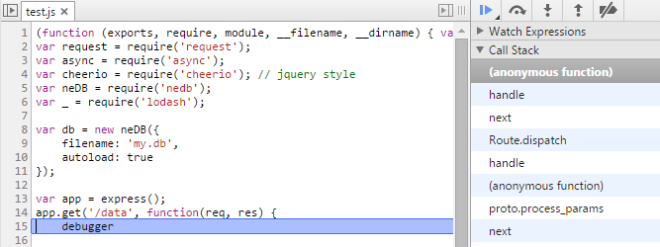

Being so interested in React, I wanted to create something *useful*, not just a Hello World. That does not tell you how to really use a framework, what are its pros and cons.

To really evaluate it, you need at least to have a design of some application, with some links here and there (routing), some dynamic rendering (events), some webservice calls (server, async), a database, and a process to build the project (because you don't want to manually add a reference in the .html everytime you add a .js file for instance, this is especially true when you deal with React components, every component should have its own file). Then it should have some testing. So, my only constraint was : use **React**. After watching so many videos and read many things, I needed to write that down and see how I'm doing. From that, I needed to store some data on a server that would connect to a DB.

So for the server, I picked [NodeJS](http://nodejs.org/). I barely used it, just for some tutorials I think. But nevermind, I'll learn. Now a database, at first, I decided on [NeDB](https://github.com/louischatriot/nedb), because I didn't want to install a true database server at the beginning. But, I was going to have some many rows later (>300k) that I had to switch to a more powerful one. I through of [MongoDB](http://www.mongodb.org/). Never used it, but I knew it integrates easily with NodeJS (using [Mongoose](http://mongoosejs.com/)) and NeDB has the same exact syntax so no code changes! I only used relational databases until now, so it was going to be a good learning curve ! Finally, as a build system, I used [Grunt](http://gruntjs.com/) a bit back then, but I heard about [Gulp](http://gulpjs.com/) being much nicer. Go for it. (I've added it at the end actually :-)) And of course, I did of all my coding in my new favorite editor, [Atom](http://ctheu.com/2015/02/03/youre-tired-of-notepad-use-atom/)!

I'm going to explain step by step how I did from scratch, what I've learned and give some tips and pointers. 

---
Summary {.summary}

[[toc]]

---

# Some design


Time a make a quick draft just to have an visual idea.

Basically, a table as main content, where to display my data. Some buttons in the header to change the table content (buttons act like a filter). Then a special button to access some charts from a third party component. Seems pretty straightforward !

Now, the data. Where are they coming from ? I wanted real data. Internet is fill of data. So I'll do some web scraping to get them, that'a good exercise (but don't abuse ofc). Okay, design _ready_. 

# Let's get into NodeJS

New Folder: 'mynewapp'. New File : 'server.js'. Okay, what now. Install [NodeJS](http://nodejs.org/download/), using the Windows Installer, _click click_, done. Then you write their example to test: 
```js
var http = require('http');
http.createServer(function (req, res) {
    res.writeHead(200, {'Content-Type': 'text/plain'});
    res.end('Hello World\n');
}).listen(1337, '127.0.0.1');

console.log('Server running at http://127.0.0.1:1337/');
```

```
$ node test.js
Server running at http://127.0.0.1:1337/
```

With Node you run any application that is written in JS. It's often used to run servers listening to some ports because, as you can see, it's very easy to set them up. But Node is not only about servers. You can run anything that is JS based. There is a lot of libraries available, currently 124046 ! They are all installable through `npm` (automatically installed with NodeJS), check the packages list here : <https://www.npmjs.com/>.

Note: NodeJS can run ES5 scripts, ES6 is still experimental, you can give a try using `node --use-strict --harmony test.js` if you want to play with [ES6 new operators](https://github.com/JustinDrake/node-es6-examples). 

# What is package.json ?

You will probably notice everybody is talking about this file `package.json`. You have to create it on the root of your project (it must contains at least an empty object `{}`).

That contains metadata about your application (name, description, version) and dependencies (to third party libraries/plugins your project is using) mostly. Everything explained here <https://docs.npmjs.com/files/package.json>.

You can create it by typing `npm init`. It's a small console wizard that will ask you a few things (name, description of your project etc.) and automatically create the `package.json` file accordingly.

Dependencies are installed into a `node_modules` folder in your project root. You can install new one by doing `npm install [package]`, that will add files into this folder :

```
$ npm install timeago --save
timeago@0.2.0 node_modules\timeago
```

I just installed the [timeago](https://github.com/ecto/node-timeago) plugin (it converts a Date to a sentence such as "3 days ago"), it's now in `node_modules/timeago`. You will notice the `--save`, it's used to automatically add this package to our dependencies listed in our `package.json` :

```json
{"dependencies": { "timeago": "^0.2.0" }}
```

Then in code, I can add on top : `var timeago = require('timeago');` and use it.

You can add dependencies globally on your computer, to install them once and for all : `npm install -g [package]`. If you want to distribute your program, you don't need to copy the `node_modules`. Anybody with `npm` can recreate it with all the packages inside (from `package.json` dependencies) just by typing `npm install` in the folder. 

# GET /expressjs

Back to the example, it's working fine! But that a bit low-level no ? Then you heard about [express](http://expressjs.com/), and your code changes to:

```js
var express = require('express');
var app = express();
app.get('/:message', function (req, res) {
    res.send('Hey ! You sent me <b>' + req.params.message + '</b>');
}) app.listen(3000)
```

That is more human readable. You can easily define routes, with parameters. Moreover, it exists of lot of plugins that can automatically do stuff on the request or the response, they are called _middleware_. Think of **express** as a pipeline : `Express Input (request) -> Middleware1 -> Middleware2 -> Middleware3 -> Express output (response)`. Every output is passed on to the next middleware as its input. You will find this kind of init easily on the Internet : 
```js
app.use(morgan('combined')); // log requests to the console output
app.use(favicon(__dirname + '/public/favicon.ico')); // serve the tab icon the browser display for your page
app.use(express.static('public')); // serve public/</i> as a static resource (just returns the file, images, scripts) 
app.use(methodOverride()); // simulate DELETE and PUT calls if the client is using X-HTTP-Method-Override 
app.use(cookieParser()); // parse <code>req.headers.cookie</code> into <code>req.cookies</code>
app.use(bodyParser.urlencoded({ extended: false })); // parse application/x-www-form-urlencoded request into req.body
app.use(session({ secret: 'your secret here' })); // make a user session available in <code>req.session</code> (only creates a cookie with an id client side)
```
 
Well, you can see that's a lot is happening when a request takes place ! For more info, check out the name of each of those middlewares on npmjs.

# Where are my data ?

So, I want to scrap [some data](http://jsbin.com/vusiwerana/3) once every day. Basically, there is a table with some `<td>`. So, I need to do a [request](https://www.npmjs.com/package/request) over there, grab the content (html), parse it to get what I want, and save it into a DB. For the parsing, we need something like jQuery. There is [cheerio](https://github.com/cheeriojs/cheerio) that can do the job using the same syntax as jQuery. That gives us :

```js
var express = require('express'); // routing
var request = require('request'); // request an url
var cheerio = require('cheerio'); // jquery style
 
var url = 'http://jsbin.com/vusiwerana/3';
 
request(url, function(error, response, html) {
    var $ = cheerio.load(html); // html is the raw response string : "<html><head>.."
    var data = [];
    $("tbody tr") // find every <tr> in this html
        .each(function() {
            var name = $(this).find('td.name').text(); // grab the 'name' cell
            var score = $(this).find('td.score').text(); // grab the 'score' cell
            data.push({ name: name, score: score });
        });
 
    console.log(data);
});
```

```
$ node test.js
[ { name: 'John', score: '48' },
  { name: 'Henry', score: '19' },
  { name: 'ALbert', score: '15' } ]
```

I got what I needed. Just need to put that into a DB for future usages. As I said earlier, I started with NeDB because it's very easy to start with as you can see :

```js
var neDB = require('nedb');
 
var db = new neDB({
    filename: 'my.db',
    autoload: true
});
 
request(url, function(error, response, html) {
    // ...
    console.log(data);
    db.save(data); // _append_ our list of objects to our database
});
```

Can't do much more easy right ? NeDB creates your db files and just append your objects inside, adding an `_id` to them.

```
{"name":"John","score":"48","_id":"8jhG83VQgD33489B"}
{"name":"Henry","score":"19","_id":"boUDzilITNM8rvq4"}
{"name":"ALbert","score":"15","_id":"medlEfshJ138ZIvM"}
```

You must have objects in your database, and not simple type such as string or number. Otherwise, you will end up with this error:

```
{ message: 'Can\'t insert key undefined, it violates the unique constraint',
  key: undefined,
  errorType: 'uniqueViolated' }
```

because every record needs a `_id` properly (generated by the NeDB), so if you don't have an object, it cannot add the `_id` property.

Then you can request your data anytime :

```js
db.find({ name: 'John' })
  .exec(function(err, result) {
    if (err) {
        console.error(err);
    } else {
        console.log('Got results: ', result);
    }
});
```
```
Got results: [ { name: 'John', score: '48', _id: '8jhG83VQgD33489B' } ]
```

As expected, NeDB supports select, insert, delete, update. It handles indexes, unique constraints, sorting and paginating.

Check out its [github](https://github.com/louischatriot/nedb), it has all the needed information.

# Mongoose

You could use MongoDB keeping the same code, except for the connection part. You need to use mongoose to talk to MongoDB in NodeJS:

```js
var mongoose = require('mongoose');
mongoose.connect('mongodb://localhost:27017/');
var ScoreModel;
var db = mongoose.connection;
db.on('error', function(e) {
    console.error('connection error:', e);
});
db.once('open', function(callback) {
   var Schema = mongoose.Schema;
   var scoreSchema = new Schema({ name: String, score: Number });
   ScoreModel = mongoose.model('Score', scoreSchema);
   app.listen(8080);
});
// ...
var newScore = new ScoreModel({ name: name, score: score });
newScore.save(function(err) { console.error("Error while saving: ", err); });
```

# I want moar data

Now, I want to scrap more than one page. Let's say I have 10 pages to scrap on the same website. I won't do a basic forEach on my urls and issue a new request for each of them (well I could but I won't !). I would like to query 3 pages max at once, then 3 more, etc. But I don't know when I'm going to have the responses to trigger the next one. I can feel some async complexity in there.

But we are using NodeJS right ? So there must be something to help us. It's simply called [async](https://www.npmjs.com/package/async). That allows us to launch in parallel some tasks, a limit of concurrent tasks running, and have a callback when it's done.

```js
// my task
var callMe = function(taskNumber) {
    return function(callback) {
        var time = ~~(Math.random() * 1000);
        console.log(new Date().getSeconds() + '.' + new Date().getMilliseconds() + ' - starting task: ' + taskNumber);
        // just waiting a random time before calling back
        setTimeout(function() {
            callback(null, { task: taskNumber, time: time });
        }, time);
    };
};
 
// create multiple tasks
var taskCount = +process.argv[2] || 10;
var tasks = _.range(taskCount).map(function(i) { return callMe(i); });
 
// nothing happened yet, let's launch the tasks now
async.parallelLimit(tasks, 2, function(error, result) {
    console.log(result);
});
```

```
$ node test.js 5
8.206 - starting task: 0
8.206 - starting task: 1
8.310 - starting task: 2
8.373 - starting task: 3
8.944 - starting task: 4
[ { task: 0, time: 927 },
  { task: 1, time: 110 },
  { task: 2, time: 61 },
  { task: 3, time: 556 },
  { task: 4, time: 520 } ]
```

Few things here:

- I'm using lodash to have some nice functions available such as _.range.
- I'm reading the arguments from the command line using process.argv, see the documentation.
- Tasks take a random time to execute. When done, they must call callback which is the argument passed by async to the function, to know when the task is done. It takes 2 arguments : error, and result. If the task sends out an error, async stops and triggers the complete callback (the 3rd argument of parallelLimit). If the task was successfull, you have a send a null, then your result.
- In the parallelLimit callback, result is an array and contains the result of the tasks in their exact order (even if the first task finished after every others, result[0] is the result of the first task).

So, to scrape 10 pages in parallel, just follow the recipe :

```js
var scrapPage = function(pageNumber) {
    return function(callback) {
        request('http://www.example.com/page/' + pageNumber, function(error, response, html) {
            var $ = cheerio.load(html);
            // when using .map() on cheerio, call .get() at the end otherwise you'll end up with a cheerio collection, not a string array
            var links = $("a").map(function() { return { link: $(this).attr('href') }; })
                              .get();
            db.insert(links, function(error) {
                console.log(error);
            });
        });
    };
};
// create 10 tasks to scrape 10 pages
var scrapTasks = _.range(10).map(function(i) { return scrapPage(i); });
async.parallelLimit(scrapTasks, 3, function(error, result) {
    console.log(result);
});
```

I have the scraping process, and the database. Let's do a small webservice to expose some data to be used in my frontend.

# Expose your data

So, my node program is listening to request on port 3000 thanks to expressjs : app.listen(3000);. Notice that even after executing that, NodeJS still executes the code that follows, and does not exit the program at the end, it just waits.

Let's add a route:

```js
app.get('/data', function(req, res) {
    // look in the database for links containing 'policies'
    // order them alphatically
    // and takes the first 10
    var data = db.find({ link: { $regex: /.*policies.*/ } })
        .sort({ link: 1 })
        .limit(10)
        .exec(function(err, result) {
            res.send(result);
        });
});
```

We added a route /data (http://localhost:3000/data). When it's requested, we are looking in our database for the word 'policies' in the property 'link' we saved. We are using the `$regex` operator, there is no `$contains` operator in NeDB/MongoDB. Then we sort the result alphabetically (you just put 1 or -1 to say ascending/descending), and we take only the first 10.

We execute the query and we wait for an answer (we provided a callback). When it's back, we send the object directly into the response (from app.get(..., function(req, res)). That will automatically convert our object to a JSON string.

After scraping a google result page for instance, I can see that in my browser :

```
[{"link":"/intl/fr/policies/privacy/","_id":"RW0qTZ8CoZBlW77m"},
{"link":"/intl/fr/policies/privacy/","_id":"VUUJDM78V77KoFdw"},
{"link":"/intl/fr/policies/terms/","_id":"tUWqDKuYoDBDIx2u"},
{"link":"/intl/fr/policies/terms/","_id":"wLzt5gfyDh3ydPny"}]
```

The `Content-Type` of the response is automatically set `Content-Type: application/json; charset=utf-8` when you send out an object.

So, the server side is ready. I can get some data, save them, and expose them through webservice calls. Now, I need the UI that display them. But, small aside about Node debugging first.

# How to debug Node JS

In browser, it's fairly easy to debug. When an exception occurs, the browser stops you directly where that happens with the current state. And you can use debugger to stop where you need (or alert(), let's face it).

Multiple solutions exist to debug with NodeJS.

You can debug in the console using node debug program.js where you can go through each line, watch variables, put breakpoints etc. but that's a bit hardcore, you only have a console UI. More info [here](http://nodejs.org/api/debugger.html).

```
$ node debug test.js
< debugger listening on port 5858
connecting... ok
break in C:\Temp\test\test.js:1
  1 var express = require('express'); // routing
  2 var request = require('request');
  3 var async = require('async');
debug>
```

The best way is to use [node-inspector](https://github.com/node-inspector/node-inspector). You can have the full Webkit debugger UI which is very good.

You can use debugger to stop wherever you want, exactly as in a browser.

To do that, you need 2 things :
– start node-inspector which basically handle the debugging UI :

```
$ node-inspector --web-port=8200  test.js
Node Inspector v0.5.0
   info  - socket.io started
Visit http://127.0.0.1:8200/debug?port=5858 to start debugging.
```

– then open a browser (a webkit one, Chrome or Opera) and go to http://localhost:8200/debug

You will have an error : `Error: connect ECONNREFUSED. Is node running with --debug port 5858` ? Because it has nothing to debug for now.

Start your node program in debug mode :

```
$ node --debug test.js
debugger listening on port 5858
```

Then refresh your browser. Done.



# Time to React

At the beginning, I did a non-React version of my app. A jQuery one, just to focus on the server-side first. It was fairly straightforward. Using [routie](http://projects.jga.me/routie/) to handle the routing, some $.ajax for the webservices, and some a simple strategy to render each time : .empty() / .append(). The data and design were set. Let's move all that view to React. \o/ I learned a lot doing that the right way, even with everything I read/watched. Let's share some tips !

First, let's handle the Hello World example. Create a file HelloWorld.jsx (I put .jsx to be handle properly in Atom, but you could use .js too), add a reference to it in a index.html file, and, because the browser has no clue what to do with your jsx syntax, add a reference to an online transformer script (later, we will transform them offline using Gulp), and of course, to React.

```html
<div id="container"></div>
<script src="http://fb.me/react-with-addons-0.12.2.js"></script>
<script src="http://fb.me/JSXTransformer-0.12.2.js"></script>
<script type="text/jsx" src="HelloWorld.jsx"></script>
```

```js
var HelloWorld = React.createClass({
    render: function() {
        return <div>Hello Ctheu</div>;
    }
});
React.render(<HelloWorld />, document.getElementById('container'));
```

When running, be sure to render your html page using a webserver, such as node. Your url must be something using the http:// protocol such as http://localhost:8090/test.html and not file:///C:/Temp/public/test.html, that won't work. Something like that is enough :

```js
var app = express();
app.use(express.static('public'));
app.listen(8090);
```

Otherwise you'll get :

```
XMLHttpRequest cannot load file:///C:/Temp/public/HelloWorld.jsx.
Cross origin requests are only supported for protocol schemes: http, data, chrome, chrome-extension, https, chrome-extension-resource.
Uncaught NetworkError: Failed to execute 'send' on 'XMLHttpRequest': Failed to load
```

From now, you can apply everything you know about React, create components, include them, render them. Let's just focus on certain features. I won't explain here how to React, you can read my other post.

# React Tips

## HTML to JSX Compiler

If you want to try out what is the React syntax for a particular HTML or if you want to migrate your HTML to React, give a try at http://magic.reactjs.net/htmltojsx.htm.

## setState does not modify this.state

When you code a component and you need to access its state, ensure to directly override getInitialState() to return something. this.state is null by default. this.props is not (empty object).

When you update the state of a component with

```js
setState({ done: true })
```

`this.state.done` is not modified on the next line. React throttles all the `setState()` calls and only apply them before rendering again. (to avoid a double render if you do `setState({ done: true }); setState({ done: false });` in the same tick.

## Why immutability is important ?

When you have to modify an array that belongs to your state, you can't just push or splice values into/from it, that's won't trigger the re-rendering because React cannot just listen to an array changes, it's not possible yet (it's part of ES7 with Array.observe(arr, callback) but we are far from it, we are still mostly running with ES5 !). That's why you have to call this.setState({...}) to tell React that something changed.

Thus, multiple ways to do that :

- Dirty way : you modify your array directly then you call setState saying a=a to trigger the re-rendering. The thing is that you changed the reference directly so, anything that is using this same reference won't be updated and it's view won't be in sync with its state:
```js
this.state.mylist.push(5);
this.setState({ mylist: this.state.mylist });
```
- you slice() your array to clone it, then modify it, then update the state :
```js
var copy = this.state.values.slice(); // this.state.values reference in NOT modified here
copy.push(5);
this.setState({ values: copy });
```
- [the React way](https://facebook.github.io/react/docs/update.html), using the immutability helpers from React.addons. That does the same thing for arrays but handle the updates to subobjects too. The syntax is inspired by MongoDB's query language (`{$push:..}`, `{$set:...}`, ...).
```js
this.setState({ values: React.addons.update(this.state.values, { $push: [ 5 ] }) });
```

# How to communicate between components ?

For a parent to talk to its child is fairly straightforward, you can simply use the props (`<MyChild value={this.value} />`)

A way for a child to talk to its parent is for the parent to pass a callback to its child. You can pass any type of object in the props of a component.

```js
var Who = React.createClass({
    render: function() {
        return <span onClick={ this.props.callback }>{ this.props.name }</span>;
    }
});
var HelloYou = React.createClass({
    getInitialState: function() {
        return { clicks: 0 };
    },
    somethingHappened: function() {
        this.setState({ clicks: this.state.clicks + 1});
    },
    render: function() {
        return  <div>Hello <Who name={ this.props.name }
                                callback={ this.somethingHappened } />.
                     You clicked on me : { this.state.clicks }
                </div>;
    }
});
React.render(<HelloYou name="Ctheu" />, document.getElementById('container'));
```

```
Hello Ctheu. You clicked on me : 0
Hello Ctheu. You clicked on me : 1
Hello Ctheu. You clicked on me : 2
```

Here, `<HelloYou>` renders a `<Who>` passing a callback. `<Who>` triggers this callback when the user clicks on the generated `<span>`. `<Who>` "talks" to its parent.

Reference to my post TK{.info}

# How to handle the data coming from a webservice ?

Then, come the asyncness when using your webservices. How to ?
Here is a boilerplate to use for components that needs to call a webservice when they are mount into the DOM.

```js
var HelloWho = React.createClass({
    getInitialState: function() {
        return { loading: true, error: false, name: null };
    },
    componentDidMount: function() {
        this.callWS();
    },
    callWS: function() {
        $.ajax({
            url: 'http://api.randomuser.me/',
            dataType: 'json',
            context: this,
            success: function(data) {
                if (this.isMounted()) {
                    this.setState({ loading: false, name: data.results[0].user.username });
                }
            },
            error: function() {
                if (this.isMounted()) {
                    this.setState({ loading: false, error: true });
                }
            }
        });
    },
    render: function() {
        if (this.state.loading) {
            return <div>Loading...</div>;
        }
        if (this.state.error) {
            return <div>Error retrieving the data</div>;
        }
        return  <div>Hello {this.state.name}</div>;
    }
});
 
React.render(<HelloWho />, document.getElementById('container'));
```

Because the component calls a webservice, we add 2 properties to its state loading and error, to render something different according to 3 states : at first, the component calls the webservice, we need to wait ; then it comes back either successfully, or in error. Using the state allows you to render something appropriate.

The method componentDidMount is called when the component is mounted into the DOM, perfect time to call the webservice. Because loading is set, render() displays the loading message. Then, the service answers and we update its state accordingly, for render() to occur again.
In the callbacks of $.ajax, don't forget to check if your component is still mounted otherwise you will get this error :

```
Uncaught Error: Invariant Violation: replaceState(...): Can only update a mounted or mounting component
```

# How to use a third party plugin that updates the DOM, such as Highcharts?

I wanted to do a chart remember ? To create it, Highcharts needs a reference to a container in the DOM. It turns out that you have access to the DOM reference of what you are rendering in React. To do that, you use this.refs. It contains every ref you have set in the DOM you generated.

But you can't add your Highcharts code in render() because the referenced items are even not rendered yet.
What you return in render() is not a DOM element. It's just a JS object React is using. return

is translated into return React.createElement('div') which is a ReactElement.
You have to wait for componentDidMount to be called (componentDidMount is called after render the first time). You will be able to access this.refs.myref which is a ReactDOMComponent. From it, you call getDOMNode() to finally have the DOM reference you are looking for. You can even add a ref to a React component. It will be available the same way and you will be able to call its method if you want (the ReactDOMComponent you got being the one you ref'd). That's a way to communicate between a parent and its child.

Here is a example that first renders a chart using this.props, then one second later, update itself and uses this.state :

```js
var DrawMeAChart = React.createClass({
    getInitialState: function() {
        return {};
    },
    // if I have my data when the component is mounted
    componentDidMount: function() {
        var node = this.refs['my-chart'].getDOMNode();
        $(node).highcharts({
            series: [{ data: [this.props.start, this.props.end]}] // immutable, using this.props
        });
 
        // in one second, componentDidUpdate() will be called
        setTimeout(function() { this.setState({ start: 37, end: 13 }); }.bind(this), 1000);
    },
    // if .setState() is called (ajax response, or any other case)
    componentDidUpdate: function() {
        var node = this.refs['my-chart'].getDOMNode();
        $(node).highcharts({
            series: [{ data: [this.state.start, this.state.end]}] // mutable, using this.state
        });
    },
    render: function() {
        return  <div ref="my-chart"></div>;
    }
});
 
React.render(<DrawMeAChart start={13} end={37} />, document.getElementById('container'));
```

# What about React/DOM Performance ?

I had a table with thousands rows, and some collapsible headers in the table that you can click to collapse hundreds of rows below (headers and normal rows being simply <tr>). Here was the render() of the <Table> component:

```js
getInitialState: function() {
    return { rows: [ { header: true, name: 'Group A'}, { value: 5 },
                     { header: true, name: 'Group B', collapsed: true }, { value: 10 }, { value: 20 }] };
},
render: function() {
    var isCollapsed = false;
    return  <table>
              {this.state.rows.map(function(row) {
                if (row.header) { // render a special row header
                  isCollapsed = row.collapsed;
                  return <MyGroupHeader groupName={row.name} />;
                }
                if (!isCollapsed) { // only render a normal row if the previous header is NOT collapsed
                  return <MyRow value={row.value} />;
                } else {
                  return null; // nothing to render for this row, its header is collapsed
                }
              })}
            </table>;
}
```

I simply returned null if I knew the row was collapsed. But on large collection, the performance were ugly due to the mass mutation of the DOM. Instead, just do it a la CSS, hide/show :

```js
return <MyRow hidden={isCollapsed} value={row.value} />;
```
 
In MyRow.render():
```js
return <tr className={this.props.hidden ? 'hidden' : ''}> ...
```

That will be WAY much faster.

Moreover, if you know that your component does not need to pass through render() when its state changed, or in case its parent re-render() itself (that will called render() on every of its children), implement shouldComponentUpdate, that could give you a big performance boost. (and even, in a general manner, you should almost always implement this method? take a look at [PureRenderMixin](https://facebook.github.io/react/docs/pure-render-mixin.html) to do that automatically for you)

```js
shouldComponentUpdate: function(nextProps) {
    // if my visibility didn't change, no need to re-render me.
    return this.props.hidden !== nextProps.hidden;
}
```

You can find out where you could implement them using [react-addons-perf](https://facebook.github.io/react/docs/perf.html), that can give you the time React passed to render() components that didn't changed for instance:

![perf][perf.png]

# I'm lazy, build my app for me

Now that my UI and server are done, I need to clean up my project (well, I should have done that since the beginning ofc) and have a nice build process.

So, what about this keen interest in Gulp ? I needed to test it out myself. I had one big file for all my components, js libs were from a [cdn](https://en.wikipedia.org/wiki/Content_delivery_network) and I was still using the online JSXTransformer. I was using pure css. Nothing was bundled nor minified. Oops.

Time to take a look into [Gulp](http://gulpjs.com/).

First: the JSX. I split my big components file into differents files, then I want to compile them offline. How to ?

After `npm install -g gulp`, I created the file `gulpfile.js` in the root of my folder to contain the build instructions.

```js
var jsxGlob = ['components/**/</i>.jsx'];
gulp.task('jsx', function() {
    gulp.src(jsxGlob)
        .pipe(react())
        .pipe(uglify())
        .pipe(concat('components-bundle.js'))
        .pipe(gulp.dest('dest/'));
});
```

```
$ gulp jsx
[01:43:10] Using gulpfile C:\Temp\test\gulpfile.js
[01:43:10] Starting 'jsx'...
[01:43:10] Finished 'jsx' after 43 µs
```

Boom, done. In your HTML page, you just reference this one file jsx-bundle.js. Can't be harder right ? It's the last time I don't directly create my project without that.
On top of that, you change your pure css to less, and again, compile them into a bundle :

```js
var lessGlob = ['styles/**/</i>.less'];
gulp.task('less', function() {
    gulp.src(lessGlob)
        .pipe(less())
        .pipe(minifycss())
        .pipe(concat('css-bundle.css'))
        .pipe(gulp.dest('dest/'));
});
```

Note: `style/**/*.less` takes every `.less` recursively in `styles/`.

You can even have a running task that auto-builds each time you change a .jsx or a .less in your project:

```js
gulp.task('watch', function() {
    gulp.watch([jsxGlob, lessGlob], ['jsx', 'less']);
});
```

You can learn what is possible from useful recipes here : https://github.com/gulpjs/gulp/tree/master/docs/recipes

# Conclusion

So, we saw a lot ! From scratch, we know how to do an application that has a database on a server with some webservices, all powered by NodeJS. Client side, we know how to properly make a React application and have the tools to identify bottlenecks, and finally, we have a build process to lighten the application and facilitate the dev job. I didn't detailed too much for each of those steps, that could have been very, very long. You have all the resources to go further and practise ! I hope you learned some tricks.

# Resources

- Frameworks: [React](http://reactjs.org/), [Node](http://nodejs.org/), [Express](http://expressjs.com/)
- NodeJS: [npm](https://www.npmjs.com/), [timeago](https://www.npmjs.com/package/timeago), [request](https://www.npmjs.com/package/request), [cheerio](https://github.com/cheeriojs/cheerio), [async](https://github.com/caolan/async), [lodash](https://www.npmjs.com/package/lodash)
- NodeJS debugging: [node debug](http://nodejs.org/api/debugger.html), [node-inspector](https://github.com/node-inspector/node-inspector)
- Databases: [NeDB](https://github.com/louischatriot/nedb), [MongoDB](http://www.mongodb.org/), [Mongoose](http://mongoosejs.com/) (to connect to MongoDB in a Node program)
- React: [HTML to JSX](http://facebook.github.io/react/html-jsx.html), [communicate between components](http://facebook.github.io/react/tips/communicate-between-components.html), [react performance tools](http://facebook.github.io/react/docs/perf.html), [react purerendermixin](http://facebook.github.io/react/docs/pure-render-mixin.html), [react immutability helpers](http://facebook.github.io/react/docs/update.html)
- Charts: [ChartJS](http://www.chartjs.org/), [Chartist](http://gionkunz.github.io/chartist-js/), [Highcharts](http://www.highcharts.com/)
- Routing: [routie](http://projects.jga.me/routie/)
- Build Systems: [Grunt](http://gruntjs.com/), [Gulp](http://gulpjs.com/) ([recipes](https://github.com/gulpjs/gulp/tree/master/docs/recipes))
- Specifications: [ES5](http://www.ecma-international.org/publications/files/ECMA-ST/Ecma-262.pdf), [ES6](https://github.com/lukehoban/es6features), [ES7](http://kangax.github.io/compat-table/es7/)
