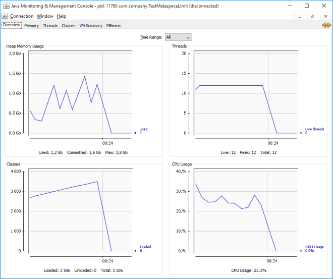

Back to the Java world, I've made my mind and realized that I didn't know the Java basis enough.

I've decided to look at the *simple* aspects of Java (CLI, GC, tools) to consolidate my knowledge, and share this article to:

- Give a global overview of what the Java CLI has to offer.
- Give some guidelines to configure the JVM memory heap and understand its limitations.
- Talk about the GC types and their most useful options.
- Introduce some tools to debug and profile the JVM.

For reference, I'm using:
```
java version "1.8.0_66"
Java(TM) SE Runtime Environment (build 1.8.0_66-b18)
Java HotSpot(TM) 64-Bit Server VM (build 25.66-b18, mixed mode)
```

---
Summary {.summary}

[[toc]]

---


# Java flags

We'll see some of the most useful flags we can enable with `java` to get more info and understand a bit more what's going on under the hood.

Quick bite: 

- `-XX:+[option]` : enable the following option
- `-XX:-[option]` : disable the following option
- `-XX:[property]=` : give a value to the option

## Print flags

### -XX:+PrintCommandLineFlags

It's interesting to know what are the default options of the JVM. 

```
$ java -XX:+PrintCommandLineFlags -version
-XX:InitialHeapSize=268055680 -XX:MaxHeapSize=4288890880 -XX:+PrintCommandLineFlags
-XX:+UseCompressedClassPointers -XX:+UseCompressedOops -XX:-UseLargePagesIndividualAllocation
-XX:+UseParallelGC
```

- `-XX:InitialHeapSize=268055680`: 256MB, default to 1/64 of the RAM (alias for `-Xms`)
- `-XX:MaxHeapSize=4288890880`: 4GB, default to 1/4 of the RAM (alias for `-Xmx`)
- `-XX:+UseParallelGC`: Parallel GC (= PSYoungGen (Parallel Scavenge) + ParOldGen). We'll talk more about them after.
- the others are advanced optimisations

### -XX:+PrintFlagsFinal

We can list every existing flags and their values. There are hundreds of them.

Below is just the list of all the `Print*` we can use to display more info in the logs:

```java
$ java -XX:+PrintFlagsFinal -version
[Global flags]
...
bool PrintAdaptiveSizePolicy             = false      {product}
bool PrintCMSInitiationStatistics        = false      {product}
intx PrintCMSStatistics                  = 0          {product}
bool PrintClassHistogram                 = false      {manageable}
bool PrintClassHistogramAfterFullGC      = false      {manageable}
bool PrintClassHistogramBeforeFullGC     = false      {manageable}
bool PrintCodeCache                      = false      {product}
bool PrintCodeCacheOnCompilation         = false      {product}
bool PrintCommandLineFlags               = false      {product}
bool PrintCompilation                    = false      {product}
bool PrintConcurrentLocks                = false      {manageable}
intx PrintFLSCensus                      = 0          {product}
intx PrintFLSStatistics                  = 0          {product}
bool PrintFlagsFinal                    := true       {product}
bool PrintFlagsInitial                   = false      {product}
bool PrintGC                             = false      {manageable}
bool PrintGCApplicationConcurrentTime    = false      {product}
bool PrintGCApplicationStoppedTime       = false      {product}
bool PrintGCCause                        = true       {product}
bool PrintGCDateStamps                   = false      {manageable}
bool PrintGCDetails                      = false      {manageable}
bool PrintGCID                           = false      {manageable}
bool PrintGCTaskTimeStamps               = false      {product}
bool PrintGCTimeStamps                   = false      {manageable}
bool PrintHeapAtGC                       = false      {product rw}
bool PrintHeapAtGCExtended               = false      {product rw}
bool PrintHeapAtSIGBREAK                 = true       {product}
bool PrintJNIGCStalls                    = false      {product}
bool PrintJNIResolving                   = false      {product}
bool PrintOldPLAB                        = false      {product}
bool PrintOopAddress                     = false      {product}
bool PrintPLAB                           = false      {product}
bool PrintParallelOldGCPhaseTimes        = false      {product}
bool PrintPromotionFailure               = false      {product}
bool PrintReferenceGC                    = false      {product}
bool PrintSafepointStatistics            = false      {product}
intx PrintSafepointStatisticsCount       = 300        {product}
intx PrintSafepointStatisticsTimeout     = -1         {product}
bool PrintSharedArchiveAndExit           = false      {product}
bool PrintSharedDictionary               = false      {product}
bool PrintSharedSpaces                   = false      {product}
bool PrintStringDeduplicationStatistics  = false      {product}
bool PrintStringTableStatistics          = false      {product}
bool PrintTLAB                           = false      {product}
bool PrintTenuringDistribution           = false      {product}
bool PrintTieredEvents                   = false      {product}
bool PrintVMOptions                      = false      {product}
bool PrintVMQWaitTime                    = false      {product}
bool PrintWarnings                       = true       {product}
...
bool UseParNewGC                         = false      {product}
bool UseParallelGC                      := true       {product}
bool UseParallelOldGC                    = true       {product}
...
```

`:=` means that the default value was overridden by something (us or the JVM Ergonomics).
We can conclude that the JVM Ergonomics estimates java could use the ParallelGC on my PC.

A classic shortcut is to grep the output, for instance to find out what is the Young Generation size (`NewSize`):

```java
$ java -XX:PrintFlagsFinal -version | grep NewSize
uintx MaxNewSize                       := 1430257664  {product}
uintx NewSize                          := 89128960    {product}
```

More details on how to read that on [javaworld](http://www.javaworld.com/article/2073676/hotspot-jvm-options-displayed---xx--printflagsinitial-and--xx--printflagsfinal.html) or [codecentric](https://blog.codecentric.de/en/2012/07/useful-jvm-flags-part-3-printing-all-xx-flags-and-their-values/).

## Get more details in the logs flags

As a reminder, the structure of the JVM heap memory:


### -XX:+PrintGC / -verbose:gc

This is the first step to know what's going on with our program and its GC.

```
[GC (Allocation Failure)  954K->896K(1536K), 0.0008951 secs]
[Full GC (Ergonomics)  896K->290K(1536K), 0.0026976 secs]
[GC (Allocation Failure)  778K->290K(1536K), 0.0006170 secs]
```

We can see the total heap going from 954K to 896K, with a max at 1536K.

- *Allocation Failure*: the JVM couldn't find any more space in the Young Generation and had to clean it up. This is a normal behavior.
- *Ergonomics*: the JVM decided to start a Full GC on its own.
- *Metadata GC Threshold*: Metaspace size is exhausted. Raise the default `MetaspaceSize` and maybe the max `MaxMetaspaceSize`.

### -XX:+PrintGCDetails

It's more interesting: we still see the heap size changes, but we also see:

- The young generation `PSYoungGen`.
- The old generation `ParOldGen`.
- The `Metaspace`.

(I was running with the Parallel GC, it's different according to which GC is used)

```
[GC (Allocation Failure)
  [PSYoungGen: 465K->400K(1024K)]
  954K->896K(1536K), 0.0011948 secs]
  [Times: user=0.00 sys=0.00, real=0.00 secs]
[Full GC (Ergonomics)
  [PSYoungGen: 400K->0K(1024K)]
  [ParOldGen: 496K->290K(512K)]
  896K->290K(1536K),
  [Metaspace: 2520K->2520K(1056768K)], 0.0032720 secs]
  [Times: user=0.00 sys=0.00, real=0.00 secs]
[GC (Allocation Failure)
  [PSYoungGen: 488K->0K(1024K)]
  778K->290K(1536K), 0.0010046 secs]
  [Times: user=0.00 sys=0.00, real=0.00 secs]
```

### -XX:+PrintReferenceGC

This options works with the previous one.

It adds information about the different `*Reference` type variables (`Soft`, `Weak`, `Final`, `Phantom`, JNI) the program might used.

The `PhantomReference` are quite tricky to work with the GC. If you're using them, I'm pretty sure you know it, right? [plumbr](https://plumbr.eu/blog/garbage-collection/weak-soft-and-phantom-references-impact-on-gc) has some nice tips about them.

```
[GC (Allocation Failure)
  [SoftReference, 0 refs, 0.0003665 secs]
  [WeakReference, 9 refs, 0.0001271 secs]
  [FinalReference, 7 refs, 0.0001104 secs]
  [PhantomReference, 0 refs, 0 refs, 0.0001707 secs]
  [JNI Weak Reference, 0.0002208 secs]
  [PSYoungGen: 465K->400K(1024K)]
  954K->896K(1536K), 0.0026939 secs]
  [Times: user=0.00 sys=0.00, real=0.00 secs]
```

### -XX:+PrintGCTimeStamps / -XX:+PrintGCDateStamps

It's useful to know when things happen and how often.

The date is useful to be able to match easily with other logs.

```xml
2016-01-11T01:12:48.878+0100: 1.071: [GC (Allocation Failure)  954K->928K(1536K), 0.0020453 secs]
2016-01-11T01:12:48.878+0100: 1.072: [Full GC (Ergonomics)  928K->290K(1536K), 0.0031099 secs]
2016-01-11T01:12:49.883+0100: 2.075: [GC (Allocation Failure)  778K->290K(1536K), 0.0012529 secs]
```

### -XX:+PrintGCApplicationStoppedTime

It's useful to know how much time our application didn't do anything, because the *World was Stopped*.

We really want to minimize those times:

```xml
Total time for which application threads were stopped: 0.0000492 seconds,
  Stopping threads took: 0.0000179 seconds
Total time for which application threads were stopped: 0.0033140 seconds,
  Stopping threads took: 0.0000130 seconds
Total time for which application threads were stopped: 0.0004002 seconds,
  Stopping threads took: 0.0000161 seconds
```

### -XX:+PrintAdaptiveSizePolicy

This displays some metrics about *survivals* and *promotions* that the JVM Ergonomics is using to tune and optimize the GC behavior (by modifying space sizes):

```
[GC (Allocation Failure)
  AdaptiveSizePolicy::update_averages:  survived: 409616  promoted: 8192  overflow: false
  AdaptiveSizeStart: 1.087 collection: 1
  PSAdaptiveSizePolicy::compute_eden_space_size: costs minor_time: 0.000377 major_cost: 0.000000
    mutator_cost: 0.999623 throughput_goal: 0.990000 live_space: 268845056 free_space: 1048576
    old_eden_size: 524288 desired_eden_size: 524288
  AdaptiveSizeStop: collection: 1
 954K->896K(1536K), 0.0022971 secs]
```

### -XX:-UseAdaptiveSizePolicy

The JVM Ergonomics always tries to improve the *latency* and the *throughput* of the applications by tuning the GC behavior, such as modifying the space sizes.

We can disable this behavior if we know we don't need it.

We can still have the details about the survivors and promotions if combined with the previous flag:

```xml
$ java -XX:+PrintAdaptiveSizePolicy -XX:-UseAdaptiveSizePolicy -XX:+PrintGC ...
[GC (Allocation Failure)
  AdaptiveSizePolicy::update_averages:  survived: 442384  promoted: 8192  overflow: false
  954K->928K(1536K), 0.0027480 secs]
```

# Memory tuning

## Heap size

Heap = Young Generation (Eden + Survivors) + Old Generation (Tenured){.info}

Tuning the heap size can impact the application for the better or for the worse.

Before tuning it, we need to be sure it's necessary, we must know the existing GC cycles, know that we have reached the limit (or not).
Or we can just give a try and check the behavior, latency, and throughput of the application afterwards. ;-)

- `-Xms` / `-XX:InitialHeapSize`: initial heap size
- `-Xmx` / `-XX:MaxHeapSize`: maximum heap size

`MaxHeapSize` influences `InitialHeapSize` up until 256MB.

- `MaxHeapSize`=2MB ? `InitialHeapSize`=2MB (max)
- `MaxHeapSize`=256MB ? `InitialHeapSize`=256MB (max)
- `MaxHeapSize`=512MB ? `InitialHeapSize`=256MB (half)

### Default heap size

The default `MaxHeapSize` is 1/4 of the machine RAM, and the `InitialHeapSize` is 1/64.

On my machine, I have 16GB of RAM, that gives:

- `InitialHeapSize` = 268435456  = 256MB
- `MaxHeapSize`     = 4290772992 = 4092MB

`PrintFlagsFinal` won't display numbers greater than 4094MB, because it displays them as `uint`, therefore the limit is 4,294,967,295.

```xml
$ java -Xmx4g -XX:+PrintFlagsFinal -version |  grep "MaxHeapSize"
uintx MaxHeapSize                              := 0                                   {product}
```

### Minimum heap size

The minimum heap size we can set is 1M (the program won't do much but it's still possible).

If we try to put less, we'll end up with an error:

```xml
Too small initial heap
```

Even if we ask for 1MB, we'll end with 2MB:

```xml
$ java -Xmx1m -XX:+PrintFlagsFinal -version |  grep HeapSize
    uintx InitialHeapSize                          := 2097152                             {product}
    uintx MaxHeapSize                              := 2097152                             {product}
```

We will always get a `MaxHeapSize` divisible by 2.

### Not enough heap ?

If our program needs more heap memory and can't find it, it will ends a lovely OOM:

```xml
Exception in thread "main" java.lang.OutOfMemoryError: Java heap space
```

## Young generation (in heap)

Young Generation = Eden + Survivors{.info}

This part of the heap is where all variables start their lifecycle. They are born here, and they will likely evolve to survivors, then ends up in the old generation; if alive long enough.

- `-XX:NewSize`: young generation initial size
- `-XX:MaxNewSize`: young generation maximum size
- `-Xmn`: shortcut for both

`MaxHeapSize` and `InitialHeapSize` influences `MaxNewSize` and `NewSize`.

- `MaxHeapSize`=1GB && `InitialHeapSize`=256MB ? `MaxNewSize`=341MB, `NewSize`=85MB
- `MaxHeapSize`=4GB && `InitialHeapSize`=256MB ? `MaxNewSize`=1365MB, `NewSize`=85MB
- `MaxHeapSize`=4GB && `InitialHeapSize`=1GB ? `MaxNewSize`=1365MB, `NewSize`=341MB

By default, the ratio is 3/1 between `MaxHeap`/`MaxNewSize` and `InitialHeapSize`/`NewSize`.

### Default young generation size

We just saw that `NewSize`/`MaxNewSize` are linked to `InitialHeapSize`/`MaxHeapSize`.

The default of `MaxHeapSize` is 1/4 of the machine RAM, and the `InitialHeapSize` is 1/64.
Therefore, the default of `MaxNewSize` is 1/12 of the RAM, and `NewSize` is 1/192.

On my machine, I have 16GB of RAM, that gives:

- `InitialHeapSize` = 256MB
- `MaxHeapSize`     = 4092MB
- `MaxNewSize` = 1430257664 = 1364MB
- `NewSize`    = 89128960   = 85MB

### Minimum young generation size

We can't have `MaxNewSize` < `NewSize`: 

```xml
Java HotSpot(TM) 64-Bit Server VM warning: NewSize (1536k) is greater than the MaxNewSize (1024k).
A new max generation size of 1536k will be used.
```

The 1536k will be equally separated between the Eden Space, the `from` Survivor space, and the `to` Survivor space. (512k each)

We can't neither have the `MaxNewSize` >= `HeapSize` (young generation size can't be greater than the total heap size) :

```xml
$ java -Xmx2m -XX:MaxNewSize=2m -XX:+PrintFlagsFinal -version | grep NewSize
Java HotSpot(TM) 64-Bit Server VM warning:
MaxNewSize (2048k) is equal to or greater than the entire heap (2048k).
A new max generation size of 1536k will be used.
    uintx MaxNewSize                               := 1572864                             {product}
    uintx NewSize                                  := 1572864                             {product}
```

### Not enough young generation space ?

Even if we have a `MaxNewSize` of 1MB and our program tries to allocate 1GB bytes, it will work if we have a big enough heap size.

The allocation will just directly go into the old generation space.

## Thread Stack (off heap)

Each and every threads in the program will allocate this size for their stack.

This is where the function will store their parameters values they are currently using. It's a stack, they will be popped out when the function exits. But, the deeper calls we do, the deeper we're going into the stack. (FILO)

The recursive calls can go very deeply because of their intrinsic natures (if they don't use [trampolines](https://en.wikipedia.org/wiki/Trampoline_(computing))). This is where we have to be careful in our logic and maybe increase the default `ThreadStackSize`.

- `-Xss` / `-XX:ThreadStackSize`: thread stack size

### Default thread stack size

If we look, we'll find out it's 0 :

```xml
$ java -XX:+PrintFlagsFinal -version | grep ThreadStackSize
intx ThreadStackSize                           = 0                                   {pd product}
```

`0` means it will fallback to the OS default.

Check out Oracle website for [unix](http://docs.oracle.com/javase/8/docs/technotes/tools/unix/java.html) or [Windows](http://docs.oracle.com/javase/8/docs/technotes/tools/windows/java.html), it's between 320kB and 1MB.

### Minimum thread stack size

The usage says we must specify at least 108k, but we can run *only* with 65k to start a simple program.

```c
The stack size specified is too small, Specify at least 108k
Error: Could not create the Java Virtual Machine.
Error: A fatal exception has occurred. Program will exit.
```

### StackOverflow

We all stumbled upon it:

```c
Exception in thread "main" java.lang.StackOverflowError
```

A simple program with a recursive function taking 2 int parameters can be called up to :

```c
ThreadStackSize at 65k  : 888 times
ThreadStackSize at 130k : 1580 times
ThreadStackSize at 260k : 2944 times
```

The more parameters to the function we add, the less times we'll be able to call it.

## Metaspace (off heap)

This is where the class definitions are.
It's a special space because class definitions are not mutable, they are loaded once and for all.

It's quite rare to change the default configuration.

- (Java < 8) `-XX:MaxPermSize` (fixed size, difficult to estimate)
- (Java >= 8) `-XX:MaxMetaSpaceSize` (is *unlimited* by default)

### Default metaspace size

As we said, it's unlimited.
If we look closely, it's actually defined at 4GB for me:

```c
$ java -XX:+PrintFlagsFinal -version | grep Metaspace
{product}
uintx MaxMetaspaceSize                          = 4294901760                          {product}
uintx MetaspaceSize                             = 21807104                            {pd product}
```

Note that `MaxHeapSize`/`Xmx` has no impact on it, the metaspace is a off-heap memory.

### Minimum metaspace size

We can't set a too small metaspace size (< 5MB) otherwise the JVM won't even be able to load the JRE, and will crash with this error:

```xml
Error occurred during initialization of VM OutOfMemoryError:
Metaspace - java.lang.OutOfMemoryError:
Metaspace <<no stack trace available>> -
Exception in thread "main" java.lang.OutOfMemoryError: Metaspace
```

It's a good idea to set a max metaspace size, to be sure the JVM will never take an *unlimited* memory (and breaks the other apps on the server) in case of some bugs.

### How many classes can we load?

I have a program that create dynamically classes on the fly and load them up. (https://gist.github.com/sderosiaux/018493089f4c75f36662)

```c
$ java -XX:MaxMetaspaceSize=10m
-Djava.home="C:\Program Files\Java\jdk1.8.0_60\jre"
-classpath "C:\wip\out\production\test"
com.company.TestMetaspaceLimit
```

With 10MB of metaspace, it crashes around 300 classes loaded (it's not a lot in the Java world if you're using some frameworks).

If we enable the GCDetails logs, we'll see some sweet GC reasons:

```vb
[Full GC (Metadata GC Threshold)
  [PSYoungGen: 64K->0K(1396224K)]
  [PSOldGen: 6548K->6548K(2793472K)] 6612K->6548K(4189696K),
  [Metaspace: 9954K->9954K(1058816K)], 0.0174232 secs]
  [Times: user=0.02 sys=0.00, real=0.02 secs]
[GC (Last ditch collection)
  [PSYoungGen: 0K->0K(1396224K)] 6548K->6548K(4189696K), 0.0006371 secs]
  [Times: user=0.00 sys=0.00, real=0.00 secs]
[Full GC (Last ditch collection)
  [PSYoungGen: 0K->0K(1396224K)]
  [PSOldGen: 6548K->6548K(2793472K)] 6548K->6548K(4189696K),
  [Metaspace: 9954K->9954K(1058816K)], 0.0183340 secs]
  [Times: user=0.01 sys=0.00, real=0.02 secs]
```

# Garbage Collectors

Every GC has a specific way to manage the Young Generation Space (new objects) and the Old Generation Space (variables referenced since a while).

They are treated differently because the Young Generation is a very fast-paced space, not the old one which contains variables that are here to stay.

The Young Generation space should never be too big, 2GB seems like a good limit. Its churn rate is very high, and the algorithms could be taking more time than expected to process all that space.

## -XX:+UseSerialGC

*The Serial GC.*

It's using a single-core and *Stop the World* when processing.

- Young Generation Collector: `DefNew`: Mark + Copy (bouncing through survivor spaces).
- Old Generation Collector: `Tenured`: Mark + Sweep + Compact.

Example of output :

```
[GC (Allocation Failure)
  [DefNew: 652352K->81514K(733888K), 0.2248788 secs]
  1630766K->1620630K(2364580K), 0.2255284 secs]
  [Times: user=0.19 sys=0.03, real=0.22 secs]
[GC (Allocation Failure)
  [DefNew: 733839K->81489K(733888K), 0.2495329 secs]
  [Tenured: 2180251K->1993562K(2180276K), 0.3855474 secs]
  2272954K->1993562K(2914164K),
  [Metaspace: 2765K->2765K(1056768K)], 0.6373276 secs]
  [Times: user=0.55 sys=0.09, real=0.64 secs]
```

## -XX:+UseParallelGC + -XX:+UseOldParallelGC

*The Parallel GC.*

It is an evolution of the Serial GC.

It's faster because it's using multiple cores to do the job, and it's also a *Stop the World* processing.

With Java 8, specifying `-XX:+UseParallelGC` automatically sets `-XX:+UseOldParallelGC`.{.info}

- YG Collector: `PSYoungGen`: Parallel Mark + Copy (bouncing through survivor spaces).
- OG Collector: `ParOldGen`: Parallel Mark + Sweep + Compact.

Example of output :

```
[GC (Allocation Failure)
  [PSYoungGen: 76221K->10729K(141824K)]
  127345K->126994K(316928K), 0.0173292 secs]
  [Times: user=0.05 sys=0.02, real=0.02 secs]
[Full GC (Ergonomics)
  [PSYoungGen: 10729K->0K(141824K)]
  [ParOldGen: 116265K->126876K(287744K)]
  126994K->126876K(429568K),
  [Metaspace: 2742K->2742K(1056768K)], 0.0224399 secs]
  [Times: user=0.03 sys=0.00, real=0.02 secs]
```

- *GC (Allocation Failure)*: a minor GC (Young Generation) was done because no more space was available. Totally normal.
- *Full GC (Ergonomics)*: the JVM decided to do a Full GC (Young + Old generations) because of some thresholds.

We can disable the `OldParallelGC` by using `-XX:-UseOldParallelGC` to use the old `PSOldGen` generation collector.
It's not parallel but serial (as the SerialGC), and we should probably not used it.

We can control how many threads the parallel phases are using with `-XX:ParallelGCThreads=N`.
By default, it's the number of cores.

## -XX:+UseParNewGC + -XX:+UseConcMarkSweepGC

*The Concurrent Mark and Sweep GC.*

It is an evolution of the Parallel GC and it is the most common.

It can collect the Old Generation concurrently while the application is still running: the application will have a better latency (less pauses).
Its Young Generation collector, `ParNewGC`, while collecting, will send some stats to its brother, the `ConcMarkSweepGC` which collects the Old Geenration.
The latter will estimate if it should run a collection, according to the promotion rates in the Young Generation: this is why the CMS does not work with the classic parallel `UseParallelGC`.

Moreover, while being mostly concurrent, it has a few phases where it still must *Stop The World* but they are very short periods.

With Java 8, specifying `-XX:+UseConcMarkSweepGC` automatically sets `-XX:+UseParNewGC`.{.info}

- YG Collector: `ParNew`: Mark + Copy (bouncing through survivor spaces).
- OG Collector: `CMS Initial Mark`, `CMS Final Remark`: Mark + Sweep (do NOT Stop the World (mostly)).

Example of output (times were removed for the sake of clarity) :

```
[GC (CMS Initial Mark) [1 CMS-initial-mark: 1446700K(1716408K)] 1456064K(1795064K), 0.0006139 secs]
[CMS-concurrent-mark-start]
[CMS-concurrent-mark: 0.014/0.014 secs]
[CMS-concurrent-preclean-start]
[CMS-concurrent-preclean: 0.003/0.003 secs]
[CMS-concurrent-abortable-preclean-start]
[CMS-concurrent-abortable-preclean: 0.021/0.381 secs]
[GC (CMS Final Remark)
  [YG occupancy: 14224 K (78656 K)]
  [Rescan (parallel) , 0.0013603 secs]
  [1 CMS-remark: 1585968K(1716408K)] 1600193K(1795064K), 0.0032058 secs]
[CMS-concurrent-sweep-start]
[CMS-concurrent-sweep: 0.003/0.003 secs]
[CMS-concurrent-reset-start]
[CMS-concurrent-reset: 0.004/0.004 secs]
```

The *Stop The World* events happen during the mark phases: `CMS Initial Mark` and `CMS Final Remark`.

We can have notice that the Old Generation is not compacted at the end: holes will appear in the memory that won't be used because it's too narrow.

If the JVM needs new memory and can't find it, a Full GC will be triggered by calling the *Parallel GC* (to do the compaction, but also *Stop The World*).

This can also happen when a CMS compaction is currently in progress (concurrently), then suddenly, a lot of survivors are promoted to the old generation and boom, no more space. This is why the CMS must be triggered way before the space is filled: it is the purpose of the flag `+XX:CMSInitiatingOccupancyFraction`. It's around 92% by default according to [Oracle](https://docs.oracle.com/javase/8/docs/technotes/guides/vm/gctuning/cms.html).

We can also control how many threads to use for the concurrent part using `-XX:ConcGCThreads=N` (different of `-XX:ParallelGCThreads=N`).

## -XX:+UseG1GC

*The Garbage First GC.*

The G1GC handles the space in a totally different way compared to its predecessors.

There is no more Young and Old Generations spaces only: there are a bunch of regions of different sizes.
Some regions will even be automatically resized on the fly by the GC to enhance performance.

Each of the regions deal with only one type of generation: an Eden, a Survivor, or an Old. (nit: and some regions deal with *Humongous objects*: they are so big that they span on several regions). G1GC targets around 2000 regions, each of them between 1MB and 32MB.


It is oriented for big heaps (> 4GB), and for small latency applications: we can specify what is the maximal acceptable pause time for the collections. The default is 0.5s.

It is mostly concurrent (it does not affect too much the latency of the application) and parallel (for the *Stop the World* phases). It's also a more computing intensive because it computes stats to enhance behavior, predict what to clean, to never go beyond the desired maximum pause time.

It's a bit more complicated than the others GC, we can refer to those two great resources to get more details: [Getting Started with the G1 Garbage Collector](http://www.oracle.com/technetwork/tutorials/tutorials-1876574.html), and [Garbage First Garbage Collector Tuning](http://www.oracle.com/technetwork/articles/java/g1gc-1984535.html).

How it works roughly:

- It starts with a STW Initial Mark.
- A concurrent scan occurs starting from the marked references.
- It does a STW Remark to take into account the updates since the Initial Mark.
- It does the cleaning and copy the non-empty regions items into another region.

Example of output :

```
[GC pause (G1 Evacuation Pause) (young) 1478M->1475M(3764M), 0.0540170 secs]
[GC pause (G1 Evacuation Pause) (young) 1767M->1766M(3830M), 0.0581689 secs]
[GC pause (G1 Evacuation Pause) (young) (initial-mark) 2105M->2106M(3830M), 0.0674928 secs]
[GC concurrent-root-region-scan-start]
[GC concurrent-root-region-scan-end, 0.0004460 secs]
[GC concurrent-mark-start]
[GC concurrent-mark-end, 0.0153593 secs]
[GC remark, 0.0065189 secs]
[GC cleanup 2126M->2114M(3830M), 0.0021820 secs]
[GC concurrent-cleanup-start]
[GC concurrent-cleanup-end, 0.0001478 secs]
[GC pause (G1 Evacuation Pause) (young) 2483M->2484M(3830M), 0.0773962 secs]
[GC pause (G1 Evacuation Pause) (mixed) 2620M->2586M(3830M), 0.0467784 secs]
[GC pause (G1 Evacuation Pause) (young) 3029M->3023M(3830M), 0.0782551 secs]
[GC pause (G1 Evacuation Pause) (young) (initial-mark) 3248M->3237M(3830M), 0.0752451 secs]
[GC concurrent-root-region-scan-start]
[GC concurrent-root-region-scan-end, 0.0003445 secs]
[GC concurrent-mark-start]
[GC concurrent-mark-end, 0.0189316 secs]
[GC remark, 0.0083292 secs]
[GC cleanup 3278M->2968M(3830M), 0.0026447 secs]
[GC concurrent-cleanup-start]
[GC concurrent-cleanup-end, 0.0004819 secs]
[GC pause (G1 Evacuation Pause) (young) 3082M->3078M(3830M), 0.0309070 secs]
[GC pause (G1 Evacuation Pause) (mixed) 3245M->3078M(3830M), 0.0408398 secs]
```

- `G1 Evacuation Pause`: It copies alive objects (Eden or Survivors) to another region(s) compacting them and promoting them if old enough (to an Old Generation region). It's a *Stop The World* processing.
- `concurrent-*`: It marks and scans alive objects and do some cleaning while the application is still running.
- `(mixed)`: both Young and Old Generations are copied (*evacuated*) somewhere else at the same time.

# Profiling

## ASCII profiling

Because we are some hardcore player, we can use the Java agent `hpref` to retrieve a human-readable heap dump with the Java profile of our application (when it ends).
It's bundled by default in the HotSpot JVM.

```shell
$ java -agentlib:hprof=heap=sites com.company.MyApp
```

This will generate a file `java.hprof.txt` where we can find out what are the most expensive function calls:

```
SITES BEGIN (ordered by live bytes) Tue Jan 12 22:38:06 2016
          percent          live          alloc'ed  stack class
 rank   self  accum     bytes objs     bytes  objs trace name
    1 14.87% 14.87%   2103552 30499   2103552 30499 302579 char[]
    2 10.35% 25.21%   1463952 30499   1463952 30499 302580 com.sun.tools.javac.file.ZipFileIndex$Entry
    3  9.27% 34.48%   1311424   11   1311424    11 301304 com.sun.tools.javac.util.SharedNameTable$NameImpl[]
```

It seems I've allocated a tons of `char[]` (2M, 31000 objects).

To identity what did the allocation, and know the callstack, we can find the trace value in the file:

```
TRACE 302579:
  java.lang.StringCoding$StringDecoder.decode(<Unknown Source>:Unknown line)
  java.lang.StringCoding.decode(<Unknown Source>:Unknown line)
  java.lang.String.<init>(<Unknown Source>:Unknown line)
  com.sun.tools.javac.file.ZipFileIndex$ZipDirectory.readEntry(ZipFileIndex.java:665)
```

Another option is to collect the function calls count and CPU usage using `cpu=times`:

```
$ java -agentlib:hprof=cpu=times com.company.MyApp
```

```
TRACE 312480:
  com.sun.tools.javac.file.ZipFileIndex$ZipDirectory.readEntry(ZipFileIndex.java:Unknown line)
  com.sun.tools.javac.file.ZipFileIndex$ZipDirectory.buildIndex(ZipFileIndex.java:Unknown line)
  com.sun.tools.javac.file.ZipFileIndex$ZipDirectory.access$000(ZipFileIndex.java:Unknown line)
  com.sun.tools.javac.file.ZipFileIndex.checkIndex(ZipFileIndex.java:Unknown line)
...
CPU TIME (ms) BEGIN (total = 17046) Tue Jan 12 22:52:08 2016
rank   self  accum   count trace method
   1  3.64%  3.64%   30711 312480 com.sun.tools.javac.file.ZipFileIndex$ZipDirectory.readEntry
   2  2.53%  6.17%    7392 312914 java.io.WinNTFileSystem.normalize
   3  2.38%  8.54%    3984 301205 java.lang.String$CaseInsensitiveComparator.compare
   4  2.09% 10.64%  324312 301204 java.lang.String.charAt
```

In a few seconds :

- 30711 calls to `ZipDirectory.readEntry`
- 324312 calls to `String.charAt`

That's quite straight-forward, can be processed by third-party tools, or gather for comparaisons.

An IDE with a true profiler will be a better solution for live stats. But sometimes, when we are lost on some server, that can come in handy.

There are a few more options, check out [hprof](http://docs.oracle.com/javase/8/docs/technotes/samples/hprof.html).

## JMX

A nice and easy way to get in-depth of our alive program (local or distant), is to enable JMX when we start the application.

JMX can be secured, but if we don't want to be bother with that, we can start the JVM with those settings:

- `-Dcom.sun.management.jmxremote.port=5432`
- `-Dcom.sun.management.jmxremote.authenticate=false`
- `-Dcom.sun.management.jmxremote.ssl=false`

It will expose its internals through the protocol JMX on port 5432.

We need a program to read from it, such as `jvisualvm` which is bundled with the JDK. It can do CPU and Memory profiling, and have some plugins like `VisualGC`, to monitor the GC in details.

When we start `jvisual`, if the Java application is on the same computer, it will automatically find it. Otherwise, some configuration needs to be done to add the remote host.


Commercial alternatives exist such as `JProfiler` and `YourKit`. [Differences](https://blog.oio.de/2014/03/07/java-profilers-a-short-comparison-between-jprofiler-yourkit-and-javas-visualvm/).

We can also use `jconsole` (bundled with the JDK) which is more simple, but sometimes it's enough.



# Java CLI tools

The HotSpot JVM has some useful console tools shipped within too.

Ensure you have access to folder `/tmp/hsperfdata_<username>`. `<username>` being the user that started the Java process. It's common to do `sudo -u user jps 1234`.{.warn}

## jps

It lists the Java processes running on the machine. It's an alternative to `ps aux | grep java`.

```xml
$ jps
11080 Launcher
11144 Jps
12140 TestMetaspaceLimit
```

```xml
$ jps -lvV
11080 org.jetbrains.jps.cmdline.Launcher -Xmx700m -D...
12140 com.company.TestMetaspaceLimit -Djava.home=C:\Program Files\Java\jdk1.8.0_60\jre -D...
6028 sun.tools.jps.Jps -Dapplication.home=C:\Program Files\Java\jdk1.8.0_60 -Xms8m
```

[Official documentation](http://docs.oracle.com/javase/7/docs/technotes/tools/share/jps.html).

## jstat

It monitors some aspects of a running JVM (no JMX needed).

The aspects can be:

```xml
-class
-compiler
-gc
-gccapacity
-gccause
-gcmetacapacity
-gcnew
-gcnewcapacity
-gcold
-gcoldcapacity
-gcutil
-printcompilation
```

For instance, to monitor the GC, show the timestamp, and refresh every 1s:

```xml
$ jstat -gc -t 7844 1s
Timestamp        S0C    S1C    S0U    S1U      EC       EU        OC         OU       MC     MU    CCSC   CCSU   YGC     YGCT    FGC    FGCT     GCT
           14,0 40960,0 53248,0 40947,8  0,0   506880,0 343724,3  175104,0   62801,2   13440,0 12979,7 1664,0 1552,3      8    0,144   0      0,000    0,144
           15,1 40960,0 53248,0 40947,8  0,0   506880,0 454765,2  175104,0   62801,2   13440,0 12979,7 1664,0 1552,3      8    0,144   0      0,000    0,144
           16,1 77824,0 53248,0  0,0   53240,9 506880,0 40423,7   175104,0   104781,8  13952,0 13581,6 1664,0 1596,0      9    0,203   0      0,000    0,203
```

It's easy to read when we translate:

- `S0`, `S1`: Survivor spaces.
- `E`: Eden.
- `O`: Old.
- `M`: Metaspace.
- `*C`: Capacity.
- `*U`: Used.
- `YG`: Young Generation.
- `FGC`: Full GC.
- `*T`: Time.

[Official documentation](http://docs.oracle.com/javase/7/docs/technotes/tools/share/jstat.html).

## jinfo

It can get the value of any flag of a running Java process.

```xml
$ jinfo -flag MaxHeapSize 5044
-XX:MaxHeapSize=4290772992
```

[Official documentation](http://docs.oracle.com/javase/7/docs/technotes/tools/share/jinfo.html).

## jstack

It retrieves the current stack trace of all the threads of a running Java process.

It's useful when we wonder what's going on with a process and is helpful to detect locks contention.

```xml
$ jstack 1204
...
"main" #1 prio=5 os_prio=0 tid=0x0000000002c9e000 nid=0x2d88 runnable [0x000000000347e000]
   java.lang.Thread.State: RUNNABLE
        at java.io.RandomAccessFile.length(Native Method)
        at java.io.RandomAccessFile.skipBytes(Unknown Source)
        at com.sun.tools.javac.file.ZipFileIndex.readBytes(ZipFileIndex.java:381)
        ...
        at com.sun.tools.javac.api.JavacTaskImpl.call(JavacTaskImpl.java:138)
        at com.company.TestMetaspaceLimit.createClass(TestMetaspaceLimit.java:42)
        at com.company.TestMetaspaceLimit.main(TestMetaspaceLimit.java:28)
...
```

[Official documentation](http://docs.oracle.com/javase/7/docs/technotes/tools/share/jstack.html).

There is also a nice tool to easily parse the content of jstack: [mjprof](https://github.com/AdoptOpenJDK/mjprof)

```xml
$ jstack -l 38515 | mjprof contains/name,Main/
```

It has a lot of different operators that can be chained to get only what we want.

## jmap

We can display the configuration and usage of the whole heap.

It's useful but I think it's more useful to use some UI to monitor that such as `jvisualvm` or `jconsole` because we care of the evolution of those values.

```xml
$ jmap -heap 11080
Attaching to process ID 11080, please wait...          
Debugger attached successfully.                        
Server compiler detected.                              
JVM version is 25.60-b23                               
                                                        
using thread-local object allocation.                  
Parallel GC with 4 thread(s)                           
                                                        
Heap Configuration:                                    
   MinHeapFreeRatio         = 0                        
   MaxHeapFreeRatio         = 100                      
   MaxHeapSize              = 734003200 (700.0MB)      
   NewSize                  = 89128960 (85.0MB)        
   MaxNewSize               = 244318208 (233.0MB)      
   OldSize                  = 179306496 (171.0MB)      
   NewRatio                 = 2                        
   SurvivorRatio            = 8                        
   MetaspaceSize            = 21807104 (20.796875MB)   
   CompressedClassSpaceSize = 1073741824 (1024.0MB)    
   MaxMetaspaceSize         = 17592186044415 MB        
   G1HeapRegionSize         = 0 (0.0MB)                
                                                        
Heap Usage:                                            
PS Young Generation                                    
Eden Space:                                            
   capacity = 67108864 (64.0MB)                        
   used     = 8111152 (7.7353973388671875MB)           
   free     = 58997712 (56.26460266113281MB)           
   12.08655834197998% used                             
From Space:                                            
   capacity = 11010048 (10.5MB)                        
   used     = 6575688 (6.271064758300781MB)            
   free     = 4434360 (4.228935241699219MB)            
   59.72442626953125% used                             
To Space:                                              
   capacity = 11010048 (10.5MB)                        
   used     = 0 (0.0MB)                                
   free     = 11010048 (10.5MB)                        
   0.0% used                                           
PS Old Generation                                      
   capacity = 179306496 (171.0MB)                      
   used     = 81936 (0.0781402587890625MB)             
   free     = 179224560 (170.92185974121094MB)         
   0.04569605777138158% used                           
                                                        
6521 interned Strings occupying 524504 bytes.          
```

[Official documentation.](http://docs.oracle.com/javase/7/docs/technotes/tools/share/jmap.html)

# Resources

I hope this overview was clear and wide enough to make you feel stronger about the basis of Java and that you learned some new tricks. I did.

- [A bit more details about the available GC tactics](http://www.fasterj.com/articles/oraclecollectors1.shtml)
- [OutOfMemoryError cases](https://docs.oracle.com/javase/8/docs/technotes/guides/troubleshoot/memleaks002.html)
- [Java VM Options You Should Always Use in Production](http://blog.sokolenko.me/2014/11/javavm-options-production.html)
- [JVM Options Cheat sheet](http://blog.ragozin.info/2011/09/hotspot-jvm-garbage-collection-options.html)
