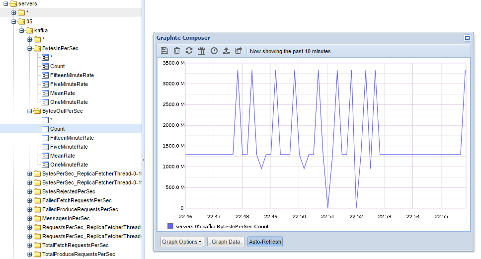

Working with Java or Scala, we probably already heard of JMX or already using it.
Most of us probably already use `jconsole` or `jvisualvm` to access the "JMX data", to get some insights about the internals of a Java process.

This article is a tentative to explain more globally what is JMX, and more importantly, what can we do with it? Is it simple? What are the existing integrations we can use? What is its ecosystem? Finally, we'll look at some awesome softwares, such as Kafka, how it is using JMX, and how we can plug ourselves into (alerting, monitoring).

---
Summary {.summary}

[[toc]]

---

# What is JMX?

It's a standard issued of the JSR 003 with an addon for the remote management and monitoring in the [JSR 160: JavaTM Management Extensions (JMX) Remote API](https://jcp.org/en/jsr/detail?id=160).


TODO

Oracle provides multiples tutorials, it's quite complete: https://docs.oracle.com/javase/8/docs/technotes/guides/jmx/tutorial/tutorialTOC.html.
    http://www.oracle.com/technetwork/java/javase/compatibility-417013.html
http://docs.oracle.com/javase/8/docs/technotes/guides/management/agent.html

http://docs.oracle.com/cd/E19698-01/816-7609/6mdjrf83l/index.html
http://docs.oracle.com/javase/7/docs/api/javax/management/MXBean.html


It provides a system to call method and update variables values on the fly (such as configuration flags).
Instead of having to restart an application when we update its configuration, with JMX, no need to restart anything.

It's a bit like [Archaius]() when you are using DynamicProperty and polling a database for changes, or when we use Zookeeper when some znode is created or is updated. JMX can also be used to directly call methods on MBeans.

## MBeans and MXBeans


Here, we are looking at the object `java.lang:type=Memory`.
The values we see in the screenshot are the exact as we can get in the code with:

```scala
val mem = ManagementFactory.getMemoryMXBean
mem.setVerbose(true)
mem.getNonHeapMemoryUsage.getUsed
mem.gc()
```

We can retrieve with its ObjectName but useless, because we just grab an instance of `ObjectInstance`, so we don't have any methods:

```scala
val obj = server.getObjectInstance(ObjectName.getInstance("java.lang:type=Memory"))
println(obj) // class javax.management.ObjectInstance
// behind it's a MemoryImpl but the visibility is package only
```

# How to use JMX?

## JMX Connectors

We can use:

- jconsole
- Java VisualVM
- Java Mission control

All three are packaged by default with the JVM installation and provide a connector to local or remote MBeans servers.

MBean Server (we register Managed Beans), it is the one that manage the objects and provides methods to register/unregister, invoke methods on the MBean.
The MBean Server is a JMX agent.

A MBean must have an object name composed of a _domain_ and key values pairs.

an interface with the "MBean" suffix is mandatory to be recognize and be able to register it into the JMX server.
Because we need get/set and we are working in Scala, we don't forget to annotate the properties with `@BeanProperty`.

MBean can be "standard", "dynamic", "open", or "model".


## Remote JMX

```bash
-Dcom.sun.management.jmxremote
-Dcom.sun.management.jmxremote.port=9010
-Dcom.sun.management.jmxremote.local.only=false
-Dcom.sun.management.jmxremote.authenticate=false
-Dcom.sun.management.jmxremote.ssl=false
-Djava.rmi.server.hostname=127.0.0.1
```


# Example: Kafka

Kafka exposes tons of MBeans.


We can retrieve and set the logging level of all the loggers, get the start/end offsets of each partitions, get metrics about elections, logs flushing, queues size, messages/bytes per seconds (globally, per topic), and so much more.


# Jolokia: JMX to HTTP

Jolokia is a Java agent used to expose JMX through HTTP (json), instead of using JMX Connectors (jconsole, Java Mission Control..).

A Java agent is some piece of code started when the JVM starts, that can instrument classes before the real application starts OR it can be plugged on any JVM application on the fly.{.info}

It supports attributes list, read, write, and methods execution. Jolokia simplifies how to use JMX because JSON through HTTP is way more accessible and can be used in any language. Jolokia [provides](https://jolokia.org/features/polyglot.html) some client libraries to simplify the flow (Java, Javascript (with jQuery, erk), Perl), but anything can query the HTTP endpoint, it's plain JSON.

The installation of Jolokia is quite straight-forward:

- We [download](https://jolokia.org/download.html) a `.jar` because we work with pure Java applications: [jolokia-jvm-1.3.5-agent.jar](http://search.maven.org/remotecontent?filepath=org/jolokia/jolokia-jvm/1.3.5/jolokia-jvm-1.3.5-agent.jar).
- We add `-javaagent` to the command line when we start Java to take our `.jar` into account ([it's also possible to start the agent on an already running JVM](https://jolokia.org/reference/html/agents.html#jvm-attach)). Configuring the command line can be done through the IDE project configuration or directly in `build.sbt` when we use `sbt run`:

```scala
fork in run := true
javaOptions += "-javaagent:jolokia-jvm-1.3.5-agent.jar=port=7777,host=localhost"
mainClass in (Compile, run) := Some("com.ctheu.JMXTest")
```

We'll get a log stating it's all good:
```xml
[info] I> No access restrictor found, access to any MBean is allowed
[info] Jolokia: Agent started with URL http://127.0.0.1:7777/jolokia/
```

Now, when we query `http://localhost:7777/jolokia/`, we get the agent version:
```js
{
    "request": {
        "type": "version"
    },
    "value": {
    "agent": "1.3.5",
    "protocol": "7.2",
    "config": {
        "maxDepth": "15",
        "discoveryEnabled": "true",
        ...
```

From there, we can list, read, or write any attributes and execute methods.

- List

When we are looking around:

```bash
http://localhost:7777/jolokia/list
# or a particular namespace
http://localhost:7777/jolokia/list/java.lang
# or particular attribute
http://localhost:7777/jolokia/list/java.lang/type=Memory/attr/HeapMemoryUsage
```

```js
{
    "request": { "type": "list" },
    "value": {
        "JMImplementation": {},
        "java.util.logging": {},
        "java.lang": {
        "name=PS Scavenge,type=GarbageCollector": {},
        "type=Threading": {},
        "name=PS Old Gen,type=MemoryPool": {},
        "type=Memory": {
            "op": { "gc": { "args": [], "ret": "void", "desc": "gc" } },
            "attr": {
                "ObjectPendingFinalizationCount": {},
                "Verbose": { "rw": true, "type": "boolean", "desc": "Verbose" },
                "HeapMemoryUsage": {
                    "rw": false,
                    "type": "javax.management.openmbean.CompositeData",
                    "desc": "HeapMemoryUsage"
                },
    ...
```

- Read

Perfect if we know what we are looking for.
The route to use when we want to monitor the metrics using a Monitoring System and have some nice charts.

```bash
http://localhost:7777/jolokia/read/java.lang:type=Memory
# or a particular attribute
http://localhost:7777/jolokia/read/java.lang:type=Memory/HeapMemoryUsage/used
```

```js
{
    "request": { "mbean": "java.lang:type=Memory", "type": "read" },
    "value": {
        "ObjectPendingFinalizationCount": 0,
        "Verbose": false,
        "HeapMemoryUsage": {
            "init": 268435456,
            "committed": 257425408,
            "max": 3814195200,
            "used": 59135648
        },
        "NonHeapMemoryUsage": {
            "init": 2555904,
            "committed": 17235968,
            "max": -1,
            "used": 16706800
        },
        "ObjectName": { "objectName": "java.lang:type=Memory" }
    },
    "timestamp": 1485728539,
    "status": 200
}
```

- Write

Let's say Jolokia has some MBeans that return these values:

```js
// http://localhost:7777/jolokia/read/jolokia:type=Config
{ "HistorySize": 82, "MaxDebugEntries": 100, "HistoryMaxEntries": 10, "Debug": false }

// http://localhost:7777/jolokia/list/jolokia/type=Config/attr/Debug
{ "rw": true, "type": "boolean", "desc": "Attribute exposed for management" }
```
We see `jolokia:type=Config > Debug` is writeable (`rw: true`) and we have its current value.


We can modify it with a classic GET (with the value at the end):
```xml
http://localhost:7777/jolokia/write/jolokia:type=Config/Debug/true
```
If we read it again:
```js
{ "HistorySize": 82, "MaxDebugEntries": 100, "HistoryMaxEntries": 10, "Debug": true }
```

- Method execution

There are already some existing MBeans in the JRE we can call:

```bash
http://localhost:7777/jolokia/exec/java.lang:type=Memory/gc
# or with arguments
http://localhost:7777/jolokia/exec/java.util.logging:type=Logging/setLoggerLevel/global/FINER
```

Those are truly useful when methods are doing complex operations. We can basically call any method remotely that will affect the process (or just return a result), thanks to JMX.


It's possible to do all those queries with POST when a GET is not enough to pass arguments properly (such as maps, arrays, complex types). GET has only a basic support of arrays based on the "a,b,c" notation.{.info}

Note that the agent has a lot of options available, we can get them by getting the help from the agent.jar itself:
```xml
$ java -jar jolokia-jvm-1.3.5-agent.jar --help
    ...
    --host <host>                   Hostname or IP address to which to bind on
                                    (default: InetAddress.getLocalHost())
    --port <port>                   Port to listen on (default: 8778)
    --agentContext <context>        HTTP Context under which the agent is reachable (default: /jolokia)
    ...
    --user <user>                   User used for Basic-Authentication
    --password <password>           Password used for Basic-Authentication
    --quiet                         No output. "status" will exit with code 0 if the agent is running, 1 otherwise
    --verbose                       Verbose output
    ...
```
As we can see, the endpoint security is builtin in Jolokia.
All the options are also listed on the [reference guide](https://jolokia.org/reference/html/agents.html#agents-jvm).

# Kamon and JMX

[Kamon](http://kamon.io/introduction/get-started/) is a delightful metrics framework written in Scala.

Without writting any code, Kamon can already provide some classic metrics (JVM, System), but it's mostly useful to create custom metrics to expose and measure the internals of our application (database latency, count of items, time to execute some code..).
The documentation is clear, the API is good and not overwhelming.

Kamon has a lot of features:

- Provides different types of metrics (counters, histograms..).
- Measures the time to execute any code block.
- Measures the `Future`s execution time.
- Measures the JVM and System metrics.
- Provides metrics about Executor Services (threads pools).

It also provides some plugins for specific frameworks: Akka, Play Framework, JDBC, Elasticsearch..

And finally, Kamon is able to send the metrics to tons of backends: _stdout_, StatsD, FluentD, ...JMX! The one we care about here.

http://kamon.io/backends/jmx/

Here is a complete example that simulate some gets and insertions into a database:

```scala
libraryDependencies ++= Seq("io.kamon" %% "kamon-core" % "0.6.5",
                            "io.kamon" %% "kamon-jmx" % "0.6.5")
```

```scala
object WithKamon extends App {
  Kamon.start()
  implicit val system = ActorSystem("with-kamon")
  implicit val ec = system.dispatcher
  val scheduler = system.scheduler

  val latency = Kamon.metrics.histogram("database-get-ms", Time.Milliseconds)
  val counter = Kamon.metrics.counter("inserted-records")

  scheduler.schedule(0 second, 10 millis)
                    (latency.record((math.random * 1000000).toInt + 100000))
  scheduler.schedule(0 second, 15 millis)
                    (counter.increment((math.random * 10).toInt))
}
```

Thanks to the JMX backend, we can check our metrics through JMX:


It can be very handy to, for instance, add some alerting (email, slack) if the database latency is greater than 1s or if the count of items is 0 while we don't expect this case.

Small tips: by default, Kamon sends the metrics to the backends every 10s. To change this interval, we can add `kamon.metric.tick-interval = 1 second` into our `application.conf`.{.info}

## Akka

A very nice Kamon plugin is [kamon-akka](http://kamon.io/integrations/akka/overview/).

Thanks to it, it's very easy to monitor the internals of any actors in the application (which is something not trivial).
It rely on a Java Agent that must be started with the JVM (to alter the bytecode).

Let's say we have a program with a main actor `PingActor` that sends a `Ping(i+1)` to 10 `PongActor`s that each reply with `i+1` to the unique `PingActor`:

```scala
case object Start
case class Ping(i: Int) extends AnyVal
case class Pong(i: Int) extends AnyVal

class PingActor(target: ActorRef) extends Actor {
  override def receive = {
    // The Ping(n) will be broadcast to all PongActors by the router
    case Start => target ! Ping(0)
    case Pong(i) => sender ! Ping(i+1)
  }
}
class PongActor extends Actor {
  override def receive = {
    case Ping(i) => sender ! Pong(i+1)
  }
}

object WithKamon extends App {
  Kamon.start()
  implicit val system = ActorSystem("with-kamon")

  val router = system.actorOf(BroadcastPool(10).props(Props[PongActor]), "routero")
  val pingo = system.actorOf(Props(classOf[PingActor], router), "pingo")
  pingo ! Start
}
```

We use a generic configuration to monitor all actors, dispatchers, and routers of the system:

```
kamon.metric.filters {
  akka-actor {
    includes = ["with-kamon/user/**", "with-kamon/system/**"]
    excludes = []
  }
  akka-dispatcher {
    includes = ["with-kamon/akka.actor.default-dispatcher"]
    excludes = []
  }
  akka-router {
    includes = [ "with-kamon/**" ]
    excludes = []
  }
}
```

Then, we can see the graal in our JMX connector:


We can find back our _routero_ router and _pingo_ actor and monitor their Akka internal state (mailbox, )

# Camel: ???

http://camel.apache.org/camel-jmx.html

# JMXTrans: Send JMX metrics to anywhere

JMXTrans is mostly a scheduler (based on [quartz](https://github.com/quartz-scheduler/quartz)) that pulls data from any JMX source and send them to one or multiple sinks (to store them and draw dashboards).

We just have to set some config file and start the application anywhere, it will try to connect to the sources and the sinks at a regular pace (1min by default).

I've created a repository [chtefi/jmxtrans-docker](https://github.com/chtefi/jmxtrans-docker) for this part, feel free to use it.{.info}

We can download JMXTrans here http://central.maven.org/maven2/org/jmxtrans/jmxtrans/263/, specifically the built distribution archive: [jmxtrans-263-dist.tar.gz](http://central.maven.org/maven2/org/jmxtrans/jmxtrans/263/jmxtrans-263-dist.tar.gz).

Then we can execute it:

```xml
$ tar zxvf jmxtrans-263-dist.tar.gz
$ java -jar jmxtrans-263/lib/jmxtrans-all.jar --help
```

The important options are:

```bash
-f, --json-file
-q, --quartz-properties-file
    The Quartz server properties.
-s, --run-period-in-seconds
    The seconds between server job runs.
    Default: 60
```
- `-f`: the main configuration to provide for JMXTrans to know which source and sink(s) to connect. It can contain multiple sources and multiple sinks. It's also possible to put several config file in a folder (`-j`).
- `-q`: if we want to specify some quartz properties.
JMXTrans has some defaults in the file `quartz-server.properties`.
Quartz has [tons of options](http://www.quartz-scheduler.org/documentation/quartz-2.2.x/configuration/) such as its threadpool config, listeners, plugins, misc thresholds.
- `-s`: to change the default 60s poll interval (`runPeriod`).

## Configuration

The configuration is what JMXTrans calls [Queries](https://github.com/jmxtrans/jmxtrans/wiki/Queries).

This is where we define the JMX sources and the sinks where we want to send the JMX values.

For instance, it can listen to the JMX data on `localhost:9010` and send the results to `stdout`:

```json
{
  "servers" : [{
    "port" : "9010",
    "host" : "localhost",
    "queries" : [{
      "outputWriters" : [{
         "@class" : "com.googlecode.jmxtrans.model.output.StdOutWriter"
      }],
      "obj" : "java.lang:type=OperatingSystem",
      "attr" : [ "SystemLoadAverage", "AvailableProcessors", "TotalPhysicalMemorySize",
                "FreePhysicalMemorySize", "TotalSwapSpaceSize", "FreeSwapSpaceSize",
                "OpenFileDescriptorCount", "MaxFileDescriptorCount" ]
    }],
    "numQueryThreads" : 2
  }]
}
```

JMXTrans will watch the given properties of the JMX "node" `java.lang:type=OperatingSystem`:

```c
Result(attributeName=SystemLoadAverage,
    className=sun.management.OperatingSystemImpl,
    objDomain=java.lang,
    typeName=type=OperatingSystem,
    values={SystemLoadAverage=-1.0},
    epoch=1485905825980,
    keyAlias=null)

Result(attributeName=FreePhysicalMemorySize,
    className=sun.management.OperatingSystemImpl,
    objDomain=java.lang,
    typeName=type=OperatingSystem,
    values={FreePhysicalMemorySize=5871636480},
    epoch=1485905825980,
    keyAlias=null)
...
```

If we had a custom Java application with custom JMX MBeans, we could use:
```
"obj": "com.ctheu:type=RandomMetrics",
```

## Monitoring the network

Send manually a metric value:
```
echo "com.ctheu.test 42 $(date +%s)" | nc 192.168.0.11 2003
```


To check if something is coming on the carbon port, we can use `ngrep`:
```xml
# ngrep -d any port 2003
interface: any
filter: (ip or ip6) and ( port 2003 )
####
T 172.17.0.1:54598 -> 172.17.0.2:2003 [AP]
  jakub.test 50 1486316847.
########
T 172.17.0.1:54600 -> 172.17.0.2:2003 [AP]
  jakub.test 56 1486316862.
####
```

## Using Kafka

Let's say we want to monitor our Kafka brokers, we can set our JMXTrans with this:

```js
{                                                                            
    "outputWriters": [{                                                                        
        "@class": "com.googlecode.jmxtrans.model.output.GraphiteWriterFactory",
        "port": "2003",                                                        
        "host": "192.168.0.11",                                                
        "flushStrategy": "always",                                             
        "typeNames": ["name", "clientId", "brokerHost", "brokerPort" ]         
    }],                                                                         
    "obj": "kafka.server:type=FetcherStats,*",                                 
    "resultAlias": "kafka",                                                    
    "attr": []                                                                 
},                                                                           
```

The `typeNames` are used when we are using the wildcard `*` to go deep into the hierarchy.
This will provides the hierarchy in the metrics name.

For instance, the complete `ObjectName` of one node is:
```
kafka.server:type=FetcherStats,name=BytesPerSec,clientId=ReplicaFetcherThread-0-109,brokerHost=hadoopmaster01.stg.ps,brokerPort=9092
```
As seen in jconsole:


In Graphite, we can now construct dashboards:




# The Swiss Java Knife: jvm-tools

Its GitHub repo: [jvm-tools](https://github.com/aragozin/jvm-tools)

It provides a fat-jar, [downloadable on bintray](https://bintray.com/artifact/download/aragozin/generic/sjk-plus-0.4.2.jar), containing different tools for Java.

The one that we care about here, is [mx](https://github.com/aragozin/jvm-tools/blob/master/sjk-core/COMMANDS.md#mx-command), to query our MBeans servers.


# Programmatically

Of course, it's possible to connect manually to the JMX agent through RMI and use the Java API to request the MBeans attributes and their values:

```scala
object JMXTestConnection extends App {
  val url = new JMXServiceURL("service:jmx:rmi:///jndi/rmi://localhost:9010/jmxrmi")
  val connector = JMXConnectorFactory.connect(url)
  val server = connector.getMBeanServerConnection()
  val all = server.queryMBeans(null, null)
  println(all.asScala.map(_.getObjectName)
                     .map(name => s"$name\n" + attributes(name)))

  // we can also call the JMX methods:
  server.invoke(ObjectName.getInstance("java.lang:type=Memory"), "gc", null, null)
  server.invoke(ObjectName.getInstance("com.ctheu:type=Data"), "change", Array(new Integer(18)), null)

  private def attributes(name: ObjectName) = {
    server.getMBeanInfo(name).getAttributes.toList.map(attribute(name, _)).mkString("\n")
  }

  private def attribute(name: ObjectName, attr: MBeanAttributeInfo) = {
    s"- ${attr.getName} (${attr.getType}) = ${attributeValue(name, attr)}"
  }

  private def attributeValue(name: ObjectName, attr: MBeanAttributeInfo) = {
    // it's possible getAttribute throws an exception, see the output
    Try(server.getAttribute(ObjectName.getInstance(name), attr.getName))
  }
}
```
The output looks like this:
```xml
Set(java.lang:type=MemoryPool,name=Code Cache
- Name (java.lang.String) = Success(Code Cache)
- Type (java.lang.String) = Success(NON_HEAP)
- CollectionUsage (javax.management.openmbean.CompositeData) = Success(null)
- CollectionUsageThreshold (long) = Failure(javax.management.RuntimeMBeanException: java.lang.UnsupportedOperationException: CollectionUsage threshold is not supported)
- CollectionUsageThresholdCount (long) = Failure(javax.management.RuntimeMBeanException: java.lang.UnsupportedOperationException: CollectionUsage threshold is not supported)
- MemoryManagerNames ([Ljava.lang.String;) = Success([Ljava.lang.String;@3ee0fea4)
...
```

We don't need `jconsole` or `jvisualvm` anymore, we can roll our own application.

This could be useful when an application wants to monitor another application or a pool of applications directly using JMX to retrieve some specific attributes, and act upon their values.

It's also possible the application to monitor itself, connecting to its own MBean server. Some values could be easier to catch there than using some third-party APIs, or when it's just impossible to grab elsewhere.

## Scala wrapper: jajmx

There is a library which implements the JMX API with some Scala wrappers: [jajmx](https://github.com/dacr/jajmx).
This way, no need of this Java non-sense (even if yes, it's not that complicated actually).

```scala
import jajmx._
val jmx = JMX()
import jmx._

mbeans.take(10).map(_.name).foreach(println)
```

Output:
```xml
java.lang:type=Memory
java.lang:type=MemoryPool,name=PS Eden Space
java.lang:type=MemoryPool,name=PS Survivor Space
...
```

It also provides some smart `sh` scripts to query any application with JMX and retrieve specific values, list threads, use filters..
Take a [look](https://github.com/dacr/jajmx)!

# Conclusion

JMX is a simple but powerful technology to expose any Java applications internals.

With Kamon to expose the application internals, some tools to regularly poll the values from JMX, and a backend to store them, it's possible to have some monitoring and alerting, with some pretty dashboard to display the evolution of any metrics. It's useful when we don't want our application to push its metrics somewhere (such as: Kamon to FluentD to Graphite), we can let any application pull them directly instead thanks to JMX.

The Jolokia project is perfect to expose the JMX MBeans values directly through HTTP, hence we are able to consume them with absolutely any application in any language.
