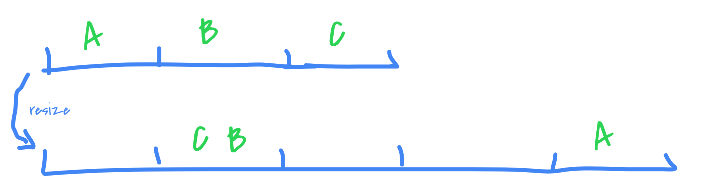
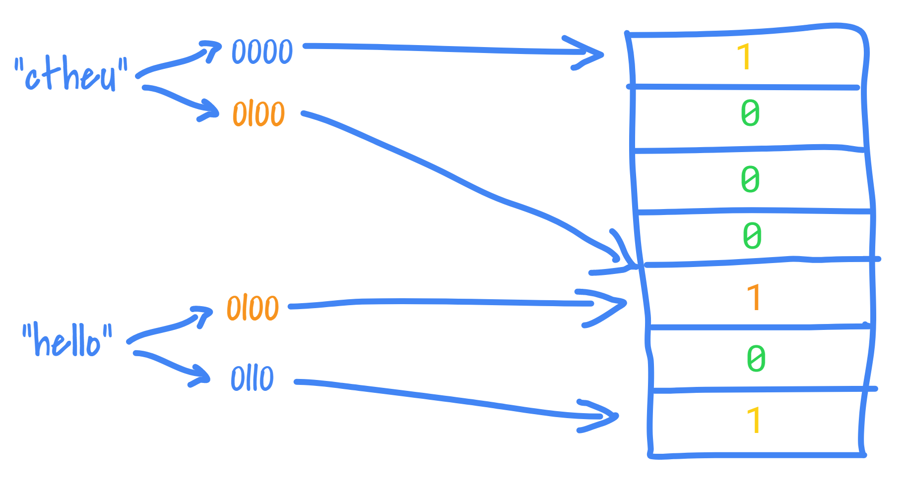
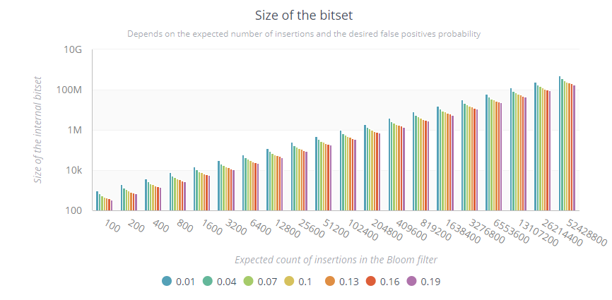

> "A hash function is any algorithm or subroutine that maps large data sets of variable length, called keys, to smaller data sets of a fixed length."

Basically:


Notice that a hash function is expected to have collisions (you could map N*2 keys into a space N (a _bucket_)) but its goal is to reduce them at the maximum while distributing (spreading) the hashes the most it can. Therefore, you can't just "go back" from a hash to its key, because a hash has an infinite number of corresponding keys.

"murmur" stands for multiply, rotate, multiply, rotate, because it's exactly what it does! Along some XORs and bit-shifting operations.
murmur3 is well-known hash function, largely used, because of its simplicity, speed, and features (good distribution, good avalanche effect).


It is used across several domains: ids generator, checksums, hash tables, bloom filters, hyperloglog.. anywhere you need to get a fairly unique fixed-length numerical ID (from anything, a string, some bytes[], an object) to be used inside those data-structures.

---
Summary {.summary}

[[toc]]

---

# Murmur3

murmur1 exists since 2008 and murmur3 is the 3rd version (better, stronger, faster!). It fixes some flaws of murmur2 and has a 128-bit variant for x64 processors (default is 32-bit encoding).

murmur3 is NOT a cryptographic hash function: meaning it MUST NOT be used when security is at stake. It's _easy_ for an attacker to provoke murmur3 collisions and use them at its advantage. (Hash Denial Of Service attack explained with... [cats](https://www.anchor.com.au/blog/2012/12/how-to-explain-hash-dos-to-your-parents-by-using-cats/)).


murmur3 is mostly used for lookups (in datastructures that supports it, such as hashtables, bloom filters etc.).

## Principle

As said, "murmur" stands for multiply, rotate, and actually XOR and bit-shifting operations.

It relies on:
- A seed, to start with. It is often customizable BUT it has to be carefully set because a different seed will lead to a different hash for the same key (hence careful of multi-threading environments etc.).
- Some fixed constants, determined empirically (through a simulated-annealing algorithm).

It's possible to give a try [online](http://murmurhash.shorelabs.com/). Note that the constants are different for both platforms x86 and x64, thus being the hashes (for a same key).

## Goals

- Simple and fast: it needs to use as few instructions as possible, while being as fast as possible and remaining statistically strong.
- Distribution: it needs to pass the Chi-Square distribution tests for all keysets and bucket sizes to ensure there is no correlation whatsoever and is similar to pure randomness. The hash space should be filled randomly.
- Avalanche Effect: when one bit in the key changes, at least half the bits should changes in the hash. It is to ensure the funtion has a good randomization and no forecast is possible (or hardly).
- Collision Resistance: a good hash function should almost never have collisions. In the 128-bit variant, the hash space is quite huge: 3.4028237e+38: it should be nearly impossible to have a collision. Moreover, 2 different keys should have only a random chance to collision, no more.

## Avalanche effect

As we know, murmur3 has a good avalanche effect.

When one bit in the key is flip, then at least half of the bits in the hash should change.

- Key: `0001` ⇨ `2484513939` (32-bit) / `e0f2f4fbd96bb1d5d96bb1d5d96bb1d5` (128-bit)
- Key: `0010` ⇨ `0019522071` (32-bit) / `9dd4f4e73df769b33df769b33df769b3` (128-bit)
- Key: `0011` ⇨ `0264741300` (32-bit) / `34164a823c142feb3c142feb3c142feb` (128-bit)

The _finalizer_ (or _bit mixer_) of a hash function takes care of the avalanche effect, it's the last part of the process.

In Scala, murmur3 is part of the standard library, and it's defined using the 32-bit finalizer (`Int`):

```scala
private final def avalanche(hash: Int): Int = {
  var h = hash
  h ^= h >>> 16
  h *= 0x85ebca6b
  h ^= h >>> 13
  h *= 0xc2b2ae35
  h ^= h >>> 16
  h
}
```

We can use it with different types of objects:
```scala
val hash: Int = MurmurHash3.stringHash("hello")
MurmurHash3.productHash((1, 2))
MurmurHash3.arrayHash(Array(1, 2))
MurmurHash3.bytesHash("hello".getBytes(Charset.forName("utf8")))
```

It's also possible to use Guava, which implements both 32-bit and 128-bit variant, with the 64-bit finalizer (`long`):

```java
private static long fmix64(long k) {
  k ^= k >>> 33;
  k *= 0xff51afd7ed558ccdL;
  k ^= k >>> 33;
  k *= 0xc4ceb9fe1a85ec53L;
  k ^= k >>> 33;
  return k;
}
```

Example of usages:

```scala
val m32 = Hashing.murmur3_32()
val m128 = Hashing.murmur3_128()
m32.hashBytes("hello".getBytes(Charsets.UTF_8)).asInt()
m128.hashBytes("hello".getBytes(Charsets.UTF_8)).asInt()
m128.hashString("hello", Charsets.UTF_8)
m128.hashInt(10)
case class Foo(a: Int)
m128.hashObject(Foo(2), (from: Foo, into: PrimitiveSink) => into.putInt(from.a))
```

The finalizers constants were determined through a simulated-annealing algorithm, but it seems possible to get slightly better results as shown [here](http://zimbry.blogspot.fr/2011/09/better-bit-mixing-improving-on.html) (by removing the random part).

Here is a small program to test the Avalanche effect (sure it can be simplified!).

It picks a random number, then alter one of its bits at each iteration. It does it 10M times and counts how many times it got more than 16 identical bits between the previous hash and the new hash (with the altered key), to know when the avalanche was not good enough:

```scala
val MAX_ITERATIONS = 1e7
val rnd = ThreadLocalRandom.current()
val start = rnd.nextInt()
val pows = (0 to 31).map(Math.pow(2, _).toInt)

def countIdenticalBits(a: Int, b: Int): Int = pows.count(p => (a & p) == (b & p))
def flipRandomBit(a: Int): Int = a ^ (1 << Math.pow(2, rnd.nextInt(32)).toInt)

// we need to convert out Int to bytes[]
def murmurize(a: Int): Int = MurmurHash3.bytesHash(ByteBuffer.allocate(4).putInt(a).array())

// Here we go
def test(threshold: Int) = {
  // we ignore the values we already count
  val seen = mutable.Set[Int]()

  @tailrec
  def testRecursive(iteration: Int, value: Int, count: Int): Int = iteration match {
    case MAX_ITERATIONS => count
    case _ =>
      val newValue = flipRandomBit(value)
      val sameBits = countIdenticalBits(murmurize(value), murmurize(newValue))
      val inc = if (!seen.add(newValue) && sameBits > threshold) 1 else 0
      testRecursive(iteration + 1, newValue, count + inc)
  }
  val belowThreshold = testRecursive(0, start, 0)
  println(s"At least ${belowThreshold*100/MAX_ITERATIONS}% got ${threshold} bits changed each time")
}

test(16)
```
If we test several thresholds, we get:

```c
At least 94.40439% got 10 bits changed each time
At least 91.22657% got 11 bits changed each time
At least 88.55292% got 12 bits changed each time
At least 76.26164% got 13 bits changed each time
At least 61.21793% got 14 bits changed each time
At least 46.18502% got 15 bits changed each time
At least 38.68463% got 16 bits changed each time
At least 30.15910% got 17 bits changed each time
At least 18.47003% got 18 bits changed each time
At least 10.37077% got 19 bits changed each time
At least 5.589840% got 20 bits changed each time
```

If we look at the threshold 16, it means that 38% of the hashes had more than half (32/2) of their bits changed.
"Only" 5% had more than 20 bits changed each time. The vast majority had always at least 10 bits changed.

Not sure it's normal to be this "low". Am I wrong somewhere? I would expect approx 100% for 16, because of the 50% probability that any bit can change in the hash.{.warn}

For instance, those 2 values have 1 bit altered (the 2nd), and the hashes have only 6 different bits, the avalanche was pretty bad:
```
-474549288 (11100011101101101111001111011000) => hash = 100101101101100111101100100110
-474549286 (11100011101101101111001111011010) => hash = 100111101001100111100101000111
                                          ^                 ^    ^          ^  ^^    ^
```

To take a closer look at the relations between the input bits and the output bits, [here is a good place](https://research.neustar.biz/tag/murmur-hash/). We can see clearly some patterns emerging among others hash functions but not with murmur3.

## Distribution and collisions

As we said, murmur3 is NOT a cryptographic hash function.

Hash DOS attacks can provoke murmur3 collisions and create slow hashtable lookups (O(n)) by making inserts into the same bucket (by generating tons of values with the same hash), thus making the service unstable.

The murmur3 distribution is "simili-random"; the Chi-Square distribution test is used to prove it.

To test the collisions, let's create our own "hash table", and insert tons of values inside. At the end, we'll check how many buckets with collision (several values inside) we have generated:

```scala
def murmurize(a: Long): Int = MurmurHash3.bytesHash(ByteBuffer.allocate(8).putLong(a).array())

val m = mutable.Map[Int, mutable.Set[Long]]()
(1 to 1000000).foreach { _ =>
  val r = rnd.nextLong() // we'll ignore the same random values
  val hash = murmurize(r)
  m.get(hash) match {
    case Some(v) => if (!v.contains(r)) m(hash) += r
    case None => m(hash) = mutable.Set(r)
  }
}

println(m.values.count(_.length > 1) + " buckets with collisions")
```

By inserting around 1M random numbers, we always get around ~100 buckets with collisions (with just 2 items inside), meaning 200 keys collided, from a base of 1M random Longs, thus 0.02%.

It was not that meaningful to test with random numbers, let's try with real data:

- [4M passwords](https://github.com/danielmiessler/SecLists/blob/master/Passwords/openwall_all.txt): No collision ✔
- [40k IPs](https://lists.blocklist.de/lists/all.txt): No collision ✔
- 2M file paths^[I indexed my system, the file containing all the path takes 220M!]: More than 400 collisions ✖

Those paths have the same hash for instance:
- `c:\Windows\SoftwareDistribution\Download\905d46ae330597577d57284aac989979\package_235_for_kb4032188~31bf3856ad364e35~amd64~~10.0.1.9.cat` and `c:\Windows\System32\msxml3.dll`
- `c:\Program Files\iTunes\CoreFoundation.resources\th.lproj\Error.strings` and `c:\Windows\SysWOW64\usbperf.dll`

## The Seed

We must be especially aware that in a multi-thread or distributed processes environment that need to get the same hash for a given key: they must use the same seed!

If the seed is different, the hash will be different, for the same key:


```scala
// def stringHash(str: String, seed: Int): Int
println(MurmurHash3.stringHash("helo", 42))
println(MurmurHash3.stringHash("helo", 1337))
// -1072944343
// -28494430
```

Most implementations provides a fixed seed (and NOT `System.currentTimeMillis()` for instance) but also generally provides a signature to set it manually.

# Use-cases

## Uniqueness

The simplest usage is probably to use it generate a shorter and mostly unique `String` or `byte[]` from a key (a random number, or a password for instance).

With murmur3, you know you'll end up with an int (32-bit variant) or 1 or 2 longs (128-bit variant).

```scala
println(MurmurHash3.stringHash("a"))
println(MurmurHash3.stringHash("myp@ssw0rd"))
println(Hashing.murmur3_128().hashString("myp@ssw0rd", Charset.forName("utf8")).asLong())
// -1454233464
// 2140328679
// 2589287969561030421
```

## Hash tables

A typical example is [memcached](https://github.com/memcached/memcached). It is using murmur3 as default hash function.

It's organized in buckets, or bins, or slots, which contain the values with the _same hash_.

- Actually, not really, otherwise we could end up with 2^32 buckets.
So instead of relying on the whole hash, they just rely on a few bits or apply a modulo, to derive a smaller hash.

It follows the [Pigeonhole principle](https://en.wikipedia.org/wiki/Pigeonhole_principle): the buckets can contain several values if all the buckets are filled. Generally, hash tables have a prime number of buckets, to prevent clustering and get a better distribution (when hashes are multiples of each other).

Note that most hash table implementations have a _load factor_ which determines when the number of buckets will "grow" (generally, it's set around 0.75). If the table capacity is at 75%, then it's triggered. When this happens, all the existing elements are either rehashed into a whole new table directly, or it's done incrementally with 2 tables in parallel (the old and the new one). This is to avoid having too many collisions after a while.



It's possible to get collisions after the resize, all depends on the formula used on the hashes to determine their new bucket (such as a modulo of the table length).

There is even a program called [gperf](http://savannah.gnu.org/projects/gperf/) that generates a perfect hash function (no collision) from a given set of keys.

## Term-Frequency
 
 - Spark's [HashingTF](https://github.com/apache/spark/blob/master/mllib/src/main/scala/org/apache/spark/mllib/feature/HashingTF.scala) (term frequency, in SparkML): every item of a document is hashed to count their occurrences (and not the word itself). It works with hashes because it's applies to ML features, which are numericals (only the hashes are used).

A simili algorithm would be:

```scala
val words = Source.fromFile("hamlet.txt", "UTF-8").getLines().flatMap(_.split(" ")).toList
val m = mutable.Map[Int, Int]()
words.foreach { w =>
  val hash = MurmurHash3.stringHash(w.toLowerCase)
  m.get(hash) match {
    case Some(v) => m(hash) = v + 1
    case None => m(hash) = 1
  }
}

println(m.toSeq.sortBy(_._2).reverse)
println("hugger-mugger: " + m(MurmurHash3.stringHash("hugger-mugger")))
println("hamlet:" + m(MurmurHash3.stringHash("hamlet")))
```
```
ArrayBuffer((126075915,1136), (1719789917,936), (721540542,728), (-1698111023,662), ...)
hugger-mugger: 1
hamlet: 400
```
We have no idea what are the top corresponding words here. But for a ML process (features), no need.

## HyperLogLog

HyperLogLog (HLL) is an algorithm to *estimate* the cardinality of a HUGE set of values (talking about hundreds of millions), and it depends on a hash function.

It's very efficient because it can be built without having the whole set in memory.
To do so, it relies on some smart observations at the binary level. All the detais in [the original paper](http://algo.inria.fr/flajolet/Publications/FlFuGaMe07.pdf).

> "the new algorithm makes it possible to estimate cardinalities well beyond 10^9
with a typical accuracy of 2% while using a memory of only 1.5 kilobytes."

- [Druid](druid.io) is using it to estimate the cardinality of the values of a column.
- [Hive](https://github.com/apache/hive) has a HLL operator to avoid using `COUNT(DISTINCT)`: `SELECT hll_approx_count(to_hll(user_id)) ...`
- [Redis](http://antirez.com/news/75) has a HLL type (`PF` as Philippe Flajolet): `PFADD var element element … element` and `PFCOUNT var`

## Bloom Filter

The bloom filter is a _space-efficient probabilistic data structure_ mostly used to know if an element was NOT already inserted. It's _like_ a `Set` but it does not contain the elements. Moreover, the result is not 100%-sure when asking if a given element was already inserted. 

When querying a Bloom filter for the presence of an element, the only responses are:
- _definitely not in_: no false negative possibles, it's 100% sure.
- _possibly in_: it can have false positives, not 100% sure.

When you insert an element to a Bloom filter:
- it is hashed several times (using `k >= 1` hash functions) and it's often murmur3 with different seeds.
- the structure (containing a fixed-size bit array of size `N`) sets some of its indexes derived from the hashes to 1 (because it is space-limited, it needs to apply a modulo on the hash or just take some bits into account).



We can use the Bloom filter to check if an element was NOT already inserted for sure: if at least one bit corresponding to one of its hash is NOT set in the structure, it means it was never recorded.

But it can't tell _for sure_ if it was inserted: because other elements could have set the same bits too. The Bloom filter only guarantees a certain probability (configurable with `k` and `N`)

Note that with a simple Bloom filter, we can't remove an element because its "1" bits could be shared with other elements.{.info}

The advantage is that it's a space-bound data-structure, inserts and lookups are `O(k)`, and we have some knobs to tune it, according to our use-case.

Having multiple hashes is necessary to avoid too many false positives: one hash function implies to check only one bit. With 2 hash functions, it needs to check 2 bits, therefore, there are less chance to have both set. The other extreme is not good neither, to have tons of hash functions means the bitset is going to be filled quickly of 1, therefore the rate of false positives is going to grow. It's a delicate equilibrium.

## Optimal number of bits

When we create a Bloom filter, we normally provide an _expected number of insertions_ and a desired probability of false positives.
A formula will then determine the size of the Bloom filter bitset. Here is the formula and a small generator to see the values:

```scala
def optimalNumOfBits(n: Long, p: Double): Long = {
  (-n * log(p) / (log(2) * log(2))).toLong
}

(1 to 20).fold(100) { (acc, _) =>
  Range.Double(0.01d, 0.2d, 0.03d).foreach { d =>
    println(s"$acc;$d;${optimalNumOfBits(acc, d)}")
  }
  acc * 2
}
```

Note that the y-axis is logarithmic:


Some raw values:

- If we expect to insert 100 elements, the Bloom filter needs 1000 bits to ensure 1% false positives max:
```
0.01 => 958
0.04 => 669
0.07 => 553
0.10 => 479
0.13 => 424
0.16 => 381
0.19 => 345
```

- If we expect to insert 1,6 billion elements, then the scale can grow a lot according to the false positive probability we want:
```
0.01 => 16,081,059,476
0.04 => 11,240,178,212
0.07 => 9,286,023,554
0.10 => 8,040,529,738
0.13 => 7,124,364,825
0.16 => 6,399,296,947
0.19 => 5,799,203,120
```
The Bloom filter will need between 5,8 billion of bits (725MB) for 19% of false positives, up to 16 billion (2GB) for 1% false positives.

[Guava](https://github.com/google/guava/wiki/HashingExplained#bloomfilter) provides a Bloom filter implementation:
```scala
// 50% of false positive rate just for this test ;-)
val bloom = BloomFilter.create[String](Funnels.stringFunnel(Charsets.UTF_8), 100000, 0.5)

val words = Source.fromFile("hamlet.txt", "UTF-8").getLines().flatMap(_.split(" ")).toList
words.foreach(bloom.put(_)) // insert every words into the Bloom filter

println(s"exact size:${words.distinct.size}")               // 7719
println(s"approx size: ${bloom.approximateElementCount()}") // 7721
println(bloom.mightContain("ctheu"))           // false
println(bloom.mightContain("Hamlet"))          // true
println(bloom.mightContain("Zzzzzzzzzzzzzzz")) // true (!)
println(words.contains("Zzzzzzzzzzzzzzz"))     // false
```

Last but not least, a Bloom filter is a serializable structure (this is often used to not start from 0 everytime), and is mergeable with other Bloom filters.

Tons of softwares implement Bloom filters:
- Elasticsearch uses it as a type of mapping, to speedup [cardinality aggregation](https://www.elastic.co/guide/en/elasticsearch/reference/current/search-aggregations-metrics-cardinality-aggregation.html).
- [Spark](https://spark.apache.org/docs/latest/api/scala/index.html#org.apache.spark.sql.DataFrameStatFunctions) provides one on the DataFrame/DataSet columns: `df.stat.bloomFilter("col", 1000, 0.03)` to get some stats and do some checks on them.
- CDNs to avoid caching one-time access items. You wait the 2nd access to cache it.
- Chrome to check if the urls are malicious (instead of saving tons of urls in a Set, we can just load a Bloom Filter from a fixed binary dump).
- PostgreSQL, HBase, Hive: is the value exist?

There are tons of variations and techniques around Bloom filters, enjoy: [https://en.wikipedia.org/wiki/Bloom_filter](https://en.wikipedia.org/wiki/Bloom_filter).

## Consistent Hashing

A last technique based on a hash function is the [Consistent Hashing](https://en.wikipedia.org/wiki/Consistent_hashing).

It's implemented on most distributed databases to distribute the data consistently (hence the name) when dealing with added/removed machines. Without it, when this happens all the keys would change of destination.

- [Cassandra is using murmur3](https://www.datastax.com/dev/blog/the-most-important-thing-to-know-in-cassandra-data-modeling-the-primary-key) to hash the partition key to determine where to send the data (which node and replicas).
- [Couchbase](https://blog.couchbase.com/scaling-memcached-vbuckets/) does the same with its vbuckets.
- Akka provides a [ConsistentHashingPool](http://doc.akka.io/docs/akka/current/scala/routing.html#consistenthashingpool-and-consistenthashinggroup) that uses a custom hash function.


# Other hash functions and benchmarks

There are tons and tons of other hash functions. murmur3 seems to not be the best overall (almost), but probably the most used?

Here is a non-exhaustive list:

- [xxHash64](https://github.com/Cyan4973/xxHash)
- [SpookyHash](http://burtleburtle.net/bob/hash/spooky.html)
- [SipHash](https://github.com/veorq/SipHash)
- [Jenkins lookup3](https://github.com/lgastako/jenkins)
- [SuperFastHash](http://www.azillionmonkeys.com/qed/hash.html)
- [CityHash](https://github.com/google/cityhash)
- [Metro](https://github.com/jandrewrogers/MetroHash)
- [FNV1/1a](https://en.wikipedia.org/wiki/Fowler%E2%80%93Noll%E2%80%93Vo_hash_function)
- [MUM](https://github.com/vnmakarov/mum-hash)

We can find more at [Wikipedia](https://en.wikipedia.org/wiki/List_of_hash_functions#Non-cryptographic_hash_functions).

The home for the murmur hash functions is https://github.com/aappleby/smhasher.
It contains performance benchmarks, distribution tests, collisions tests. People have fork it https://github.com/rurban/smhasher to compare more and more functions.

This post is algo very good because it visualises the randomness of the distribution of several hash functions:
https://softwareengineering.stackexchange.com/questions/49550/which-hashing-algorithm-is-best-for-uniqueness-and-speed
