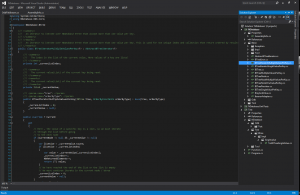
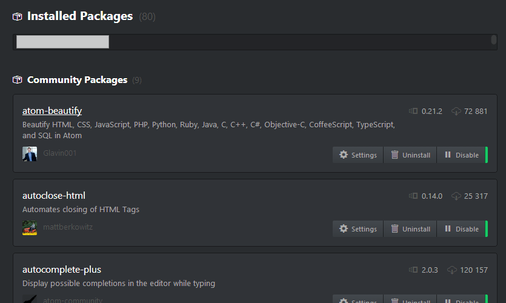
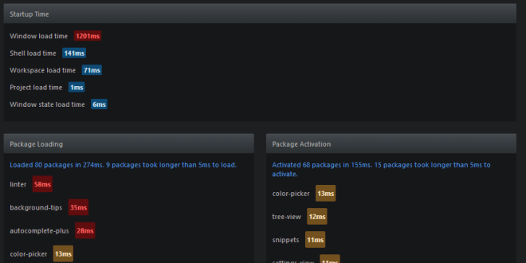
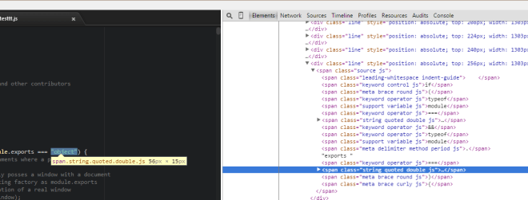

The world of text editors was a bit frozen until GitHub released a new kind of editor, based on the web technology: Atom!

What does it bring? Is it fast? Is it for everyone? Let's take a look.

---
Summary {.summary}

[[toc]]

---

# Changing habits

{.fr} I'm used to work on **Visual Studio 2013**, which is a very good IDE.

It handle frontend and backend projects, can deal with a lot of files, uses TFS as source control, has an interface to merge files, has the ability to drag & drop in the files treeview, display images without going back to the explorer, has a lot of refactoring options and so much more. It just works flawlessly and the interface is quite responsive^[Except when some background process occurs and you're good to force close it and restart, that's faster.].

I wanted to make some new light websites, I asked myself : *Should I use Visual Studio to make them ?*

It was not feeling right. Visual Studio to handle 2/3 pages and some images/scripts ? Seems overkilled. I decided to look around for a cool editor. A lot existed but I never feel them right.

Moreover, I often used [Notepad++](http://notepad-plus-plus.org/) to edit any files quickly, but it was not enough. I was using it as a syntax highlight editor, and as a mass replacer (with regexes), not more. I've never used any other functions. _Did you ?_

# Atom!

I have an account on Github I barely use^[In 2016, this has totally changed! I'm using it like every day.] but still, a lot of projects I'm working with come from there.

I was aware of some cool other applications from Github such as [gitter.im](https://gitter.im/), and especially [Atom](https://atom.io/) since a while. I thought it was not mature enough for me to use it (it was just the beginning, let's wait for the people to beta test it !).

But a few months passed, so I decided to give a try. I don't regret it.

It's not a true project manager yet but it's getting there. And I'm sure there are plugins to make it so.

{.fr}

Atom is a big plugins/packages manager on its core. It comes automatically with dozen of them that we will need for misc purposes :

- find and replace
- go to line
- syntax highlighting (all the `language-*` packages)
- displays files in a treeview
- image viewer
- settings panel
- notifications inside Atom
- snippets management 

As we can see, there are some basic packages in there. If we disabled them, we have a true naked text editor à la Notepad. (see below)

Hopefully, this is not the goal. I have 80 installed packages currently.

Each plugin adds a tiny piece of logic. The community is very active, and offers more and more quality plugins.

Most of them are dynamically removed/added on the fly, no need to confirm or restart the editor, that's pretty impressive.

It can be infortunate to disable some of them, such as the `settings-view` one, while we are in the settings. If we do: the whole style is destroyed. We need to edit `.atom/config.cson` and remove the package from the `disabledPackages` array. And hop, the settings are back directly in Atom. 

# Experience: A naked Atom

As we said, we can disable everything to have only the core features from Atom itself:

This is notepad!

- we can edit a file with `File > Open`
- some super basic text editor features (delete a line, uppercase/lowercase..)
- can split panes
- an Atom theme (still need the settings to access it)
- help
- ... that's it.

We can't look for text, no syntax highlighting, no special panel, no toolbar, no options: just a super fast Notepad.

As we see, not everything is in a plugin for some reason (the split pane could have been a plugin, the text editor functions too..).

When it's time to enable back every packages, just clear the `disabledPackages` array in `.atom/config.cson`.

[[info]]
|Notice that it's not true JSON, there is no comma, no need of {} for subobjects etc.

We can find the list of packages at <https://atom.io/packages> or using Atom : `Packages > Settings View > Manage Packages`. 

# What about the performances ?

It's very fast when we edit multiple files, they really work hard on that.

There is a package pre-installed to check if Atom loads fast enough: **Timecop**.

It tells us the time the packages needs to load on startup and if some of them are taking more time than expected.

But unfortunately, right now, nothing more (no live stats):

Because we can *work* with big files (js bundles, logs), I tried to different types of big files to see how it goes, and it's not that great:

- one json extraction on one line, 500k characters (520kB): it was very slow to open it and move inside. (using Notepad++ it was fast enough, native eh?)
- `jquery.js` source (non minified), 10k lines (278kB): it was very slow to copy/paste inside (about 20s). Editing was fine. It was pretty fast (*2s*) to open the saved file too. So it seems it's only the paste feature that has some difficulties with big buffers.
- More than 2MB files : we got a nice notification : *Atom can only handle files < 2MB for now. Large file support is being tracked at atom/atom#307.* (the issue was closed in Jun 2015)

At the process level, with a few dozen of files opened, it took 250MB max (application + 4 background processes).

Notepad++, as a native application, 20MB.

We can see the big cons with web applications on desktop (performances, memory usage).

# HTML on Desktop

Atom is a web application running on a desktop. It encapsulates a webkit rendering engine.

[[info]]
|We can get access the devtools using `View > Developer > Toggle Developer Tools` and see that everything is html/css/js !

Thanks to this, anybody (that knows javascript) can easily extend the software, write plugins, and be cross-platform.

It has its drawbacks too: it takes a lot of space (that's not really a problem anymore with our 2TB disks), a lot of memory, and is not as performant as a native application.

Atom is based on [atom-shell](https://github.com/atom/atom-shell) which has been renamed to the famous [Electron](https://github.com/electron/electron) because it is now a general framework to write any kind of desktop web applications.

> Electron lets us write cross-platform desktop applications using JavaScript, HTML and CSS. It is based on NodeJS and Chromium and is used by the Atom editor and many other apps.

It's still actively under development, sure they will enhance speed^[Since this writing Feb 2015, they work on it and did a great job] and add powerful features Atom will benefit from.

Interested in Atom? They have a nice blog to learn more things: http://blog.atom.io/

They are a lot of packages I didn't mentioned. I didn't even talked about the themes, the git integration, and about some nice packages to have such as :

- atom-beautify: beautify the code
- autocomplete-plus: what would we do without autocomplete?
- auto-indent: same here
- language-generic-config: syntax highlight in configuration files
- minimap: a large scrollbar with the code preview inside (à la Visual Studio)

Go grab it: https://atom.io/

[[info]]
|2016: Since, I switched to Sublime Text (native, way faster), and Visual Studio Code (a web application also, with wonderful integrations, less hacky).