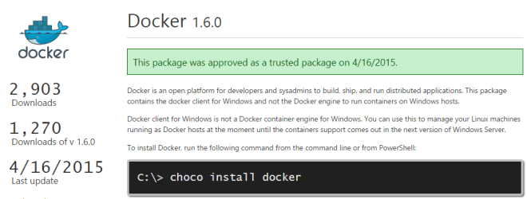
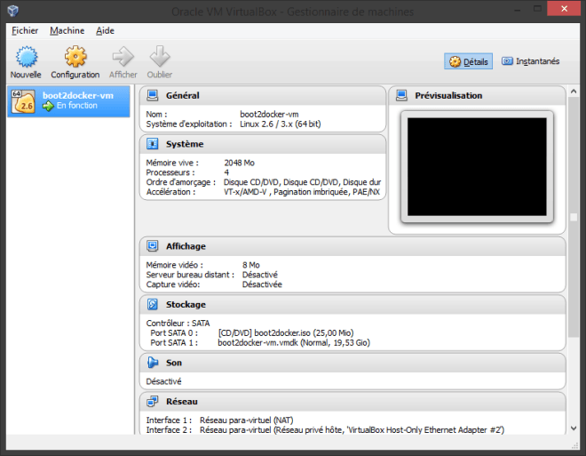
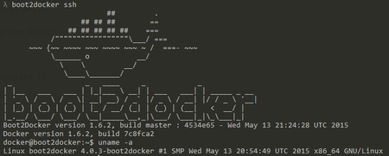
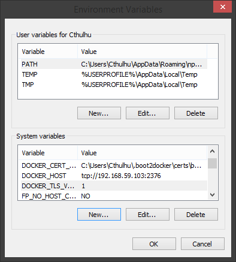
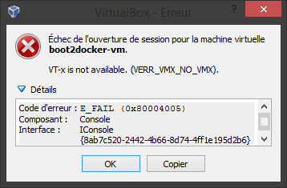
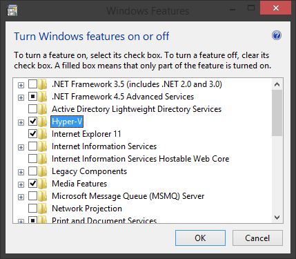

TOC

# Installer le client Docker via Chocolatey

Après avoir joué un peu avec [boot2docker](http://boot2docker.io/) il y a quelques temps pour pouvoir tester Docker et lancer quelques hello-world, je suis tombé sur une news comme quoi une équipe avait réussi à le faire compiler sous Windows.

Il était possible de *le* récupérer via [chocolatey](https://chocolatey.org/packages/docker) et de *l*'installer simplement et magiquement à la Unix : `choco install docker`.



*Le* : comme *Le* client Docker, **pas** le moteur de conteneurs Docker qui lui, est encore exclusivement disponible sous un environnement Linux.

Le client ne fait que se connecter à ce moteur.

# Installer boot2docker pour le moteur Docker

Sous Windows, il faut donc toujours une machine Linux quelque part faisant tourner le moteur de conteneur Docker : c'est ce quoi à sert [boot2docker](http://boot2docker.io/). Il installe en fait [virtualbox](https://www.virtualbox.org/) et y créé une machine virtuelle :



Normalement, rien ne sert d'ouvrir VirtualBox pour jouer avec la VM. Les commandes de boot2docker s'en occupent:

```xml
init                Create a new Boot2Docker VM. 
up|start|boot       Start VM from any states. 
ssh [ssh-command]   Login to VM via SSH. 
save|suspend        Suspend VM and save state to disk. 
down|stop|halt      Gracefully shutdown the VM. 
restart             Gracefully reboot the VM. 
poweroff            Forcefully power off the VM (may corrupt disk image). 
reset               Forcefully power cycle the VM (may corrupt disk image). 
delete|destroy      Delete Boot2Docker VM and its disk image. 
config|cfg          Show selected profile file settings. 
info                Display detailed information of VM. 
ip                  Display the IP address of the VM's Host-only network. 
shellinit           Display the shell commands to set up the Docker client. 
status              Display current state of VM. 
download            Download Boot2Docker ISO image. 
upgrade             Upgrade the Boot2Docker ISO image (restart if running). 
version             Display version information.
```

Les principales commandes étant :

- `init` : créer la VM
- `start`/`stop`
- `ssh` : se connecter à la VM pour avoir accès à son shell
- `upgrade` : à faire de temps en temps pour mettre à jour la VM si mise à jour il y a. 



Pour rappel, installer le client de chocolatey n'est pas requis pour utiliser Docker sous Windows.

Il y a déjà un client Docker dans la VM installé par boot2docker.
Il suffit de s'y connecter via `boot2docker ssh` et d'utiliser les commandes `$ docker run hello-world`.

Le client de chocolatey permet de se passer de cette étape, et d'utiliser les commandes docker directement sous votre shell Windows (cmd, powershell, cmder..). 

# La connexion entre les deux

On commence par s'assurer que la VM de boot2docker est en train de tourner.
```
> boot2docker up Waiting for VM and Docker daemon to start... 
............................ooooooooooooooooooooooo 
Started. 
Writing C:\Users\Cthulhu\\.boot2docker\certs\boot2docker-vm\ca.pem 
Writing C:\Users\Cthulhu\\.boot2docker\certs\boot2docker-vm\cert.pem 
Writing C:\Users\Cthulhu\\.boot2docker\certs\boot2docker-vm\key.pem 

To connect the Docker client to the Docker daemon, please set: 
    export DOCKER_HOST=tcp://192.168.59.103:2376 
    export DOCKER_CERT_PATH='C:\Users\Cthulhu\\.boot2docker\certs\boot2docker-vm' 
    export DOCKER_TLS_VERIFY=1
```

Une fois up, il vous exécuter les lignes indiquées pour que le client Chocolatey puisse se connecter au daemon Docker sur la VM.

Si vous n'exportez pas ces variables, vous rencontrez ce genre d'erreur :

```
> docker run hello-world
FATA[0000] Post http:///var/run/docker.sock/v1.18/containers/create: 
dial unix /var/run/docker.sock: An address incompatible with the requested protocol was used.. 
Are you trying to connect to a TLS-enabled daemon without TLS?
```

En gros, cela permet au client Docker de savoir où est la VM via son IP et où est le certificat pour s'y connecter via TLS.

Vous pouvez revoir ces variables via la commande `shellinit` :

```
> boot2docker shellinit 
Writing C:\Users\Cthulhu\\.boot2docker\certs\boot2docker-vm\ca.pem 
Writing C:\Users\Cthulhu\\.boot2docker\certs\boot2docker-vm\cert.pem 
Writing C:\Users\Cthulhu\\.boot2docker\certs\boot2docker-vm\key.pem 
    export DOCKER_HOST=tcp://192.168.59.103:2376 
    export DOCKER_CERT_PATH='C:\Users\Cthulhu\\.boot2docker\certs\boot2docker-vm' 
    export DOCKER_TLS_VERIFY=1
```

En mode Windows, cela donne : 

```
> set DOCKER_HOST=tcp://192.168.59.103:2376
> set DOCKER_CERT_PATH=C:\Users\Cthulhu\\.boot2docker\certs\boot2docker-vm
> set DOCKER_TLS_VERIFY=1
```

Une fois cela fait, un petit test histoire de voir que tout va bien : 

```
> docker run hello-world
Unable to find image 'hello-world:latest' locally
latest: Pulling from hello-world

a8219747be10: Pull complete ================================================>] 596 B/596 BB 
91c95931e552: Already exists ===============================================>] 32 B/32 BB 
hello-world:latest: The image you are pulling has been verified.
                    Important: image verification is a tech preview feature and should not be relied on to provide security.
Digest: sha256:aa03e5d0d5553b4c3473e89c8619cf79df368babd18681cf5daeb82aab55838d 
Status: Downloaded newer image for hello-world:latest 
Hello from Docker. 
This message shows that your installation appears to be working correctly ...
```

N'oubliez pas de donner une valeur à ces variables au démarrage de votre shell à chaque fois, via un `.bashrc` si vous avez, ou via les variables d'environnement Windows :



# Les erreurs rencontrées

## Mode de virtualisation

Si, quand vous lancez la VM dans VirtualBox, si vous obtenez cette erreur : 

```
VT-x is not available (VERR_VMX_NO_VMX)
```



Ou si en utilisant boot2docker, vous obtenez, peu importe la commande, cette erreur :

```
error in run: Failed to start machine "boot2docker-vm": exit status 1
```

Vérifiez que Hyper-V ne soit PAS activé dans vos *Windows Features*, sinon désactivez-le, et redémarrer Windows pour que cela soit pris en compte. 



Plus rarement —car toujours activé de nos jours— et que je n'ai pas testé, j'ai également lu qu'il faut s'assurer que la virtualization  VT-x soit activée dans votre BIOS (généralement dans un menu `Advanced > CPU`). 

## Mode administrateur

Si vous avez des erreurs bizarre comme quoi la VM n'existe pas alors qu'elle est bien là : 

```
> boot2docker -v ssh
Boot2Docker-cli version: v1.6.2 
Git commit: cb2c3bc 
2015/05/17 23:01:24 executing: C:\Program Files\Oracle\VirtualBox\VBoxManage.exe showvminfo boot2docker-vm --machinereadable 
error in run: Failed to get machine "boot2docker-vm": machine does not exist (Did you run `boot2docker init`?) 

> boot2docker init 
error in run: Failed to initialize machine "boot2docker-vm": exit status 1
```

Pourtant, la VM est bien là !

```
> ls "VirtualBox VMs\boot2docker-vm\
Logs boot2docker-vm.vbox boot2docker-vm.vbox-prev boot2docker-vm.vmdk
```

N'oubliez pas de lancer votre shell ou votre gestionnaire VirtualBox en mode **administrateur** ! Testé et approuvé.