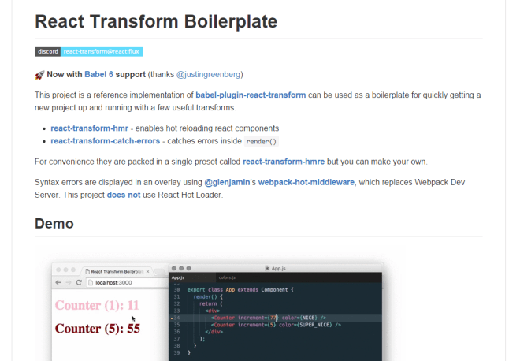

Nowadays, working with ReactJS/webpack boilerplates, the Hot Reloading piece is already included and we can enjoy it. It's not yet in [`create-react-app`](https://github.com/facebookincubator/create-react-app) but that won't take long I think.

We are going to explain what's going on under the hood, and how the different projects/plugins used for HR are working together: webpack expressjs middlewares, `react-transform`, `react-hot-loader`.

We are going to use the *latest* React HR project in date [`react-transform-hmr`](https://github.com/gaearon/react-transform-hmr) and not the previous one [`react-hot-loader`](https://github.com/gaearon/react-hot-loader) which has been sentenced to the maximum penalty : [the-death-of-react-hot-loader](https://medium.com/@dan_abramov/the-death-of-react-hot-loader-765fa791d7c4). RHL is still working properly but you know that the Javascript community is always on the bleeding edge side.

`react-transform-hmr` is deprecated since, and `react-hot-loader` v3 is on the edge and is already working.
We can see it in action in a previous update of mine: [Using react-hot-loader with webpack](http://localhost:8000/2015/05/14/using-react-hot-loader-with-a-webpack-dev-server-and-a-node-server/#react-hot-loader-v3).


# Why should we enjoy Hot Reloading?

In one word : **productivity**. In another word : **DX** (Developer eXperience).

- We broke our F5 key years ago, we can't refresh anymore
- We don't want to develop blindly, then refresh, then try again. It's a backend thing. We have a UI, it's alive.
- We don't want to lose our application state (by doing a full refresh) if we just fixed a typo or a color. 
- HR can instantly display our compilation and runtime errors directly in the browser, at the exact spot in the UI where it's being used.
- HR works with Javascript, CSS, anything. We'll just focus on React components here.
- There is no caveat: it will work forever without any modifications. Its integration is easy and does not impact many files.

For more reasons, read the intro of [Using react-hot-loader with webpack](http://localhost:8000/2015/05/14/using-react-hot-loader-with-a-webpack-dev-server-and-a-node-server).

OK, I lied about the caveats. There is one with `react-transform-hmr`: it does not handle the [ReactJS stateless functional components](https://facebook.github.io/react/blog/2015/10/07/react-v0.14.html#stateless-functional-components). BUT, `react-hot-loader` v3 [does now](http://localhost:8000/2015/05/14/using-react-hot-loader-with-a-webpack-dev-server-and-a-node-server/#react-hot-loader-v3).


# What packages to install to use HR

Let's suppose we already have a base project using:

- webpack: to compile our Javascript bundle(s).
- ReactJS: for our frontend of course.
- a nodejs server: runs a HTTP server based on expressjs to serve our static content (html, js, css..).

## webpack already exposes an HR API

webpack is the main actor dealing with the HR.
It exposes an API to process some parts of the HR pipeline.

We just need to add some wrapper around to use its API, and some more logic to manage the specific React components state: *we don't want to lose the current state of our components* when we change something in a Javascript file (a style, some constant, a prop, add a React component inside an existing one etc.).

## We just need some HR wrappers

We will install 4 packages : 2 for webpack, 2 for React:

- [webpack-dev-middleware](https://github.com/webpack/webpack-dev-middleware):
  - An expressjs [middleware](http://expressjs.com/en/guide/using-middleware.html), where requests are passed on.
  - It automatically watches the sources for changes to recompile the Javascript bundle.
  - It always serves the bundle up to date.
- [webpack-hot-middleware](https://github.com/glenjamin/webpack-hot-middleware):
  - An expressjs [middleware](http://expressjs.com/en/guide/using-middleware.html), where requests are passed on.
  - It automatically subscribes to the bundle recompilation events (*start*, *done*), to notify the frontend that something has changed and that it needs to update itself.
  - It uses [SSE](http://www.html5rocks.com/en/tutorials/eventsource/basic) to communicate with the frontend.
- [babel-plugin-react-transform](https://github.com/gaearon/babel-plugin-react-transform):
  - It can add any code around React components methods. It works with `babel-loader` we generally have configured in our webpack's config:
  
  ```js
    loaders: [{
        test: /\\.js$/,
        loader: 'babel-loader',
        include: path.join(__dirname, 'src')
    }, ...]
  ```
- [react-transform-hmr](https://github.com/gaearon/react-transform-hmr):
  - it is used with `babel-plugin-react-transform` to add specific HR code around the React components. 

That gives us :

```xml
$ npm install --save-dev webpack-dev-middleware webpack-hot-middleware \
                         babel-plugin-react-transform@beta react-transform-hmr
```
[[info]]
|2015-12-28: we explicitely ask for the beta (>=2.0.0) of `babel-plugin-react-transform` because the latest published version does not work with Babel 6 yet. But work has been done and is just waiting to be merged.
 
## How to configure Babel with HR

We need to configure Babel `.babelrc` to use `babel-plugin-react-transform` and `react-transform-hmr` to add the HR code around them:

```json
{
  "presets": ["react", "es2015"],
  "env": {
    "development": {
      "plugins": [
        ["react-transform", {
          "transforms": [{
            "transform": "react-transform-hmr",
            "imports": ["react"],
            "locals": ["module"]
          }]
        }]
      ]
    }
  }
}
```

- We add the transform `babel-plugin-react-transform` when `NODE_ENV`=`development` only.
- This transform retrieves all the ReactJS components it can find in the source code.
- It passes them on to each of the processors defined in `transforms` to let them add their custom code. (`react-transform-hmr` will some HR code)
 
For the record, `babel-plugin-react-transform` handles as many `transforms` as we want.
They are just going to be called right after each other, eg:

```json
{
  "presets": ["react", "es2015"],
  "env": {
    "development": {
      "plugins": [
        ["react-transform", {
          "transforms": [{
            "transform": "react-transform-hmr",
            "imports": ["react"],
            "locals": ["module"]
          }, {
            "transform": "react-transform-catch-errors",
            "imports": ["react", "redbox-react"]
          }]
        }]
      ]
    }
  }
}
```

The ReactJS component code will pass through `react-transform-hmr`, then through `react-transform-catch-errors`.
Each of them will add its code around each components.

As a note, `react-transform-catch-errors` is used to catch errors that are thrown in the `render()` method of the React components. It's using its `imports` property to redirect the error to another React component. Here `redbox-react` displays a big red screen of the death with the stacktrace, but it could be anything else.

Technically, `react-transform-catch-errors` just adds `try { render() } catch (e) { ... }` around the original `render()` method of the components. In the `catch`, it returns the React component we gave in `imports`.

Our React code is ready to handle HR.
We now have to make the server communicate with the browser about code updates.

# Handle server/client communication to send/receive HR updates

## Bundle recompilation on the fly

First, we need to make the server aware that the source code has changed to recompile the bundle, and then notify the browser.
That's the role of `webpack-dev-middleware` and `webpack-hot-middleware`.

- `webpack-dev-middleware` will automatically start to watch the source code for changes and recompile the bundle.
- `webpack-hot-middleware` will be notified a new bundle is compiled and will notify the browser.

They are expressjs middlewares, we just need to plug them:

```js
var express = require('express');
var webpack = require('webpack');
var path = require('path');
 
var webpackDevMiddleware = require("webpack-dev-middleware");
var webpackHotMiddleware = require("webpack-hot-middleware");
var webpackConfig = require('../webpack.config');
 
var app = express();
 
var compiler = webpack(webpackConfig);
app.use(webpackDevMiddleware(compiler));
app.use(webpackHotMiddleware(compiler));
app.use(express.static('src'));
 
app.listen(3000);
```

We have some process that notify the browser it must update some part of the application.

But how is the browser going to handle the updates ? It's where webpack itself rises.

## Browser live update

We need to add some code client-side to handle the update. HR is not browser native or anything.

To inject some code that will handle HR client-side, we will add another entry to the webpack bundle `entry`, to add another root edge to the dependency graph.

```js
entry: [
  'webpack-hot-middleware/client',
  path.join(__dirname, 'src', 'App.js'),
]
```

[[info]]
|`webpack-hot-middleware/client` refers to the file `node_modules/webpack-hot-middleware/client.js`.

It contains the code that will be used in the browser to handle the SSE communications from the server (the update notifications).

We need to add a specific webpack internal plugin `HotModuleReplacementPlugin` to expose the generic webpack HR API in the browser, that will be used by this code:

```js
plugins: [
  new webpack.optimize.OccurenceOrderPlugin(), // recommanded
  new webpack.HotModuleReplacementPlugin(),
  new webpack.NoErrorsPlugin() // recommanded
]
```

Technically, the code from `webpack-hot-middleware/client` will call `module.hot.apply(...)` provided by the `HotModuleReplacementPlugin`.

## A boilerplate on github

You can checkout [gaearon/react-transform-boilerplate](https://github.com/gaearon/react-transform-boilerplate) to give a try.
More options are being used but nothing fancy.

You can notice its `.babelrc` is using [`react-hmre`](https://github.com/danmartinez101/babel-preset-react-hmre) instead of our two transforms packages (`babel-plugin-react-transform` and `react-transform-hmr`). It's exactly the same: `react-hmre` is just a plugin that encapsulates them both.



## react-hot-loader v3

Update.

It appears that `babel-plugin-react-transform` is now deprecated and `react-hot-loader` is rising from its ashes.
I'll quickly go through what we already explained in a previous article [Using react-hot-loader with webpack#react-hot-loader-v3](https://www.sderosiaux.com/2015/05/14/using-react-hot-loader-with-a-webpack-dev-server-and-a-node-server/#react-hot-loader-v3).

In order to use it, we simply cleanup our config by removing the references to `babel-plugin-react-transform` in `.babelrc` and `package.json`.
The webpack plugins stay, there are not related to React in particular.

We install the latest version of `react-hot-loader`:

```xml
npm install --save-dev react-hot-loader@next
```

Then, we update our `webpack.config.js` to inject some code into the bundle and around our React components:

```diff
    entry: [
+       'react-hot-loader/patch',
        'webpack-hot-middleware/client',
        './src/index.js',
    ],
    loaders: [{
        test: /\.js$/,
+       loaders: ['react-hot-loader/webpack', 'babel-loader'],
        include: path.join(__dirname, 'src'),
    }]
```

Instead of adding this loader, we can just replace our previous `.babelrc` plugin `react-transform` by `react-hot-loader/babel`:

```
"plugins": ["react-hot-loader/babel"]
```
[[info]]
|It's not necessary anymore to wrap it into `"env": { "development": { "plugins": [ ... ] } }` because the code itself checks for `NODE_ENV` and noop if it's `"production"`, but I would consider to add it anyway, because the intention is more clear.

Finally, we must change our `index.js` to wrap our application into a new `AppContainer` of `react-hot-loader` and handle the call to the HR API ourself:

```diff
 import React from 'react'
 import ReactDOM from 'react-dom'

+import { AppContainer } from 'react-hot-loader'
 import App from './App.js'

 ReactDOM.render(
-   <App>
+   <AppContainer><App></AppContainer>
    document.getElementById('app'));

+if (module.hot) {
+  module.hot.accept('./App', () => {
+    const NextApp = require('./App').default
+    // const NextApp = require('./App') or this one! Depends how the component is exported
+    ReactDOM.render(
+      <AppContainer><NextApp /></AppContainer>,
+      document.getElementById('app')
+    )
+  })
+}
```

We can find way more information in the PR itself: [react-hot-loader#240](https://github.com/gaearon/react-hot-loader/pull/240/files) and the next [README](https://github.com/gaearon/react-hot-loader/blob/next/docs/README.md).


# Under the hood

## webpack-dev-middleware is optional, but...

Without `webpack-dev-middleware`, we just need to start the webpack watch ourself:

```js
var webpackConfig = require('../webpack.config');
var compiler = webpack(webpackConfig);
// app.use(webpackDevMiddleware(compiler));
// we can replace webpack-dev-middleware by a simple watch() (args are mandatory)
compiler.watch({}, function(){});
app.use(webpackHotMiddleware(compiler));
```

It still works because `webpackHotMiddleware` subscribes to the bundle compilation events (no matter what started it).

Doing so, we'll suffer from some consequences: a bunch of `.js` and `.json` files will appear in our project each time a compilation occurs.
Those files contain the delta sent to the client to update itself. Webpack only sends the updated chunks, not the whole bundle each time.

`webpack-dev-middleware` handles those files in-memory.

## react-transform-hmr/react-hot-loader are the ones who understand React

Without the code added by `react-transform-hmr` or `react-hot-loader`, webpack would not be able to *hot update* the React components.
We would get this in the browser console without it:

```xml
[HMR] bundle rebuilding
[HMR] bundle rebuilt in 160ms
[HMR] Checking for updates on the server...
[HMR] The following modules couldn't be hot updated: (Full reload needed)
[HMR]  - ./src/App.js
```

## What's inside the SSE?

The browser starts by initializing a SSE request on this specific url : `localhost:3000/__webpack_hmr`.
  - It starts thanks to the code from `webpack-hot-middleware/client.js` injected in the bundle 
  - The SSE request never returns. The server knows it's SSE. (`webpack-hot-middleware` expressjs middleware handles it)

If one Javascript file is edited:
- `webpack-dev-middleware` recompiles the bundle
- `webpack-hot-middleware` is notified and notify the frontend via the SSE channel that a new module map (used by webpack) is on its way:

```js
data: {
    "action":"building"
}
```
 
A few milliseconds later:
 
```js
data: {
    "action":"built",
    "time":260,
    "hash":"6b625811aa23ea1ec259",
    "warnings":[],
    "errors":[],
    "modules":{
        "0":"multi main",
        "1":"./~/fbjs/lib/invariant.js",
        "2":"./~/react/lib/Object.assign.js",
        "3":"./~/fbjs/lib/warning.js",
        "4":"./~/fbjs/lib/ExecutionEnvironment.js",
        "5":"./~/react/lib/ReactMount.js",
        "6":"./~/react/lib/ReactElement.js",
    ...
```

Then the frontend asks for those 2 files:
(I guess the hash used in the GET comes from the SSE data ? I didn't check)

- `GET http://localhost:3000/0.0119cbdcd4c2cf8d27c2.hot-update.js`

```json
{"h":"6b625811aa23ea1ec259","c":[0]}
```

- `GET http://localhost:3000/0119cbdcd4c2cf8d27c2.hot-update.json`

```js
webpackHotUpdate(0,{
 
/***/ 97:
/***/ function(module, exports, __webpack_require__) {
 
  /* WEBPACK VAR INJECTION */(function(module) {'use strict';
  ...
```

Those urls `*.hot-update.js[on]` are served by `webpack-dev-middleware` which is serving those files from memory as any classic static file.

They are requested by the code injected by `webpack.HotModuleReplacementPlugin()` that handles the responses and *hot updates* the Javascript with the new code.

# Conclusion

Before I dug into this, I was finding that the HR was a piece a bit complicated to understand the internals, who were the actors, how does it communicate, etc.
I was never sure which package was used for what exactly.
I hope those explanations were clear enough. Don't hesitate to add more details or correct me if I'm wrong.

Finally, it's not that complex, it just needs a lot of "pipes" to plug everything together.

Unfortunately, there are some caveats with the way I exposed :

- `babel-plugin-react-transform` was simply an experiment, ~~maybe it will die~~, it has died and is now deprecated.
- `react-transform-hmr` doesn't work with the functional stateless React components.
- `react-hot-loader` is rising again in its v3 and is now more integrated into the React pipeline and deals with functional stateless components.