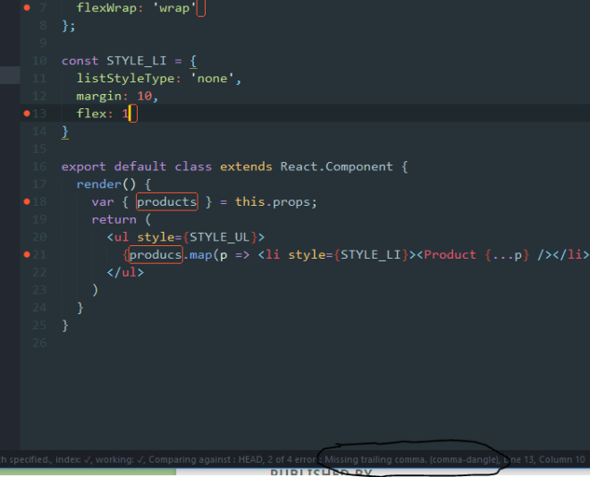

TLDR: By linting our source code. 

---
Summary {.summary}

[[toc]]

---

# What does code linting provide?

Code linting is the process to check for a set of rules on a particular code base.

It can be used to enforce some styles and rules into the code. It often spot bugs due to typos or mere oversights.

By applying the same rules on the whole code base, we can make sure that:

- There is no missing semicolons or that there is not semicolons at all if we don't like them.
- The variables are properly named.
- The order of methods to override is fixed (alphabetical)
- The constructor is the first method
- The depth of the functions is not more than 4.
- etc. there are a tons of possible rules.

We can use some presets created by big tech companies to avoid to set them all manually.
If they follow some given style, we can be sure that's it a *professional* style and follow the same one.

We'll see what is needed in order to apply this linting and configure it as we expect.

Moreover, because we are using ReactJS, we will add some special packages to deal with ReactJS components and methods.

# Multiple tools to lint a code base

- JSLint: the original project.
- JSHint: a fork of JSLint.
- ESLint: a *recent* alternative (2013), highly pluggable.

We are going to stick with ESLint because it supports ReactJS linting rules through a plugin `eslint-plugin-react`.
Because the linting is only necessary for the developers, the npm dependency is installed with `--save-dev`:

```
$ npm install --save-dev eslint
```

## How to use ESLint

`eslint` gives us a command with the same name in `./node_modules/.bin/eslint`.
It just takes as parameter a folder/file name on which we want to do the linting, such as:

```xml
$ ./node_modules/.bin/eslint src
``` 

If we have some ES2014 code in there, doing that could lead to some errors:

```xml
src\components\App.js 1:2
error Parsing error: Illegal import declaration src\components\Product.js 1:2
error Parsing error: Illegal import declaration
```

By default, ESLint does not understand ES2015 (`import`).

Before fixing that, let's simplify our life, and create a `npm script` command to run this command quickly.

```json
"scripts": { "lint": "eslint src" }
```

[[info]]
|When `npm` executes the scripts, it has access to the `./node_modules/.bin` folder automatically `eslint` refers to. We don't need to add the path in the script.

## ESLint + ES6 + JSX

As the [documentation](http://eslint.org/docs/user-guide/configuring#specifying-parser) states, we need to create a file `.eslintrc` at the root of the project to set the configuration.

First of all, let's make it understand `import`:

```json
{
  "ecmaFeatures": {
    "modules": true
  }
}
```
```xml
6:2 error Parsing error: Unexpected token const
```

Now, it does not understand `const`. Let's make it understand ES2015:

```diff
{
  "ecmaFeatures": {
    "modules": true
  },
+ "env": {
+   "es6": true
+ }
}
```
```
25:8 error Parsing error: Unexpected token <
```

It does understand ES2015 but not JSX. Let's make it understand JSX:

```diff
{
  "ecmaFeatures": {
+   "jsx": true,
    "modules": true
  },
  "env": {
    "es6": true
  }
}
```

It can now parse our code base.

Surprisingly, there is no error. It's not because the code is already perfect, but because: *all rules are disabled by default*.

There are tons of rules, let's see how to use some existing defaults.

## Extends some default ESLint configuration

It's recommanded to use [eslint:recommanded](http://eslint.org/docs/rules/) set of rules, to begin with.

But we can also use some other known presets, such as :

- [eslint-config-airbnb](https://github.com/airbnb/javascript/tree/master/packages/eslint-config-airbnb): want to work at airbnb ? Learn their style.
- ~~[eslint-config-rackt](https://github.com/rackt/eslint-config-rackt): a nice style overriding some properties of `eslint:recommanded`. I'm not fan because it forbids semicolons, commas on the last array item, all those useless things I like to write.~~

To use those extra configuration, `npm install` them.

Then extends your config with `eslint:recommanded` or `eslint:airbnb`:

```diff
{
+ "extends": "eslint:recommended",
  "ecmaFeatures": {
    "jsx": true,
    "modules": true
  },
  "env": {
    "es6": true
  }
}
```
```xml
3:8 error "Toolbar" is defined but never used no-unused-vars
19:378 error Unexpected trailing comma comma-dangle
```

Now we have some linting issues. But it seems ESLint does not understand yet this kind of program :

```
import Toolbar from './Toolbar.js';
... <Toolbar /> ...
```

The variable `Toolbar` is used by `<Toolbar />` (translated to `React.createElement(Toolbar)`), so the `no-unused-vars` error is not a true error.

To make it understand that the imported components are used in JSX, we need to install the plugin [`eslint-plugin-react`](https://github.com/yannickcr/eslint-plugin-react) and add a special rule [`jsx-uses-react`](https://github.com/yannickcr/eslint-plugin-react/blob/master/docs/rules/jsx-uses-vars.md) from this plugin, that will remove this ESLint false error.


```shell
$ npm install --save-dev eslint-plugin-react
```

```diff
{
  "extends": "eslint:recommended",
  "ecmaFeatures": {
    "jsx": true,
    "modules": true
  },
  "env": {
    "es6": true
  }
+ "plugins": [
+   "react"
+ ],
+ "rules": {
+   "react/jsx-uses-react": 1
+ }
}
```

It's also possible to add all default presets from `eslint-plugin-react` by extending the configuration:

```diff
- "extends": "eslint:recommended",
+ "extends": [ "eslint:recommended, "plugin:react/recommanded" ],
```

We are left with some true linting errors such as:

```xml
19:378 error Unexpected trailing comma comma-dangle
```

This one states that we have a line finishing by a [trailing comma in object literal](http://eslint.org/docs/rules/comma-dangle.html) and that we should not (because we have a rule that forbids it).

The documentation of ESLint describes all the default [rules](http://eslint.org/docs/rules/) and [eslint-plugin-react](https://github.com/yannickcr/eslint-plugin-react) describe all the ReactJS specific ones.

## Javascript environments

We can stumbled upon this kind of error:

```xml
6:19  error  "document" is not defined  no-undef
```

ESLint doesn't know what is `document`: it didn't found it in the scope because it's *implicit* in a browser environment.
By default, it does not assume the environment is a browser because it can be a pure nodejs program, where `document` does not exist.

Therefore, we have to specify that we are dealing with a "*browser* Javascript", that `document`, `window`, `console.log` does exist:

```diff
{
  "extends": "eslint:recommended",
  "ecmaFeatures": {
    "jsx": true,
    "modules": true
  },
  "env": {
    "es6": true,
+   "browser": true
  },
  "plugins": [
    "react"
  ],
  "rules": {
    "react/jsx-uses-react": 1,
  }
}
```

There are a lot of different environments, we can find them here http://eslint.org/docs/user-guide/configuring.html.

Some other examples are:

- nodejs
- worker
- mocha
- jquery

Each of them exposes some globals (that ESLint will assume they exist) that we don't need to specify.

We can find the list of the implicit globals here https://github.com/sindresorhus/globals/blob/master/globals.json.

## Overriding rules

If we want to allow trailing commas, we can override the rule:

```diff
"rules": {
  "react/jsx-uses-react": 1,
+ "comma-dangle": 0
}
```

The value corresponds to:

- `0`: we don't care (disabled).
- `1`: we get a warning if the rule is violated, but it's tolerated (ESLint will still succeed).
- `2`: ESLint is going to fail if the rule is violated.

Also, some rules accept some options to change their behavior.
For instance, if we want to force trailing commas for multilines, it's possible:

```diff
"rules": {
  "react/jsx-uses-react": 1,
+ "comma-dangle": [ 2, "always-multiline" ]
}
```

This will generate errors if there is a missing trailing comma on an array or object that spans multiple lines.
The option has no effect if the code is 0 (disabled).

The available rule options (if there is) depend on the rule, check http://eslint.org/docs/rules/comma-dangle for instance.
Personally, I like to enable `comma-dangle` because we can switch the lines order without playing with end-of-lines, and the diff is simpler (it does not highlight the previous line because we've added a `,`).

ESLint is very configurable, anybody can match its code style and forces it everywhere in the code base.
However, it is not only useful for the style, it can also find bugs.

# Bug finder

The biggest issues when typing Javascript are the typos. Because it's dynamic and we often lack of a good auto-completion, we do typos and nothing warns us. Then, we run into them at runtime, it's not funny and is time consuming.

By linting our code to find those typos easily:

```xml
38:34  error  "decription" is not defined              no-undef
```

Typo !

It's never a good idea to disable the rule `no-undef`, we can understand why.

# babel-eslint to parse experimental features

ESLint uses [espree](http://eslint.org/docs/user-guide/configuring#specifying-parser) to parse ES2015.

~~It does not handle some features such as the spread notation:~~

```js
const obj = { a: 1, ...{ b: 2, c: 3 } };
```

ESLint won't be able to parse that :

```xml
19:18  error  Parsing error: Unexpected token ..
```

Update: You don't need to use babel-eslint if you are using ES2015 (ES6), ES2016 (ES7) or ES2017 (ES8).
[[info]]
|ESLint actually supports ES2015/ES2016/ES2017, JSX, and object rest/spread by default now.

Nonetheless, `babel-eslint` is still used for the *current* experimental features, such as class properties, decorators, types.

We need to plug the Babel parser (which understand all the experimental things) to make ESLint able to lint.

```xml
$ npm install --save-dev babel-eslint
```

```diff
{
  "extends": "eslint:recommended",
  "ecmaFeatures": {
    "jsx": true,
    "modules": true
  },
+ "parser": "babel-eslint",
  "env": {
    "es6": true,
    "browser": true
  },
  "plugins": [
    "react"
  ],
  "rules": {
    "react/jsx-uses-react": 1,
    "comma-dangle": 0
  }
}
```

We now have a proper ESLint configuration, we can code properly and invite people to code with us.

It's often a good opportunity to lint when building or publishing a package by using in `package.json`'s `npm scripts`:

```json
"compile": "npm run lint && webpack",
```

If an error occurs, webpack won't be executed.

# Classic errors

Let's quickly go through some classic linting errors :

- `"Foo" is defined but never used | no-unused-vars`: if we're using <Foo /> it won't find it unless we are using `eslint-plugin-react` and define `"react/jsx-uses-react": 1`.
- `"foo" is defined but never used | no-unused-vars`: a plain Javascript variable not used. Typo?
- `Unexpected var, use let or const instead | no-var`: `var` is evil.
- `Strings must use singlequote | quotes`: prefer `'` over `"`.
- `Unexpected trailing comma | comma-dangle`: the lovely trailing comma at the end of multilines.
- `Extra semicolon | semi`: if we want or don't want a semicolon at the end of the statements.

# In-code ESLint hints

We only deal with a single file `.eslintrc` for now, meaning it's global to all our source code.

Sometimes, we want to make some exceptions, mostly because we added a hack somewhere.

We can add special comment in our code to talk to ESLint:

```js
// eslint-disable-line
 
/*eslint-disable */
... ugl-, err, smart hacky code ...
/*eslint-enable */
```


# Text editors/IDEs that support linting

Last but not least, every good text-editors or IDEs have a plugin to automatically apply linting to our code when typing, and display a marker next to the line if something is wrong.

- Sublime Text plugin
- Atom
- WebStorm
- Visual Studio
- Visual Studio Code
...

In my case, I'm using the best text editor aka Sublime Text, I just need to install:

- [SublimeLinter](http://www.sublimelinter.com/)
- [SublimeLinter-contrib-eslint](https://github.com/roadhump/SublimeLinter-eslint)

This is what we can see in our editor :

