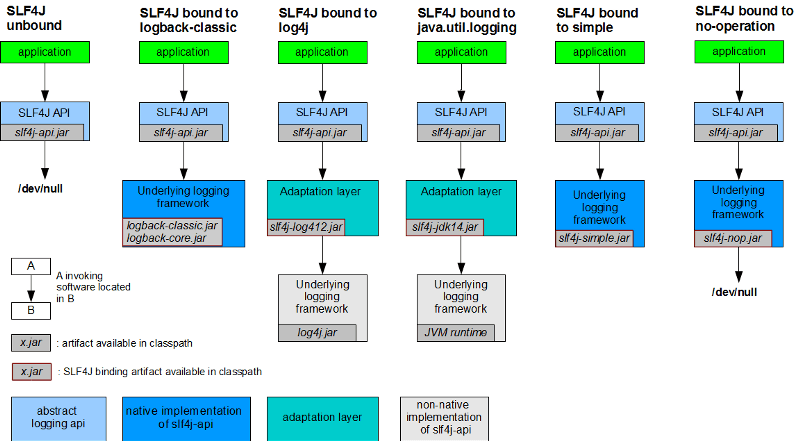

You are a Java or Scala developer.

You are logging stuff with different levels of severity because you need them to debug, or "monitor" what's going on.
Maybe you want to send them using the ELK stack to have nice graphs and metrics.
You probably already used slf4j even without noticing, it's quite ubiquitous.

This post is a explanation of what it is, why it exists, how does it work, and does an overview of its ecosystem.
This will help you to understand what's going on the next time you have some strange logging errors, or not logging at all.

We'll start to explain what is the concept of slf4j, then present different ways of interacting with it (the implementations).

---
Summary {.summary}

[[toc]]

---

# The answer to everything: slf4j

Why do we need something complicated like a logging framework to do something simple as put a message on `stdout`?

- Because not everybody wants to use only `stdout`. Even if that's super practical (this is the [UNIX philosophy](https://www.confluent.io/blog/apache-kafka-samza-and-the-unix-philosophy-of-distributed-data/)), we may want to send them directly into a file, to a http endpoint, or send an email!
- Because we want granularity: sometimes we want more logs (debug), in production only warnings and errors.
- Because the dependencies can have their own logging logic too, we need to be able to handle them (we can't block stdout!^[Well we can with `System.setOut(...)`]).

## A source without sink

slf4j is an API that exposes logging methods (`logger.info`, `logger.error` and so on).
Behind, there is nothing! It's just a facade, an abstraction, an interface.

On its own, it can't truly log anything.
It needs an implementation, a *binding*, something that truly handle the logs and send them somewhere (like stdout).
slf4j is just the entry point, it needs an exit. 

## A pipe

It can also redirect the logs from other logging systems and send them to its implementation.
This is the purpose of the *logging adapters*/*bridges*.

Hence, we can make all our application logs to go through the same pipe even if the origin logging system is different. 

## Neutral

We can do all without altering the existing code, but only the project dependencies.

We are going to see several logging implementations slf4j can be bound to.

I'm going to use Scala code because it's the best and it's more concise, but that's exactly the same in Java. 

# Without slf4j: using the JDK and JUL

JUL stands for `java.util.logging`.

This is a package that exists since the JDK1.4 (JSR 47). It has a class `Logger` which is quite simple to use, has some granularities, and does the job well:

```scala
val l = java.util.logging.Logger.getLogger("My JUL")
l.info("coucou")
```
```
Aug 18, 2016 11:41:00 PM App$ delayedEndpoint$App$1 INFO: coucou
```

`App` is my class, `delayedEndpoint` is the method (don't be scared by the `$`, this is is Scala specific).

The logger is configurable through its API: 
```scala
// we create a logger that accept ALL levels
val l = java.util.logging.Logger.getLogger("My JUL")
l.setLevel(Level.ALL) // the base level of the logger is ALL

val h = new ConsoleHandler
h.setLevel(Level.ALL) // we output ALL the logs to the console

val f = new FileHandler("warn.log", true)
f.setLevel(Level.WARNING) // we also send all WARNINGs or more critical to a file
f.setFormatter(new SimpleFormatter)

l.addHandler(h)
l.addHandler(f)

// now, we can log stuff
l.entering(classOf[App].toString, "myMethod")
l.info("hello there")
l.severe("badaboom")
l.exiting(classOf[App].toString, "myMethod")
```
```
sept. 07, 2016 11:16:53 PM interface scala.App myMethod
FINER: ENTRY
sept. 07, 2016 11:16:53 PM com.App$ myMethod
INFO: hello there
sept. 07, 2016 11:16:53 PM com.App$ myMethod
INFO: hello there
sept. 07, 2016 11:16:53 PM com.App$ myMethod
SEVERE: badaboom
sept. 07, 2016 11:16:53 PM com.App$ myMethod
SEVERE: badaboom
sept. 07, 2016 11:16:53 PM interface scala.App myMethod
FINER: RETURN
```

Notice we have the INFO and SEVERE twice but not the FINER: there is already a default console handler logging all INFO.

It's configurable through a properties file often named `logging.properties`.

On OSX, we can find the JVM global JUL configuration here: 
```
/Library/Java/JavaVirtualMachines/jdk1.8.0_91.jdk/Contents/Home/jre/lib/logging.properties
```

We can use any file by specifying its path in the system properties when we start our program: 
```
-Djava.util.logging.config.file=src/main/resources/logging.properties
```

Here is an example:
```xml
.level = INFO
handlers = java.util.logging.ConsoleHandler
java.util.logging.ConsoleHandler.level     = INFO
java.util.logging.ConsoleHandler.formatter = java.util.logging.SimpleFormatter
java.util.logging.SimpleFormatter.format   = %4$s: %5$s [%1$tc]%n
```

That will log all INFO with our custom format: 
```
FINER: ENTRY [Wed Sep 07 23:32:48 CEST 2016]
INFO: hello there [Wed Sep 07 23:32:48 CEST 2016]
SEVERE: badaboom [Wed Sep 07 23:32:48 CEST 2016]
FINER: RETURN [Wed Sep 07 23:32:48 CEST 2016]
```

Note that we can grab a reference to the global logger, and change its minimum level (default is INFO): 
```scala
java.util.logging.Logger.getGlobal.setLevel(Level.ALL)
```

Specifying a configuration file is not used as an override of the default but as a full replacement.{.warning}

If we forget something (especially `handlers=`), we might not see any logging.

We can also use the handler `java.util.logging.FileHandler` (it logs into `$HOME/java0.log` by default). 

## JUL's Loggers are managed by LogManagers

All the `Logger`s created in the application are managed by a `LogManager`.

By default, there is a default instance created on startup.
It's possible to use another one, by specifying the property `-Djava.util.logging.manager`.

It's often used along with log4j that implements a custom LogManager (available in the package `org.apache.logging.log4j:log4j-jul`): 
```
-Djava.util.logging.manager=org.apache.logging.log4j.jul.LogManager
```

This way, any manager can have a hand on any `Logger` created in the application. It can change their behavior and where do they read their configuration for instance.

This is what we call a *Logging Adapter* or a *bridge*: we can log using JUL in the code and use log4j features to manipulate and save the logs.

Don't worry if that does not make much sense, we'll go into more details later. 

# The Holy Grail: slf4j

## The interface: slf4j-api

Let's ditch JUL and finally use slf4j.

First, we need to add a dependency to its API: 
```scala
libraryDependencies += "org.slf4j" % "slf4j-api" % "1.7.21"
```
```scala
val sl: Logger = LoggerFactory.getLogger("My App") sl.info("hello")
```
We are getting some logs, but not what we expect: 
```scala
SLF4J: Failed to load class "org.slf4j.impl.StaticLoggerBinder".
SLF4J: Defaulting to no-operation (NOP) logger implementation
SLF4J: See http://www.slf4j.org/codes.html#StaticLoggerBinder for further details.
```

slf4j is using a `org.slf4j.helpers.NOPLogger` to log, but unfortunately, as the name says, its methods are empty shells: 
```scala
// org.slf4j.helpers.NOPLogger.java
final public void info(String msg, Throwable t) {
    // NOP
}
```

The application still works, but does not output any logs.

[[info]]
|slf4j tries to find a class `org.slf4j.impl.StaticLoggerBinder` available in the classpath. If it does not found one, it fallbacks to the `NOPLogger`. 

## The simple binding: slf4j-simple

Fortunately, there is a simple implementation of slf4j : 
```scala
libraryDependencies += "org.slf4j" % "slf4j-simple" % "1.7.21"
```

It contains a `org.slf4j.impl.StaticLoggerBinder` that creates an implementation of a `org.slf4j.Logger` (a `SimpleLogger`).

By default, this logger publishes its messages to `System.err`, but it can write to `System.out` or any file with some tuning. 
```scala
val sl: Logger = LoggerFactory.getLogger("My App")
sl.info("message from {}", "slf4j!")
```
```
[main] INFO My App — message from slf4j!
```

The style and destination can be configured using system variables or via a properties file. 

With system properties:
```
-Dorg.slf4j.simpleLogger.showDateTime=true
-Dorg.slf4j.simpleLogger.dateTimeFormat="yyyy-MM-dd HH:mm:ss"
-Dorg.slf4j.simpleLogger.levelInBrackets=true
-Dorg.slf4j.simpleLogger.logFile=simpleLogger.log
```
Here, we say we want to log into a file `simpleLogger.log` with some custom formatting.

For the sake of clarity and organization, it's preferable to put those properties in a dedicated file such as `src/main/resources/simplelogger.properties`:

```
org.slf4j.simpleLogger.showDateTime=true
org.slf4j.simpleLogger.dateTimeFormat="yyyy-MM-dd HH:mm:ss"
org.slf4j.simpleLogger.levelInBrackets=true
org.slf4j.simpleLogger.logFile=simpleLogger.log
```

This was our first slf4j binding.

Let's use another one we already used: JUL !

## slf4j to JUL

slf4j can redirect its logs to JUL that provides the "writing" piece.

```scala
libraryDependencies += "org.slf4j" % "slf4j-api" % "1.7.21"
libraryDependencies += "org.slf4j" % "slf4j-jdk14" % "1.7.21"
```

The name *slf4j-jdk14* comes from the origin of the JUL package: the JDK1.4! (strange name to pick)

```
INFO: message from slf4j! [Thu Aug 18 23:45:15 CEST 2016]
```
The code is the same as previously: we just changed the dependencies, but the output is different of the `SimpleLogger`'s.
We can recognize the style we defined at the beginning, in `logging.properties`, in the JUL section, remember ?

This logger is actually an instance of `JDK14LoggerAdapter` that extends `org.slf4j.Logger` and wraps a `java.util.logging.Logger`.
Note that we don't have the whole `java.util.logging.Logger` API exposed, but just the `org.slf4j.Logger`'s: this makes sense, because we're supposed to code independently of the implementations.

## Possible errors

### First warning: multiple implementations

Before going further with some other bindings, let's take a look at what happens when we use multiple implementations at the same time.

Will slf4j with dispatch the messages to all of them ? No.

It will pick one of them, and leave us a small warning about that.

Let's say we add the 2 bindings we know about:
```scala
libraryDependencies += "org.slf4j" % "slf4j-api" % "1.7.21"
libraryDependencies += "org.slf4j" % "slf4j-jdk14" % "1.7.21"
libraryDependencies += "org.slf4j" % "slf4j-simple" % "1.7.21"
```
```xml
SLF4J: Class path contains multiple SLF4J bindings.
SLF4J: Found binding in [.../slf4j-simple/jars/slf4j-simple-1.7.21.jar!...]
SLF4J: Found binding in [.../org.slf4j/slf4j-jdk14/jars/slf4j-jdk14–1.7.21.jar!...]
SLF4J: See http://www.slf4j.org/codes.html#multiple_bindings for an explanation.
SLF4J: Actual binding is of type [org.slf4j.impl.SimpleLoggerFactory]
"2016-08-18 23:53:54" [main] [INFO] My App - message from slf4j!
```

As we said, *slf4j-api* is looking for the class `org.slf4j.impl.StaticLoggerBinder` to get an implementation, and he finds two.
That *often* happens in projects because of the dependency graph (when some dependencies depend on a slf4j binding that they should not have exposed).

This message is just a warning, the logging will work. But it's a bad smell that should be fixed, because maybe it won't pick the one we want.

They have to be excluded (see below) and **ONLY** our own program, our final application, should import a slf4j binding.

### Second warning: logs loss

Let's deal with a real case: we'll import the hadoop client library because we like big data:

```scala
libraryDependencies += "org.apache.hadoop" % "hadoop-client" % "2.3.0"
```

If we restart our program, it's getting more verbose and comes with a small surprise:

```xml
SLF4J: Class path contains multiple SLF4J bindings.
SLF4J: Found binding in [.../org.slf4j/slf4j-log4j12/jars/slf4j-log4j12–1.7.5.jar!...]
SLF4J: Found binding in [.../org.slf4j/slf4j-jdk14/jars/slf4j-jdk14–1.7.21.jar!...]
SLF4J: See http://www.slf4j.org/codes.html#multiple_bindings for an explanation.
SLF4J: Actual binding is of type [org.slf4j.impl.Log4jLoggerFactory]
log4j:WARN No appenders could be found for logger (My App).
log4j:WARN Please initialize the log4j system properly.
log4j:WARN See http://logging.apache.org/log4j/1.2/faq.html#noconfig for more info.
```

We can see some log4j warnings that *we* never imported, and we don't see our own messages.
Where did they go?

Answer: they went into log4j that is not configured, ie: into a blackhole.

One way is to exclude the log4j binding from the hadoop dependency:

```scala
libraryDependencies += "org.slf4j" % "slf4j-api" % "1.7.21"
libraryDependencies += "org.slf4j" % "slf4j-jdk14" % "1.7.21"
libraryDependencies += "org.apache.hadoop" % "hadoop-client" % "2.3.0"
                           exclude("org.slf4j", "slf4j-log4j12")
```

If we restart our application, our JUL console logs are back.

Note that we won't see any hadoop logs, because they still rely on log4j configuration we didn't set.

One way to fix this would be to redirect log4j to slf4j: it's possible, we need to add the dependency `"org.slf4j" % "log4j-over-slf4j"`.
We'll see that in details later in this article.

The point is: don't have multiple logging implementations available within one application.

### Tip: slf4j bindings should be declared as optional

A best practice when writing a library or any module that can be imported into any application, is to set the slf4j implementation dependency as `optional`:

```scala
libraryDependencies += "org.slf4j" % "slf4j-jdk14" % "1.7.21" % "optional"
```

```xml
<dependency>
  <groupId>org.slf4j</groupId>
  <artifactId>slf4j-jdk14</artifactId>
  <optional>true</optional>
</dependency>
```

With optional, the `dependency` won't be imported by transitivity.
More details on [maven.apache.org](https://maven.apache.org/guides/introduction/introduction-to-optional-and-excludes-dependencies.html).

## Back to bindings: JCL/ACL

JCL stands for *Jakarta Commons Logging*.

Jakarta is an old retired Apache project. It is known as ACL now: *Apache Commons Logging*.
It is not maintained anymore (2014), but we can find it in old dependencies.

It serves the same purpose as slf4j: it is an abstraction over different logging frameworks such as log4j or JUL.

```scala
libraryDependencies += "org.slf4j" % "slf4j-api" % "1.7.21"
libraryDependencies += "org.slf4j" % "slf4j-jcl" % "1.7.21"
```

slf4j's loggers would be instances of `JCLLoggerAdapter` which extends `org.slf4j.Logger` and wraps a `org.apache.commons.logging.Log`.

It rely on the system property `org.apache.commons.logging.log` to should reference a FQCN of a `org.apache.commons.logging.Log`. (yes, lots of indirections)
If not set, it will try to fallback on any implementation it can find in the classpath (log4j, JUL..).

Anyway, new projects should forget about it.

If you stumbled upon it, consider adding a bridge to redirect JCL logs to slf4j. (see below)

## A winner: log4j

log4j is a widely-used logging framework. v1.x has been refactored and improved a lot to create the v2.x called *log4j2* to differenciate both.

It can be used as an abstraction over a logging implementation (again..), but it can be used as an implementation as well (what we prefer).

### log4j1.2

log4j1.2 has reached its end of life in 2015 so it's still common to find it.

```scala
libraryDependencies += "org.slf4j" % "slf4j-api" % "1.7.21"
libraryDependencies += "org.slf4j" % "slf4j-log4j12" % "1.7.21"
```

This will pull `log4j` v1.2 dependency too, which is outside of the slf4j's implementation (it can be used alone).

Here is the dependency tree (I always import `slf4j-api` but it's useless, because the slf4j binding always depends on it):

```xml
[info] +-org.slf4j:slf4j-log4j12:1.7.21
[info]   +-log4j:log4j:1.2.17
[info]   +-org.slf4j:slf4j-api:1.7.21
```

When calling slf4j's `getLogger`, it will use log4j API to create the logger:

```scala
org.apache.log4j.LogManager.getLogger(name);
```

Note that this `LogManager` has nothing to do with the JUL's one.

When we don't have slf4j but just log4j, this is the method we would call to get a `Logger`. `slf4j-log4j12` just does the same.

That's not enough:
```xml
log4j:WARN No appenders could be found for logger (My App).
log4j:WARN Please initialize the log4j system properly.
log4j:WARN See http://logging.apache.org/log4j/1.2/faq.html#noconfig for more info.
```

log4j needs some configuration by default.

We can create a simple properties file `src/main/resources/log4j.properties`:

```xml
log4j.rootLogger=DEBUG, STDOUT
log4j.appender.STDOUT=org.apache.log4j.ConsoleAppender
log4j.appender.STDOUT.layout=org.apache.log4j.PatternLayout
log4j.appender.STDOUT.layout.ConversionPattern=%-4r [%t] %-5p %c %x - %m%n
```

If we restart our program, we can see our message:

```xml
0 [main] INFO My App — message from slf4j!
```

If we like xml^[Nobody likes XML], we can create a file `log4j.xml` (notice the lowercase tags):

```xml
<?xml version="1.0" encoding="UTF-8"?>
<!DOCTYPE log4j:configuration PUBLIC "-//APACHE//DTD LOG4J 1.2//EN" "log4j.dtd">
<log4j:configuration xmlns:log4j='http://jakarta.apache.org/log4j/'>
 
 <appender name="STDOUT" class="org.apache.log4j.ConsoleAppender">
   <layout class="org.apache.log4j.PatternLayout">
     <param name="ConversionPattern" value="%d %-5p [%t] %C{2} (%F:%L) - %m%n"/>
   </layout>
 </appender>
 
 <root>
   <priority value ="info" />
   <appender-ref ref="STDOUT" />
 </root>
 
</log4j:configuration>
```

We get it:
```xml
2016–08–22 01:06:38,194 INFO [main] App$ (App.scala:11) — message from slf4j!
```

### log4j2

log4j12 should never be used again. Its successor is way more optimized and powerful.

It may be the most popular slf4j binding used nowadays.

```scala
libraryDependencies += "org.slf4j" % "slf4j-api" % "1.7.21"
libraryDependencies += "org.apache.logging.log4j" % "log4j-slf4j-impl" % "2.6.2"
```

Notice the organization of the binding is `org.apache.logging.log4j`, and not `org.slf4j` like log4j12's.

Only adding this dependency is not enough (!): 

```xml
Failed to instantiate SLF4J LoggerFactory
Reported exception:
java.lang.NoClassDefFoundError: org/apache/logging/log4j/spi/AbstractLoggerAdapter
...
```

We need to add `log4j-api` dependency ourselves:

```scala
libraryDependencies += "org.slf4j" % "slf4j-api" % "1.7.21"
libraryDependencies += "org.apache.logging.log4j" % "log4j-slf4j-impl" % "2.6.2"
libraryDependencies += "org.apache.logging.log4j" % "log4j-api" % "2.6.2"
```

Not enough yet (!!): 

```xml
ERROR StatusLogger Log4j2 could not find a logging implementation.
Please add log4j-core to the classpath. Using SimpleLogger to log to the console…
```

We need to add `log4j-core` dependency too

```scala
libraryDependencies += "org.slf4j" % "slf4j-api" % "1.7.21"
libraryDependencies += "org.apache.logging.log4j" % "log4j-slf4j-impl" % "2.6.2"
libraryDependencies += "org.apache.logging.log4j" % "log4j-api" % "2.6.2"
libraryDependencies += "org.apache.logging.log4j" % "log4j-core" % "2.6.2"
```
We get another error message (!!!):

```xml
ERROR StatusLogger No log4j2 configuration file found.
Using default configuration: logging only errors to the console.
```

That's better, we just need a configuration file, that's the last step.

Let's create a sample `log4j2.xml` (notice the caps):

```xml
<?xml version="1.0" encoding="UTF-8"?>
<Configuration>
 
 <Appenders>
   <File name="A1" fileName="A1.log" append="true">
     <PatternLayout pattern="%t %-5p %c{2} - %m%n"/>
   </File>
   <Async name="ASYNCFILE">
     <AppenderRef ref="A1"/>
   </Async>
   <Console name="STDOUT" target="SYSTEM_OUT">
     <PatternLayout pattern="%d %-5p [%t] %C{2} (%F:%L) - %m%n"/>
   </Console>
 </Appenders>
 
 <Loggers>
   <Root level="debug">
     <AppenderRef ref="STDOUT"/>
     <AppenderRef ref="ASYNCFILE"/>
   </Root>
 </Loggers>
 
</Configuration>
```

Our message is finally back and a file `A1.log` is created too:
```xml
2016–08–22 01:51:49,912 INFO [run-main-a] App$ (App.scala:8) — message from slf4j!
```

log4j2 is great because it has a [vast collections](https://logging.apache.org/log4j/log4j-2.4/manual/appenders.html) of `Appenders` where to write logs:

- Console
- File, RollingFile, MemoryMappedFile
- Flume, Kafka, JDBC, JMS, Socket, ZeroMQ
- SMTP (emails on errors, woo!)
- ... much more

Any appender can be wrapped into a `Async` appender (doing the logging in another thread, to not block the main thread cause of i/o).
It's a good practice to use it when there are a lot of logs, to lighten the main threads.

## The brother: logback

logback has the same father as log4j, it's another successor of log4j.

The syntax of the configuration is therefore quite similar.

```scala
libraryDependencies += "org.slf4j" % "slf4j-api" % "1.7.21"
libraryDependencies += "ch.qos.logback" % "logback-classic" % "1.1.7"
```

`logback-classic` will pull-down `logback-core` as dependency, no need to add it.

It will run without configuration (finally!):

```xml
02:17:43.032 [run-main-1f] INFO My App — message from slf4j!
```

But of course, we can (and should) create a `logback.xml` to customize its behavior:

```xml
<configuration debug="true" scan="true" scanPeriod="30 seconds">
 
    <appender name="STDOUT" class="ch.qos.logback.core.ConsoleAppender">
        <encoder>
            <pattern>%d{HH:mm:ss.SSS} [%thread] %-5level %logger{36} - %msg%n</pattern>
        </encoder>
    </appender>
 
    <root level="debug">
        <appender-ref ref="STDOUT" />
    </root>
</configuration>
```

Some tips:
- `debug` : to display some info about the logging system creation on startup (where it looks)
- `scan` : if some modifications are made on the file, they will be taken into account in live. This is particularly useful in production when we just want to get some debug messages for a short amount of time.

It's also possible to use a custom config file (multi-environment configurations):
```xml
-Dlogback.configurationFile=src/main/resources/logback.xml
```

As log4j, logback has [a lot of appenders](http://logback.qos.ch/manual/appenders.html).

Some are not part of the official package, such as:

- kafka: https://github.com/danielwegener/logback-kafka-appender
- Slack (for errors only!): https://github.com/maricn/logback-slack-appender

## TLDR

Add a dependency to slf4j interface: `"org.slf4j" % "slf4j-api"` and add an logging implementation:

| Binding | Dependencies | Configuration |
|----------------|-----------------|----------------------|
| to the console | "org.slf4j" % "slf4j-simple" | `simplelogger.properties` |
| to java.util.logging (JUL) | "org.slf4j" % "slf4j-jdk14" | `logging.properties` |
| to log4j2 | "org.apache.logging.log4j" % "log4j-[slf4j-impl\|api\|core]" | `log4j2.xml` |
| to logback | "ch.qos.logback" % "logback-classic" | `logback.xml` |
| ~~to log4j1.2~~ | ~~"org.slf4j" % "slf4j-log4j12"~~ | `log4j.properties` `log4j.xml]` |
| ~~to JCL/ACL~~ | ~~"org.slf4j" % "slf4j-jcl"~~ | |

A very nice picture to resume what we just saw (we didn't talked about `slf4j-no`, it's just a black hole):



http://www.slf4j.org/manual.html
 

If our project depends on other projects that are *not* using slf4j, but directly JUL or log4j, it's possible to redirect them to our slf4j.

This is what bridges are used for.

# Bridges

In a previous example, we imported `hadoop-client` and our logs disappeared because the library is using a log4j logger we never configured.

We excluded its implementation from our application and our logs reppeared, but the logs of the hadoop-client library were still hidden, because they were using an unconfigured log4j.

To avoid that, it's possible to create a *bridge* to send log4j logs to slf4j, that will then dispatch them where we want.

The bridge packages generally contain both sides in their name, such as:

```scala
"org.apache.logging.log4j" % "log4j-to-slf4j" % "2.6.2"
```
It's a bridge from log4j to slf4j.


With the bridges, we can have some fun:

```scala
libraryDependencies += "org.slf4j" % "slf4j-api" % "1.7.21"
libraryDependencies += "org.slf4j" % "slf4j-jdk14" % "1.7.21"
libraryDependencies += "org.apache.hadoop" % "hadoop-client" % "2.3.0"
libraryDependencies += "org.apache.logging.log4j" % "log4j-to-slf4j" % "2.6.2"
```

The path of the logs is:
```xml
hadoop → ACL → log4j → *bridge* → slf4j → JUL → System.err
```

Phew!

Let's give a try:

```scala
val sl: Logger = LoggerFactory.getLogger("My App")
sl.info("message from {}", "slf4j!")
new DFSClient(new InetSocketAddress(1337), new Configuration)
```
```xml
SLF4J: Class path contains multiple SLF4J bindings.
SLF4J: Found binding in [...slf4j-jdk14–1.7.21.jar!...]
SLF4J: Found binding in [...slf4j-log4j12–1.7.5.jar!...]
SLF4J: See http://www.slf4j.org/codes.html#multiple_bindings for an explanation.
SLF4J: Actual binding is of type [org.slf4j.impl.JDK14LoggerFactory]
INFO: message from slf4j! [Fri Aug 19 01:08:46 CEST 2016]
FINE: dfs.client.use.legacy.blockreader.local = false [Fri Aug 19 01:08:46 CEST 2016]
FINE: dfs.client.read.shortcircuit = false [Fri Aug 19 01:08:46 CEST 2016]
FINE: dfs.client.domain.socket.data.traffic = false [Fri Aug 19 01:08:46 CEST 2016]
FINE: dfs.domain.socket.path = [Fri Aug 19 01:08:46 CEST 2016]
…
```

We are actually *lucky* because two implementations were available to slf4j:
- `slf4j-log4j12` (provided by `hadoop-client`)
- `slf4j-jdk14`.

Fortunately for us, slf4j used `slf4j-jdk14`. Otherwise we would have get trap into an infinite loop (with `slf4j-log4j12`) :

```xml
hadoop → ACL → log4j → *bridge* →
slf4j → log4j → *bridge* →
slf4j → log4j → *bridge* → ...
```

Another bridge doing the same exists : `"org.slf4j" % "log4j-over-slf4j" % "1.7.21"` (the previous one was from `org.apache.logging.log4j`).

Unfortunately, it creates the infinite loop in our case, because slf4j uses `slf4j-log4j12`:

```xml
SLF4J: Found binding in [...slf4j-log4j12–1.7.5.jar!...]
SLF4J: Found binding in [...slf4j-jdk14–1.7.21.jar!...]
SLF4J: Actual binding is of type [org.slf4j.impl.Log4jLoggerFactory]
Exception in thread "main" java.lang.StackOverflowError
```

We can explicitely exclude the other binding:

```scala
libraryDependencies += "org.apache.hadoop" % "hadoop-client" % "2.3.0"
                            exclude("org.slf4j", "slf4j-log4j12")
```

If we do, both bridges are working as expected.

Conclusion: without altering anything in the hadoop library nor our code, we made it generate logs where we wanted, with the format we wanted.

Bridges between those common implementations are available ^[They couldn't agree on the naming it seems!]:

- `jcl-over-slf4j`
- `log4j-over-slf4j`
- `jul-to-slf4j`

That's the power of slf4j: its bindings and its bridges: completely decoupled from the source.

Here's a picture resuming the available bridges to slf4j:


http://www.slf4j.org/legacy.html

# Performance

Some applications can generate a tremendous amount of logs.

Some precautions should be taken care of:

- **async** logging should always be preferred (another thread will do the effective work to log, not the caller's thread).
- we should not add level guards (`if (logger.isDebugEnabled)`) before logging, that brings us to the next point:
- do not concat strings manually in the message: slf4j methods have a placeholder syntax such as `log.info("the values are {} and {}", item, item2)`. The `toString()` on the parameters won't be computed if it's not needed ^[It *can* be cpu intensive. Even if it's not, it's just useless to call it if the log level is not enough, that would allocate objects for nothing].
- In Scala, we take advantage of macros to add level guards automatically, like with [log4s](https://github.com/Log4s/log4s) or [scala-logging](https://github.com/typesafehub/scala-logging). This way, we can use the classic strings interpolation. :)

Several benchmarks of the bindings (throughput, response time, sync/async): https://logging.apache.org/log4j/2.x/performance.html


It seems the best (the fastest) is log4j2, with the `Async` appender, but checkout the link, it contains much more info.

To be honest, it's not all applications that care generating 20M logs/second. We should go with what we're at ease (the configuration), and be done with it.

# The End

slf4j is useful combined to a powerful implementation such as **log4j2** or **logback**.

But don't forget that application logs are generally managed by another application. Like *supervisor*, it can handle file rolling itself. *logstash* can send the logs anywhere.

Often, keeping the logging configuration simple is enough (stdout, and just filters on the level and some classes).

A lot of frameworks have traits/abstract classes/globals to provide the logging facility directly  :

- Akka : provides `LoggingReceive`, `ActorLogging`, `akka.event.Logging`, a bridge to slf4j: `akka-slf4j`
- Spark : it's using log4j and had a trait `org.apache.spark.Logging` (removed in 2.0.0)
- Play! Framework: it's using logback and provides a Logger object/class on top of slf4j's Logger