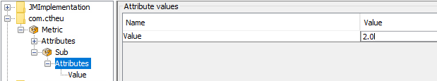
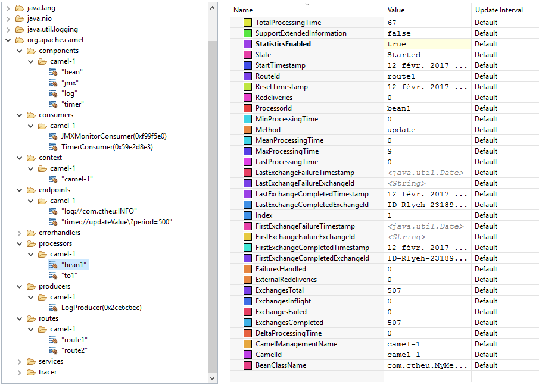
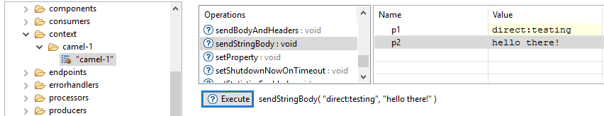
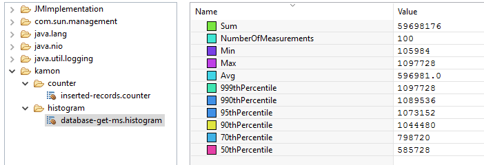
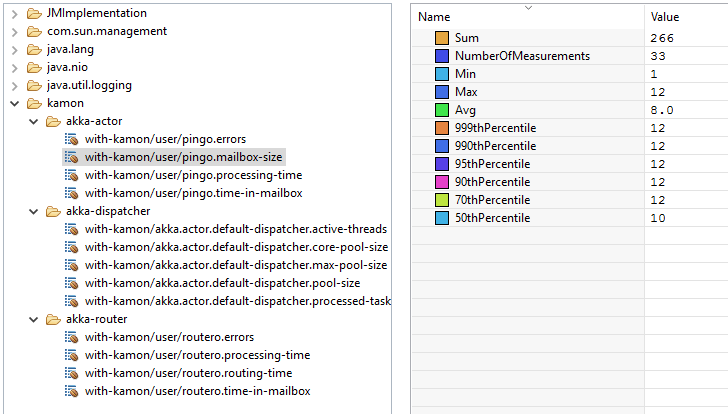
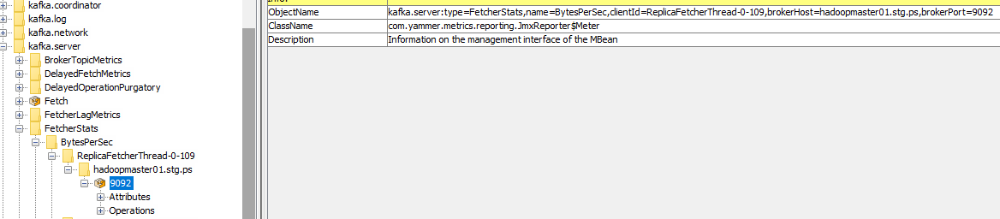
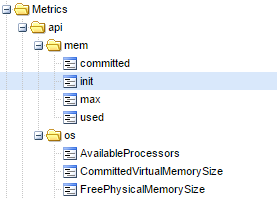
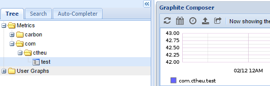

If you're working with Java or Scala, you probably already heard of JMX or already using it. Most of us probably already used `jconsole` or `jvisualvm` to access the "JMX data", to get some insights about the internals of a Java process. If you did not, you're going to wonder why you never did. If you did, you may be interested by all the integrations we're going to show.

This article is a tentative to explain globally what is JMX. What is its purpose? What can we do with it? Is it simple to use? What are the existing integrations we can use? What about its ecosystem? We'll use a bunch of tools that are using it to make it clear.

---
Summary {.summary}

[[toc]]

---

# What is JMX?

It's a standard originally from the [JSR 3: Java&trade; Management Extensions (JMX&trade;) Specification](https://jcp.org/en/jsr/detail?id=003) (came with J2SE 5.0), that defines a way and an API to manage and expose resources (custom and of the JVM itself, called _MBeans_) in an application. It was later consolidated by the [JSR 160: Java&trade; Management Extensions (JMX) Remote API](https://jcp.org/en/jsr/detail?id=160) to handle JMX remote management (with RMI).

With JMX, we can retrieve or change some application resources values (MBeans attributes), or call methods on them, on the fly, to alter the behavior of the application and to monitor its internals.

We can use JMX for anything, the possibilities are quite infinite. For instance:
- Know the memory and CPU the application is using.
- Trigger the GC.
- How many _requests_ were processed by the application?
- What are the database latency percentiles?
- How many elements are contained in the caches?
- Change the load-balancing strategy in real-time.
- Force an internal circuit-breaker to be open.
- ...

It all depends on what the application is "offering".

It's _almost_ like we had a reactive database inside the application and we were exposing HTTP REST services (GET, PUT) over it, without coding anything, without the hassle, and with standard request/response payloads anyone (exterior) can interact with.

## MBeans &amp; Co

All those values we talked about (that we can read or write) and methods we can call, must be contained inside MBeans.

- MBean stands for _Managed Bean_. It's simply a _Java Bean_ following some constraints (implements an interface `xxxMBean` and provides gets/sets).
- MBeans have the possibility to send notifications on changes but it's not mandatory (they are often read by just polling them at a regular interval).
- A evolution are the [MXBeans](http://docs.oracle.com/javase/8/docs/api/javax/management/MXBean.html): they are MBeans that handle a pre-defined set of [Open Types](https://docs.oracle.com/javase/8/docs/api/javax/management/openmbean/OpenType.html) necessary for a better inter-operability.
- There are pre-existing _platform MXBeans_: the ones already packaged with the JRE that expose the JVM internals (memory, cpu, threads, system, classes).

Here is the platform MXBean `java.lang:type=Memory` attributes and values:


The values we see in the screenshot are the exact as we can get in the code with:

```scala
val mem = ManagementFactory.getMemoryMXBean
mem.setVerbose(true)
mem.getNonHeapMemoryUsage.getUsed // 8688760

// we can call methods!
mem.gc()
```

The platform MXBeans have static accessors in `ManagementFactory` (because they are Java standards) and they are strongly typed.

It's also possible to grab them dynamically, as any other MBean.
To do that, we need to build a `ObjectName`, which is the _path_ of the MBean:

```scala
// MBeans belongs to a MBeans server as we say: the Java API can create one if we ask
val server = ManagementFactory.getPlatformMBeanServer()

println(server.getMBeanCount())
// 22

val info = server.getMBeanInfo(ObjectName.getInstance("java.lang:type=Memory"))
info.getAttributes() // MBeanAttributeInfo[]
info.getOperations() // MBeanOperationInfo[]
```

## How to declare a custom MBean

The MBeans must be declared by the application in a standard way.

- It has to implement an interface with the `MBean` suffix. (or `MXBean` if [Open Typed](https://docs.oracle.com/javase/8/docs/api/javax/management/openmbean/OpenType.html))
- It needs getters and/or setters (properties can be readonly). Because we are working in Scala, we can use `@BeanProperty` to generate them but they still need to be declared in the interface/trait.
- It can have methods with parameters.

```scala
trait MetricMBean {
  def getValue(): Double
  def setValue(d: Double): Unit
}
class Metric(@BeanProperty var value: Double) extends MetricMBean
```

Finally, to be accessible, we need to register an instance of it into a MBeans server.

- A MBeans server is the entity that manages the resources (MBeans), provides methods to register/unregister them, invoke methods on the MBeans and so on.
- A MBeans server is part of a _JMX agent_, which runs in the same JVM. The JMX Agent exposes a JMX server connector for JMX client connector to be able to connect to it (local or remote), list the MBeans, get the attributes values, invoke methods, and do whatever they want with them.

To register a MBean instance, we must provide an object name composed of a _domain_ and key values pairs to form the path:

```scala
object JMX extends App {
  val server = ManagementFactory.getPlatformMBeanServer()
  server.registerMBean(new Metric(1.0), ObjectName.getInstance("com.ctheu:type=Metric"))
  server.registerMBean(new Metric(2.0), ObjectName.getInstance("com.ctheu:type=Metric,subtype=Sub"))

  Thread.sleep(60000)
}
```
We can see our metrics in JConsole, and modify them:



The application itself can monitor this value or be notified to adapt its behavior.
Other applications can do the same by connecting themselves to the application JMX Agent, through RMI.

# How to use JMX?

## UI: JMX Client Connectors: jconsole, jvisualvm, jmc

The Java JDK already embeds several JMX client connectors with more or less complex UIs, that provides more or less general features:

- [jconsole](http://docs.oracle.com/javase/8/docs/technotes/guides/management/jconsole.html): the simplest, the fastest.
- [Java VisualVM](http://docs.oracle.com/javase/8/docs/technotes/guides/visualvm/index.html): the middle-ground, it has more options and handle plugins. It's also on [GitHub](https://github.com/visualvm/visualvm.src).
- [Java Mission Control](https://docs.oracle.com/javacomponents/jmc-5-5/jmc-user-guide/toc.htm): part of the Oracle commercial features, the UI is more polished, it has a complete recorder feature that can really help to find problems source.

All three are packaged by default with the JDK installation and can connect to a local or remote JMX Agent (exposing a MBeans server).

## Programmatically

Java exposes a client API in `javax.management[.remote]` to connect to any JMX agent through RMI and retrieve a `MBeanServerConnection` to request the MBeans attributes, their values, etc.

The connection scheme is quite ugly: `service:jmx:rmi:///jndi/rmi://localhost:9010/jmxrmi` but trust me, it works! The important part being `localhost:9010`. (here, 9010 is the RMI _registry_ port I pick, we'll see that just after)

Here is a program that output the whole MBeans hierarchy attributes and values, then calls some JMX methods:

```scala
// The program was started with:
// -Dcom.sun.management.jmxremote.port=9010
// -Dcom.sun.management.jmxremote.authenticate=false
// -Dcom.sun.management.jmxremote.ssl=false

object JMXTestConnection extends App {
  // we listen to our own JMX agent!
  val url = new JMXServiceURL("service:jmx:rmi:///jndi/rmi://localhost:9010/jmxrmi")
  val connector = JMXConnectorFactory.connect(url)
  val server = connector.getMBeanServerConnection()
  val all = server.queryMBeans(null, null).asScala

  println(all.map(_.getObjectName)
             .map(name => s"$name\n" + attributes(name)))

  // we can also call the JMX methods: "gc", "change" (custom MBean):
  server.invoke(ObjectName.getInstance("java.lang:type=Memory"), "gc", null, null)
  server.invoke(ObjectName.getInstance("com.ctheu:type=Metric"), "change", Array(new Integer(18)), null)

  
  // helpers
  private def attributes(name: ObjectName) = {
    server.getMBeanInfo(name).getAttributes.toList.map(attribute(name, _)).mkString("\n")
  }
  private def attribute(name: ObjectName, attr: MBeanAttributeInfo) = {
    s"- ${attr.getName} (${attr.getType}) = ${attributeValue(name, attr)}"
  }
  private def attributeValue(name: ObjectName, attr: MBeanAttributeInfo) = {
    // it's possible getAttribute throws an exception, see the output below
    Try(server.getAttribute(ObjectName.getInstance(name), attr.getName))
  }
}
```
The output looks like this:
```xml
Set(java.lang:type=MemoryPool,name=Code Cache
- Name (java.lang.String) = Success(Code Cache)
- Type (java.lang.String) = Success(NON_HEAP)
- CollectionUsage (javax.management.openmbean.CompositeData) = Success(null)
- CollectionUsageThreshold (long) = Failure(javax.management.RuntimeMBeanException: java.lang.UnsupportedOperationException: CollectionUsage threshold is not supported)
...
Set(java.nio:type=BufferPool,name=mapped
- Name (java.lang.String)=Success(mapped)
- MemoryUsed (long)=Success(0)
...
Set(java.lang:type=GarbageCollector,name=PS Scavenge
- LastGcInfo (javax.management.openmbean.CompositeData)=Success(...)
...
```

We can see it's possible for an application to monitor itself, connecting to its own MBean server. Some values could be easier to catch there than using some third-party APIs, or when it's just impossible to grab elsewhere.

But it's mostly useful to connect to another application, or pool of applications, to grab some specific attributes, and act upon their values (monitoring, alerting, routing, load balancing..).

### Scala wrapper: jajmx

There is a library which implements the JMX API with some Scala wrappers: [jajmx](https://github.com/dacr/jajmx).
This way, no need of this Java non-sense (ok, it's not that complicated but still).

```scala
import jajmx._
val jmx = JMX()
import jmx._

mbeans.take(10).map(_.name).foreach(println)
```
The API is a bit more Scala'ish.

```xml
java.lang:type=Memory
java.lang:type=MemoryPool,name=PS Eden Space
java.lang:type=MemoryPool,name=PS Survivor Space
...
```

It also provides some smart `sh` scripts to query any application with JMX and retrieve specific values, list threads, use filters..
Take a [look](https://github.com/dacr/jajmx)!

## Connect to a distant JMX Agent

By default, it's not possible to connect to a distant JMX Agent. The distant application must add some Java options to allow the connection.

This is the purpose of the [JSR 160: Java&trade; Management Extensions (JMX) Remote API](https://jcp.org/en/jsr/detail?id=160): to handle JMX remote management with RMI.

The most common options to use on the distant application are (the others are mostly security related):

```
# -Dcom.sun.management.jmxremote
-Dcom.sun.management.jmxremote.local.only=false
-Dcom.sun.management.jmxremote.port=9010
-Dcom.sun.management.jmxremote.authenticate=false
-Dcom.sun.management.jmxremote.ssl=false
```

- `-Dcom.sun.management.jmxremote`: was necessary until J2SE6, is not needed anymore, but we can still stumbled upon it.
- `-Dcom.sun.management.jmxremote.local.only`: by default, it's `true` to accept only local connections. If a `port` is specified, it is automatically switch to `true`.
- `-Dcom.sun.management.jmxremote.port`: publish a RMI connector on this port for a remote application to connect to. It's just the _registry_ port (default is 1099), there is another port which is the server port (random).
- `-Dcom.sun.management.jmxremote.authenticate=false`: by default, the authentication is enabled. The user must beforehands update the config files in `JRE_HOME/lib/management` to specify users, passwords, permissions.. It's often disabled! You must be sure nobody from the exterior can access it.
- `-Dcom.sun.management.jmxremote.ssl=false`: by default, SSL is enabled when connecting remotely. The user must beforehands update create a certificate and import it into the keystore of the JVM. Often disabled! You must be sure nobody from the exterior can access it.

---

Finally, 2 more options are necessary when the private networks are different between the client and the server, or for other networking reasons:

```
-Djava.rmi.server.hostname=server
-Djava.rmi.server.useLocalHostname=true
```

- `-Djava.rmi.server.hostname=server`: it is the address the client (the RMI stub) will use to query the remote server. For instance, if the server is not on the same local network than ours, the default address will the be private IP of the server, that we can't reach. But it's possible we can reach it through its hostname or another IP, so we set this property.
- `-Djava.rmi.server.useLocalHostname`: if `java.rmi.server.hostname` is not specified, the client will use the hostname of the server instead of the local IP (it's useful when the IP is a private one belonging to another network). It's a shortcut/alternative to `java.rmi.server.hostname`.

More documentation is available in the [Agent technotes](http://docs.oracle.com/javase/8/docs/technotes/guides/management/agent.html).

[[info]]
|If you want to connect through SSH tunnel, there is a nice [SO thread](http://stackoverflow.com/questions/15093376/jconsole-over-ssh-local-port-forwarding/32418821#32418821) to explain how to.

Now that we've seen the theory, let's dive into the JMX ecosystem! 


# Jolokia: JMX to HTTP

## A Java Agent

Jolokia is a Java Agent used to expose JMX through HTTP (as JSON), which is universal.

[[info]]
|A Java agent is some piece of code started when the JVM starts, that can instrument classes before the real application starts OR it can be plugged on any JVM application on the fly.

Jolokia supports attributes listing, reading, writing, and methods execution. Jolokia simplifies how to use JMX because JSON through HTTP is way more accessible and can be used by any language. Jolokia [provides](https://jolokia.org/features/polyglot.html) some client libraries to simplify the flow (Java, Javascript (with jQuery, erk), Perl), but anything can query the HTTP endpoint, it's plain JSON.

The installation of Jolokia is quite straight-forward:

- We [download](https://jolokia.org/download.html) a `.jar` because we work with pure Java applications: [jolokia-jvm-1.3.5-agent.jar](http://search.maven.org/remotecontent?filepath=org/jolokia/jolokia-jvm/1.3.5/jolokia-jvm-1.3.5-agent.jar).
- We add `-javaagent` to the command line when we start Java to take our `.jar` into account ([it's also possible to start the agent on an already running JVM](https://jolokia.org/reference/html/agents.html#jvm-attach)). Configuring the command line can be done through the IDE project configuration or directly in `build.sbt` when we use `sbt run`:

```scala
fork in run := true
javaOptions += "-javaagent:jolokia-jvm-1.3.5-agent.jar=port=7777,host=localhost"
mainClass in (Compile, run) := Some("com.ctheu.JMXTest")
```

We'll get a log stating it's all good:
```xml
[info] I> No access restrictor found, access to any MBean is allowed
[info] Jolokia: Agent started with URL http://127.0.0.1:7777/jolokia/
```

Now, when we query `http://localhost:7777/jolokia/`, we get the agent version:
```c
{
    "request": {
        "type": "version"
    },
    "value": {
    "agent": "1.3.5",
    "protocol": "7.2",
    "config": {
        "maxDepth": "15",
        "discoveryEnabled": "true",
        ...
```

## Queries

From there, we can list, read, or write any attributes and execute methods.

### List

When we are looking around:

```bash
http://localhost:7777/jolokia/list
# or a particular namespace
http://localhost:7777/jolokia/list/java.lang
# or a particular attribute
http://localhost:7777/jolokia/list/java.lang/type=Memory/attr/HeapMemoryUsage
```

```c
{
    "request": { "type": "list" },
    "value": {
        "JMImplementation": {},
        "java.util.logging": {},
        "java.lang": {
        "name=PS Scavenge,type=GarbageCollector": {},
        "type=Threading": {},
        "name=PS Old Gen,type=MemoryPool": {},
        "type=Memory": {
            "op": { "gc": { "args": [], "ret": "void", "desc": "gc" } },
            "attr": {
                "ObjectPendingFinalizationCount": {},
                "Verbose": { "rw": true, "type": "boolean", "desc": "Verbose" },
                "HeapMemoryUsage": {
                    "rw": false,
                    "type": "javax.management.openmbean.CompositeData",
                    "desc": "HeapMemoryUsage"
                },
                ...
```

Note that this route does not return the values, but only the JMX metadata.

### Read

It's perfect if we know what we are looking for.

It's the route to use when we want to monitor some specific metrics in a monitoring system and renders some nice charts because it exposes the values.

```bash
http://localhost:7777/jolokia/read/java.lang:type=Memory
# or a particular attribute
http://localhost:7777/jolokia/read/java.lang:type=Memory/HeapMemoryUsage/used
```

```c
{
    "request": { "mbean": "java.lang:type=Memory", "type": "read" },
    "value": {
        "ObjectPendingFinalizationCount": 0,
        "Verbose": false,
        "HeapMemoryUsage": {
            "init": 268435456,
            "committed": 257425408,
            "max": 3814195200,
            "used": 59135648
        },
        "NonHeapMemoryUsage": {
            "init": 2555904,
            "committed": 17235968,
            "max": -1,
            "used": 16706800
        },
        "ObjectName": { "objectName": "java.lang:type=Memory" }
    },
    "timestamp": 1485728539,
    "status": 200
}
```

### Write

Let's say Jolokia has some MBeans that return these values:

```js
// http://localhost:7777/jolokia/read/jolokia:type=Config
{ "HistorySize": 82, "MaxDebugEntries": 100, "HistoryMaxEntries": 10, "Debug": false }

// http://localhost:7777/jolokia/list/jolokia/type=Config/attr/Debug
{ "rw": true, "type": "boolean", "desc": "Attribute exposed for management" }
```
We see `jolokia:type=Config > Debug` is writeable (`rw: true`) and we have its current value.


We can modify it with a classic GET (with the value at the end):
```xml
http://localhost:7777/jolokia/write/jolokia:type=Config/Debug/true
```
If we read it again:
```js
{ "HistorySize": 82, "MaxDebugEntries": 100, "HistoryMaxEntries": 10, "Debug": true }
```

### Method execution

There are already some existing MBeans in the JRE we can call:

```bash
http://localhost:7777/jolokia/exec/java.lang:type=Memory/gc
# or with arguments
http://localhost:7777/jolokia/exec/java.util.logging:type=Logging/setLoggerLevel/global/FINER
```

Those are truly useful when methods are doing complex operations. We can basically call any method remotely that will affect the process (or just return a result), thanks to JMX.


[[info]]
|It's possible to do all those queries with POST when a GET is not enough to pass arguments properly (such as maps, arrays, complex types). GET has only a basic support of arrays based on the "a,b,c" notation.

Note that the agent has a lot of options available, we can get them by getting the help from the agent.jar itself:
```xml
$ java -jar jolokia-jvm-1.3.5-agent.jar --help
    ...
    --host <host>                   Hostname or IP address to which to bind on
                                    (default: InetAddress.getLocalHost())
    --port <port>                   Port to listen on (default: 8778)
    --agentContext <context>        HTTP Context under which the agent is reachable (default: /jolokia)
    ...
    --user <user>                   User used for Basic-Authentication
    --password <password>           Password used for Basic-Authentication
    --quiet                         No output. "status" will exit with code 0 if the agent is running, 1 otherwise
    --verbose                       Verbose output
    ...
```
As we can see, the endpoint security is builtin in Jolokia.
All the options are also listed on the [reference guide](https://jolokia.org/reference/html/agents.html#agents-jvm).

Jolokia is a very nice tool to consider when we want to quickly plug an application into an existing monitoring system which has probably already something to read metrics from HTTP. It's useless to develop a custom HTTP service expose metrics. It's better to expose them through JMX, then, by HTTP with Jolokia. That will provide 2 ways to read the metrics.

# Camel: stay awhile and listen

Camel is a generic _sources_ and _sinks_ connector, that can be used to create complex pipelines of events publishing/consuming.
It has a support for absolutely every possible source or sink (files, messages queues, sockets, aws, ftp, mail, irc, and [more more more](https://camel.apache.org/components.html)).
Here, we're just going to talk about the JMX part.

Camel handles it in two ways:
- It can listen to MBeans modifications, this is the [JMX Component](https://camel.apache.org/jmx.html).
- We can use JMX to monitor Camel internals, this is [Camel JMX](http://camel.apache.org/camel-jmx.html).

## Listen to MBeans modifications

Camel can subscribe to MBeans that are listenable: MBeans that implements `javax.management.NotificationBroadcaster` (this just offers a simple publisher/subscriber interface).

It's quite common to inherit directly from `NotificationBroadcasterSupport` that implements it and support Executors (to notify the listeners asynchronously).

A typical MBean implementation would be:

```scala
trait MyMetricMBean {
  def getValue(): Double
  
  def update(): Unit // we'll use it after
}
class MyMetric(var value: Double) extends NotificationBroadcasterSupport with MyMetricMBean {
  // a notification needs a unique sequence number
  private val sequence = new AtomicInteger()

  override def getValue(): Double = value
  def setValue(newValue: Double) = {
    val oldValue = value
    this.value = newValue
    // this is quite verbose but at least, it contains everything we could think of
    this.sendNotification(new AttributeChangeNotification(this,
      sequence.incrementAndGet(), Instant.now().toEpochMilli,
      "Value changed", "Value", "Double",
      oldValue, newValue
    ))
  }

  override def update(): Unit = setValue(math.random)
}
```

Now, we can register an instance of this MBean into the local MBeans server, and ask Camel to subscribe to its notifications, and act upon them (here, we'll just log the notification on stdout):

```scala
object WithCamel extends App with LazyLogging {
  val server = ManagementFactory.getPlatformMBeanServer

  val metric = new MyMetric(0)
  server.registerMBean(metric, ObjectName.getInstance("com.ctheu:type=MyMetric"))

  val context = new DefaultCamelContext()
  context.addRouteDefinition(new RouteDefinition(
    "timer:updateValue?period=800")
    .bean(metric, "update"))
  context.addRouteDefinition(new RouteDefinition(
    "jmx:platform?objectDomain=com.ctheu&key.type=MyMetric")
    .to("log:com.ctheu:INFO"))

  // it's possible to be notified only according to some thresholds (<0.05 or >0.95 here)
  /* context.addRouteDefinition(new RouteDefinition(
    "jmx:platform?objectDomain=com.ctheu&key.type=MyMetric" + 
    "&observedAttribute=Value&monitorType=gauge&granularityPeriod=500" + 
    "&notifyHigh=true&notifyLow=true&thresholdHigh=0.95&thresholdLow=0.05")
    .to("log:com.ctheu:INFO")) */

  context.start()
  Thread.sleep(60000)
  context.stop()
}
```

We can find the JMX values in this stdout extract:

```xml
Route: route1 started and consuming from: timer://updateValue?period=800
Route: route2 started and consuming from: jmx://platform?key.type=MyMetric&objectDomain=com.ctheu&observedAttribute=Value
Total 2 routes, of which 2 are started.
Apache Camel 2.18.1 (CamelContext: camel-1) started in 0.647 seconds

INFO com.ctheu:INFO - Exchange[ExchangePattern: InOnly, BodyType: String, Body:
<?xml version="1.0" encoding="UTF-8" standalone="yes"?>
<AttributeChangeNotification xmlns="urn:org.apache.camel.component:jmx">
  <source>com.ctheu:type=MyMetric</source>
  <message>Value changed</message>
  <sequence>1</sequence>
  <timestamp>1486933777838</timestamp>
  <dateTime>2017-02-12T22:09:37.838+01:00</dateTime>
  <type>jmx.attribute.change</type>
  <attributeName>Value</attributeName>
  <attributeType>Double</attributeType>
  <newValue>0.23164144347463556</newValue>
  <oldValue>0.0</oldValue>
</AttributeChangeNotification>]

INFO com.ctheu:INFO - Exchange[ExchangePattern: InOnly, BodyType: String, Body:
<?xml version="1.0" encoding="UTF-8" standalone="yes"?>
  <AttributeChangeNotification xmlns="urn:org.apache.camel.component:jmx">
  <source>com.ctheu:type=MyMetric</source>
  <message>Value changed</message>
  <sequence>2</sequence>
  <timestamp>1486933778624</timestamp>
  <dateTime>2017-02-12T22:09:38.624+01:00</dateTime>
  <type>jmx.attribute.change</type>
  <attributeName>Value</attributeName>
  <attributeType>Double</attributeType>
  <newValue>0.37393058222906805</newValue>
  <oldValue>0.23164144347463556</oldValue>
</AttributeChangeNotification>]
```

From there, we can trigger any pipeline and send those data to messages brokers, monitoring systems, files, anything.

## Monitor Camel internals with JMX

Camel exposes a TONS of MBeans.

- The Camel context: generally only one per application. It exposes a bunch of global metrics, exchanges counts, processing time.
- All instantiated components: from which the endpoints were created.
- All endpoints: their configuration (mutable).
- All processors: the things doing the work. They exposes the same metrics as the context but just about them.
- All consumers: the things that listen to some incoming messages.
- All producers: the things that publish the messages.
- All routes: the pipelines of consumers and producers. Same metrics as processors but about the whole pipeline.



All those MBeans have operations to get part of their state (getters), dump the stats and routes as XML, pause/stop/start the context/consumers/producers/processors/routes..

Also, through JMX, we can send custom data into the Camel context directly. Let's say we create a simple `direct` endpoint:

```scala
context.addRouteDefinition(new RouteDefinition("direct:testing").to("log:com.ctheu:INFO"))
```



```
[RMI TCP Connection(5)-10.0.75.1]
INFO com.ctheu:INFO - Exchange[ExchangePattern: InOnly, BodyType: String, Body: hello there!]
```

Because any program can invoke the JMX methods, and Camel is able to handle them and put them into some pipeline, the possibilities and combinaisons are endless.

[[info]]
|A program running Camel can get its data from another application, do some transformations, merge multiple sources, send and broadcast new events anywhere else: it can just act as a big processor itself.


# Kamon and JMX

## Kamon's features

[Kamon](http://kamon.io/introduction/get-started/) is a delightful metrics framework written in Scala.

[[info]]
|[Dropwizard's Metrics](http://metrics.dropwizard.io/3.1.0/getting-started/#) is another good metrics framework written in Java.

Without writing any code, Kamon can already provide some classic metrics (JVM, System), but it's mostly useful to create custom metrics to expose and measure the internals of our application (database latency, count of items, time to execute some code..).
The documentation is clear, the API is good and not overwhelming.

Kamon has a lot of features:

- Provides different types of metrics (counters, histograms..).
- Measures the time to execute any code block.
- Measures the `Future`s execution time.
- Measures the JVM and System metrics.
- Provides metrics about Executor Services (threads pools).

It also provides some plugins for specific frameworks: Akka, Play Framework, JDBC, Elasticsearch..

And finally, Kamon is able to send the metrics to tons of backends: _stdout_, StatsD, FluentD, ...JMX! The one we care about here.

http://kamon.io/backends/jmx/

## Exposing metrics to JMX

Here is a complete example that simulate some gets and insertions into a database:

```scala
libraryDependencies ++= Seq("io.kamon" %% "kamon-core" % "0.6.5",
                            "io.kamon" %% "kamon-jmx" % "0.6.5")
```

```scala
object WithKamon extends App {
  Kamon.start()
  implicit val system = ActorSystem("with-kamon")
  implicit val ec = system.dispatcher
  val scheduler = system.scheduler

  val latency = Kamon.metrics.histogram("database-get-ms", Time.Milliseconds)
  val counter = Kamon.metrics.counter("inserted-records")

  scheduler.schedule(0 second, 10 millis)
                    (latency.record((math.random * 1000000).toInt + 100000))
  scheduler.schedule(0 second, 15 millis)
                    (counter.increment((math.random * 10).toInt))
}
```

Thanks to the JMX backend, we can check our metrics through JMX:



It can be very handy to, for instance, add some alerting (email, slack) if the database latency is greater than 1s or if the count of items is 0 while we don't expect this case.

[[info]]
|Small tips: by default, Kamon sends the metrics to the backends every 10s. To change this interval, we can add `kamon.metric.tick-interval = 1 second` into our `application.conf`.

## kamon-akka: Monitoring Akka's actors

A very nice Kamon plugin is [kamon-akka](http://kamon.io/integrations/akka/overview/).

Thanks to it, it's very easy to monitor the internals of any actors in the application (which is something not trivial).
It rely on a Java Agent that must be started with the JVM (to alter the bytecode).

Let's say we have a program with a main actor `PingActor` that sends a `Ping(i+1)` to 10 `PongActor`s that each reply with `i+1` to the unique `PingActor`:

```scala
case object Start
case class Ping(i: Int) extends AnyVal
case class Pong(i: Int) extends AnyVal

class PingActor(target: ActorRef) extends Actor {
  override def receive = {
    // The Ping(n) will be broadcast to all PongActors by the router
    case Start => target ! Ping(0)
    case Pong(i) => sender ! Ping(i+1)
  }
}
class PongActor extends Actor {
  override def receive = {
    case Ping(i) => sender ! Pong(i+1)
  }
}

object WithKamon extends App {
  Kamon.start()
  implicit val system = ActorSystem("with-kamon")

  val router = system.actorOf(BroadcastPool(10).props(Props[PongActor]), "routero")
  val pingo = system.actorOf(Props(classOf[PingActor], router), "pingo")
  pingo ! Start
}
```

We use a generic configuration to monitor all actors, dispatchers, and routers of the system:

```
kamon.metric.filters {
  akka-actor {
    includes = ["with-kamon/user/**", "with-kamon/system/**"]
    excludes = []
  }
  akka-dispatcher {
    includes = ["with-kamon/akka.actor.default-dispatcher"]
    excludes = []
  }
  akka-router {
    includes = [ "with-kamon/**" ]
    excludes = []
  }
}
```

Then, we can see the graal in our JMX connector:



We can find back our _routero_ router and _pingo_ actor and monitor their Akka internal state:
- mailboxes size: it should stay small
- processing time: it should be tiny
- errors: it should be 0

We can create nice dashboards with those metrics to clearly have the picture of what's going on within the actors, that's truly useful.

# JMXTrans: Send JMX metrics anywhere

## Standalone

JMXTrans is mostly a scheduler (based on [quartz](https://github.com/quartz-scheduler/quartz)) that pulls data from any JMX source and send them to one or multiple sinks (to store them and draw dashboards).

We just have to set some config file and start the application anywhere, it will try to connect to the sources and the sinks at a regular pace (1min by default).

[[info]]
|I've created a repository [sderosiaux/jmxtrans-docker](https://github.com/sderosiaux/jmxtrans-docker) for this part, feel free to use it.

We can download JMXTrans here http://central.maven.org/maven2/org/jmxtrans/jmxtrans/263/, specifically the built distribution archive: [jmxtrans-263-dist.tar.gz](http://central.maven.org/maven2/org/jmxtrans/jmxtrans/263/jmxtrans-263-dist.tar.gz).

Then we can execute it:

```xml
$ tar zxvf jmxtrans-263-dist.tar.gz
$ java -jar jmxtrans-263/lib/jmxtrans-all.jar --help
```

The important options are:

```c
-f, --json-file
-q, --quartz-properties-file
    The Quartz server properties.
-s, --run-period-in-seconds
    The seconds between server job runs.
    Default: 60
```
- `-f`: the main configuration to provide for JMXTrans to know which source and sink(s) to connect. It can contain multiple sources and multiple sinks. It's also possible to put several config file in a folder (`-j`).
- `-q`: if we want to specify some quartz properties.
JMXTrans has some defaults in the file `quartz-server.properties`.
Quartz has [tons of options](http://www.quartz-scheduler.org/documentation/quartz-2.2.x/configuration/) such as its threadpool config, listeners, plugins, misc thresholds.
- `-s`: to change the default 60s poll interval (`runPeriod`).

## Queries

The configuration is what JMXTrans calls [Queries](https://github.com/jmxtrans/jmxtrans/wiki/Queries).

This is where we define the JMX sources and the sinks where we want to send the JMX values.

For instance, it can listen to the JMX data on `localhost:9010` and send the results to `stdout`:

```json
{
  "servers": [{
    "port": "9010",
    "host": "localhost",
    "queries": [{
      "outputWriters": [{
         "@class": "com.googlecode.jmxtrans.model.output.StdOutWriter"
      }],
      "obj": "java.lang:type=OperatingSystem",
      "attr": [ "SystemLoadAverage", "AvailableProcessors", "TotalPhysicalMemorySize",
                "FreePhysicalMemorySize", "TotalSwapSpaceSize", "FreeSwapSpaceSize",
                "OpenFileDescriptorCount", "MaxFileDescriptorCount" ]
    }],
    "numQueryThreads": 2
  }]
}
```

JMXTrans will watch the given properties of the JMX "node" `java.lang:type=OperatingSystem`:

```c
Result(attributeName=SystemLoadAverage,
    className=sun.management.OperatingSystemImpl,
    objDomain=java.lang,
    typeName=type=OperatingSystem,
    values={SystemLoadAverage=-1.0},
    epoch=1485905825980,
    keyAlias=null)

Result(attributeName=FreePhysicalMemorySize,
    className=sun.management.OperatingSystemImpl,
    objDomain=java.lang,
    typeName=type=OperatingSystem,
    values={FreePhysicalMemorySize=5871636480},
    epoch=1485905825980,
    keyAlias=null)
...
```

If we had a custom Java application with custom JMX MBeans, we could use:

```scala
trait RandomMetricsMBean {
  def getValue(): Double
}
class RandomMetrics(@BeanProperty var value: Double) extends RandomMetricsMBean

val metrics = new RandomMetrics(0d)
server.registerMBean(metrics, ObjectName.getInstance("com.ctheu:type=RandomMetrics"))
```

```js
"queries": [{
  "outputWriters": [{
      "@class": "com.googlecode.jmxtrans.model.output.StdOutWriter"
  }],
  "obj": "com.ctheu:type=RandomMetrics",
  "attr": []
}],
```

By default, if no attributes are specified, JMXTrans will just take them all.

## Example: Kafka as source

Kafka exposes tons of MBeans about its internals.


We can retrieve get the start/end offsets of each partitions, get metrics about elections, logs flushing, queues size, messages/bytes per seconds (globally, per topic), and so much more.

Let's say we want to monitor the `FetcherStats` metrics, we setup our JMXTrans queries with this:

```json
{                                                                            
    "outputWriters": [{                                                                        
        "@class": "com.googlecode.jmxtrans.model.output.GraphiteWriterFactory",
        "port": "2003",                                                        
        "host": "192.168.0.11",                                                
        "flushStrategy": "always",                                             
        "typeNames": ["name", "clientId", "brokerHost", "brokerPort" ]         
    }],                                                                         
    "obj": "kafka.server:type=FetcherStats,*",                                 
    "resultAlias": "kafka",                                                    
    "attr": []                                                                 
}
```

The `typeNames` are used when we are using the wildcard `*` to grab the full hierarchy undernealth.
[[info]]
|This will properly set the path names of the metrics in Graphite.

For instance, the complete `ObjectName` of one of theses nodes is:
```
kafka.server:type=FetcherStats,
             name=BytesPerSec,
             clientId=ReplicaFetcherThread-0-109,
             brokerHost=hadoopmaster01.stg.ps,
             brokerPort=9092
```
As seen in jconsole:



Thanks to `typeNames`, we'll have a clear and distinct path in Graphite for all the attributes:


## JMXTrans as an Agent

It's also possible to run JMXTrans not a standalone application, but as an Java agent, starting directly with the application it monitors.

This is the purpose of the project [jmxtrans-agent](https://github.com/jmxtrans/jmxtrans-agent) which embeds JMXTrans, and just rely on a config.xml file (that contain the JMX queries to do). _It's too bad it's not the same format as the JMXTrans standalone application._

We already used an agent previously, Jolokia. This is the same story:

- We [download](https://github.com/jmxtrans/jmxtrans-agent/releases/latest) the agent: [jmxtrans-agent-1.2.4.jar](https://github.com/jmxtrans/jmxtrans-agent/releases/download/jmxtrans-agent-1.2.4/jmxtrans-agent-1.2.4.jar).
- We add `-javaagent` to the command line when we start Java to take our `.jar` into account. Configuring the command line can be done through the IDE project configuration or directly in `build.sbt` when we use `sbt run`:

```scala
fork in run := true
javaOptions += "-javaagent:jmxtrans-agent-1.2.4.jar=path/to/jmxtrans-agent.xml"
mainClass in (Compile, run) := Some("com.ctheu.JMXTest") // a simple blocking app
```

Let's use the macro feature (explained below) of the agent (`#...#`) and create this config file, that will output the metrics to stdout every 10s:

```xml
<jmxtrans-agent>
    <queries>
        <query objectName="java.lang:type=OperatingSystem"
               resultAlias="os.#attribute#"/>
        <query objectName="java.lang:type=Memory"
               attribute="HeapMemoryUsage" resultAlias="mem.#key#"/>
        <query objectName="java.lang:type=Runtime"
               attribute="InputArguments" resultAlias="args.#position#"/>
    </queries>
    <outputWriter class="org.jmxtrans.agent.ConsoleOutputWriter"/>
    <collectIntervalInSeconds>10</collectIntervalInSeconds>
</jmxtrans-agent>
```
[[warn]]
|If we don't put a `resultAlias`, it will still work but the metrics name will be empty!

If everything is right, when we `sbt run`, we should get:

```java
[info] 2017-02-16 23:28:10.483 INFO [main] org.jmxtrans.agent.JmxTransAgent -
Starting 'JMX metrics exporter agent: 1.2.4' with configuration 'path/to/jmxtrans-agent.xml'...
[info] 2017-02-16 23:28:10.499 INFO [main] org.jmxtrans.agent.JmxTransAgent -
PropertiesLoader: Empty Properties Loader
[info] 2017-02-16 23:28:15.527 INFO [main] org.jmxtrans.agent.JmxTransAgent -
JmxTransAgent started with configuration 'path/to/jmxtrans-agent.xml'

[info] os.CommittedVirtualMemorySize 479408128 1487285558
[info] os.FreePhysicalMemorySize 4773953536 1487285558
[info] os.FreeSwapSpaceSize 2861543424 1487285558
[info] os.ProcessCpuLoad 0.008171516430434778 1487285558
...

[info] mem.committed 257425408 1487285558
[info] mem.init 268435456 1487285558
[info] mem.max 3814195200 1487285558
[info] mem.used 22726360 1487285558

[info] args.0 -javaagent:jmxtrans-agent-1.2.4.jar=src/main/resources/jmxtrans-agent.xml 1487285558
...
```

We clearly see our `os`, `mem`, and `args` metrics, with the macros replaced.

Macros automatically pick the name of the resources to name the metrics:
- `#attribute#`: for classic JMX MBeans properties (the fields).
- `#key#`: for `CompositeData` (maps) fields.
- `#position#`: for arrays.

And, last but not least, multiple backends exists, especially Graphite:

```xml
<outputWriter class="org.jmxtrans.agent.GraphitePlainTextTcpOutputWriter">
  <host>localhost</host>
  <port>2003</port>
  <namePrefix>api.</namePrefix>
</outputWriter>
```

Results in Graphite:



Easy as pie right?

I invite you to check the repository [jmxtrans-agent](https://github.com/jmxtrans/jmxtrans-agent) to read a bit more about the other available backends. (files, statsd, influxdb)

## The raw Graphite protocol: using nc and ngrep

Not directly related to JMX but more to Graphite and specially Carbon (which is the piece that listen to incoming metrics), it's possible and very easy to send any metrics to Carbon using simple tool such as `nc`.

The input format of Carbon is `[metric path] [value] [timestamp]`.
The JMXTrans Graphite connector simply translates the JMX attributes path and values to this format when we use Graphite as sink.

For instance, to send a metric value:
```c
echo "com.ctheu.test 42 $(date +%s)" | nc 192.168.0.11 2003
```



When running into troubles, it's possible to check if the carbon port receives something using `ngrep`:
```c
# ngrep -d any port 2003
interface: any
filter: (ip or ip6) and ( port 2003 )
####
T 172.17.0.1:54598 -> 172.17.0.2:2003 [AP]
  com.ctheu.test 42 1486316847.
########
T 172.17.0.1:54600 -> 172.17.0.2:2003 [AP]
  com.ctheu.test 43 1486316862.
####
```

# The Swiss Java Knife: jvm-tools / sjk

[jvm-tools](https://github.com/aragozin/jvm-tools) provides several general Java command line tool (monitor threads, gc, memory..), and things about JMX, what we care about here.

Click [here](https://bintray.com/artifact/download/aragozin/generic/sjk-plus-0.4.2.jar) to download the fat-jar.

## mxdump: The whole JMX tree into JSON

It's useful when we just want to deal with JSON without thinking twice. We can put this into some NoSQL database and query it the way we want.

```c
$ java -jar sjk-plus-0.4.2.jar mxdump -p 3032
```
```json
{
  "beans" : [ {
    "name" : "java.lang:type=MemoryPool,name=Metaspace",
    "modelerType" : "sun.management.MemoryPoolImpl",
    "Name" : "Metaspace",
    "Type" : "NON_HEAP",
    "Valid" : true,
    "UsageThreshold" : 0,
    "UsageThresholdSupported" : true,
    "Usage" : {
      "committed" : 227868672,
      "init" : 0,
      "max" : -1,
      "used" : 219723800
    },
```

## mx: query the MBeans

[mx](https://github.com/aragozin/jvm-tools/blob/master/sjk-core/COMMANDS.md#mx-command) is more granular and allow us to pick which MBean we'd like to query attributes, and provide setter and invoke methods.

It's useful to use it with some bash scripts: the script can monitor and affect the Java process internals. 

```c
$ java -jar sjk-plus-0.4.2.jar mx -p 3032 -b java.lang:type=Memory --info
java.lang:type=Memory
sun.management.MemoryImpl
 - Information on the management interface of the MBean
 (A) HeapMemoryUsage : CompositeData
 (A) NonHeapMemoryUsage : CompositeData
 (A) ObjectPendingFinalizationCount : int
 (A) Verbose : boolean - WRITEABLE
 (A) ObjectName : javax.management.ObjectName
 (O) gc() : void
```
(A)ttributes, and (O)perations!

```
$ java -jar sjk-plus-0.4.2.jar mx -p 3032 -b java.lang:type=Memory --attribute HeapMemoryUsage --get
java.lang:type=Memory
committed: 2112618496
init:      2147483648
max:       2112618496
used:      1116738328
```

As we said, it's possible to call operations, for instance let's call [`dumpAllThreads`](https://docs.oracle.com/javase/7/docs/api/java/lang/management/ThreadMXBean.html#dumpAllThreads(boolean,%20boolean)) exposed by the `ThreadMXBean`:

```xml
$ java -jar sjk-plus-0.4.2.jar mx -p 3032 -b java.lang:type=Threading \
                                  --operation dumpAllThreads --call   \
                                  --arguments [false,false]
java.lang:type=Threading
blockedCount|blockedTime|inNative|lockInfo                                |lockName                                |lockOwnerId|lockOwnerName|lockedMonitors|lockedSynchronizers|stackTrace                              |suspended|threadId|threadName                              |threadState  |waitedCount|waitedTime
------------+-----------+--------+----------------------------------------+----------------------------------------+-----------+-------------+--------------+-------------------+----------------------------------------+---------+--------+----------------------------------------+-------------+-----------+----------
2           |-1         |false   |{className=[I,identityHashCode=167611...|[I@63e785f6                             |-1         |null         |              |                   |{className=java.lang.Object,fileName=...|false    |217     |JMX server connection timeout 217       |TIMED_WAITING|3          |-1
2           |-1         |false   |{className=[I,identityHashCode=315703...|[I@12d13f02                             |-1         |null         |              |                   |{className=java.lang.Object,fileName=...|false    |216     |JMX server connection timeout 216       |TIMED_WAITING|3          |-1
...
```

# Conclusion

JMX is a _simple_ and powerful technology to expose any Java application internals and react upon their modifications.

- The Jolokia project is perfect to expose the MBeans values directly through HTTP, to be able to consume them with absolutely any application in any language.
- We can integrate JMX updates or notifications into Camel pipelines.
- With Kamon to expose custom metrics and Akka Actors internals, JMXTrans to poll values, and a backend such as Graphite to store them, it's possible to create useful monitoring and alerting systems, and some pretty dashboards to display the evolution of any metrics.

Exposing metrics through JMX is useful when we don't want our application to push its metrics itself somewhere (such as: Kamon &#x2794; FluentD &#x2794; Graphite): we can let any application pull them directly from our JMX Agent.


