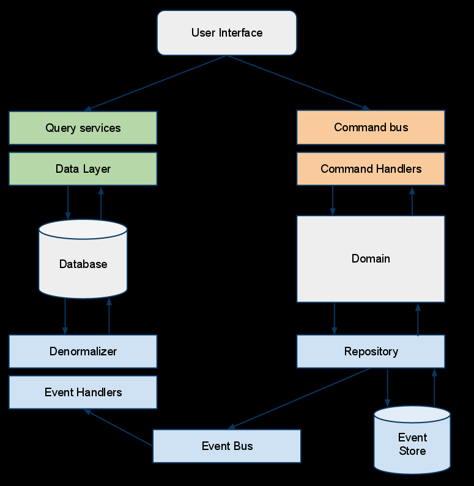

I'm working on a new project intended to replace a large —too large— monolith.

To adapt to the evolving needs of the **business** (Customer Orders), boost the **Time To Market**, improve **traceability** and **communication** between teams, we settled in using a CQRS asynchronous architecture (but _without_ Event Sourcing).

Long story short, it's not an easy task to "convert" everyone to the new way of thinking this imposes. Things people thought acquired must be re-questionned, re-challenged and new constraints arise (such as eventual consistency, or knowing if we should own a certain piece of data). I was _this_ guy always saying "you can't do that", reminding the whys.

This kind of architecture forces us to put strong constraints and have limitations most of us didn't have before (with a classic backend + DB). It's not always a bad thing: it **reveals** things. We learned a lot about the domains themselves, always questionning their separations and their responsabilities. It makes us **understand the business**.

Here, I'll talk about a use-case where we ~~wanted~~ needed to expose _not_-eventually-consistent (aka strongly-consistent) data to other services. CQRS has not to be eventually-consistent, but in our case, it was (because asynchronous). I can see some of you frowning because we should _accept_ eventual-consistency, it's part of the life. Agreed. But..

TOC

# CQRS

## Why do we need it?

CQRS —Command Query Response Segregation— was atypical years ago, but nowadays we can find a lot of content about it and lots of companies are using it and communicate about it. We can do CQRS without even knowing we do!

Let's explain the consequences of it:


#### One Write Model, N Read Models

The idea of CQRS is to enable an application (in the large sense) to work with different models:

- One model it writes with: the write model, altered by _Commands_ (more on this later)
- One or several models it and other applications read from (no read using the _write_ model)

CQRS does not imply working with microservices, or a messaging infrastructure, or _Events_, or doing DDD in essence. It's just often use with those techniques for reasons.

[[info]]
|eg: If we have an API taking POST/PUT on some resource, saving the state into PostgreSQL, and have a process to synchronize it into Elasticsearch for smart-lookups on our webpage, we're doing CQRS.

#### Scalability

CQRS allows us to scale our system independently: we _often_ have to handle way more reads than writes hence a different scalability.

We want our reads to be accessed in **O(1)**: we don't want taking more time fetching an entity because it has more links to other entities: we want to avoid explosive JOINs. The solution is to precompute the result when data changes, _before_ anyone request them. Doing so will also use less resources when a request occurs, will reduce the **latency** and make it **predictable** and stable on p999. We are trading _time_ for _space_. More on this later.

When we implement a Redis cache in order to avoid overloading the main database —taking writes— is the CQRS spirit.

#### Business requirements

Separating the write model from the read models helps us separating complex aspects of our domain (who needs what, who is responsible for what) and increase the flexibility of our solution. We can adapt more simply to changing business requirements.

This is because we think more about the responsabilities: who is mutating data, what is the use-case, should we truly own this data, is this not the responsability of another application, who just need to read data, should it be strongly-consistent etc. CQRS is often tighted to **DDD** because of this way of thinking.

#### Concurrency

Technically, it can also _simplify_ concurrency and locking (transactional databases) management, **by revealing them**.

When we are working with an asynchronous CQRS pattern, we often talk about data being eventually-consistent, data lifecycles, data ownerships, business requirements, and a lot about the modelization: the transactional boundaries of the entities and the invariants we should always have. Again, this is why CQRS is often DDD-oriented: data form **aggregates** which must be _very_ carefully defined. (more on this later)

#### No "Read your own Writes" semantics

Stale data must be explicitely deal with. If we alter a resource (by sending a Command) and read this same resource right away, we won't see our changes. Async CQRS does not provide "Read your own Writes" semantics. Front-ends can simulate it by doing **Optimistic Concurrency**: it can embed some knowledge and suppose the mutation it asked for will _be fine_, so it displays _what it thinks_ will be the answer before getting the real one. In case of discrepancies, it adapts.

When it's synchronous CQRS we can have this semantics: we write the two models into different tables, in the same transaction. It's always in-sync. CQRS is rarely synchronous because we want to work/scale with different resources, type of databases, use a messaging infrastructure: we can rarely make a distributed transaction cross-resources (we could talk about XA or Sagas but... not now!).

> CQRS is a pattern that strictly segregates the responsibility of handling commands (mutations) from the responsibility of handling side-effect-free query/read access.

## It's not a one-fit-all solution

We should consider implementing CQRS only in certain cases:

- We have changing business requirements _a lot_
- The business doesn't know exactly where it's heading
- We have scalability issues
- We collaborate with other teams (ie: other bounded contexts)
- Multiple users compete to alter the same resources
- We are orchestrating other services around us
- What's going on in our domain will affect them or vice-versa
- Our domain is write-oriented, we don't read our own data, other applications do

The overhead can be tremendous and unnecessary if we want to expose a simple API working solo or whose the scope is clearly defined.

Even if we **want** to implement a CQRS architecture, the team (developers & business) will need to bypass the **fear of changes**, to follow a **learning curve**, to **bend their minds**, then **adapt** how they used to work.

## AKF Scale Cube

If we follow the logic, it means we're going to have duplicated data in our system. The "same" data will be present under the write-model and under the read-model.

I encountered some people really scared of duplicated data, or feeling it's an anti-pattern. Data have one master, it should be the only one to control who has access to the data, nobody should copy it in its own database or messaging infrastructure. _You must always call my API! Vade Retro!_

Yes, sometimes it can necessary to always call an API and not copy the data (like the user data under GDPR). But it's rarely necessary and it can be an anti-pattern itself because leading to more complexity, more dependencies, bad performances, interruption of services, SLA diminution.

I like the AKF Scale Cube to see why duplication is transversal in an organization: https://akfpartners.com/growth-blog/scale-cube


In short, 3 axis:

- X: **low-level technical**: we should duplicate, replicate, cache, load-balance data
- Y: **organizational**: we should have independent services to handle different domains: they are responsible of their own data (à la DDD)
- Z: **high-level sharding**: we should segment similar things (per resource_id, per geography), per use-case, into their own infra

## Commands / Writes: side-effects

So the _thing_ that causes writes to the _write_ model is called a `Command`. It's a generic term to design what we always worked with: something to change the state of the system (an update of any kind).

- A `Command` can be synchronous or asynchronous.
- A `Command` can go through a message-bus or not.
- A `Command` can be a simple API call.
- A `Command` can be a super-class if doing OOP or not.
- A `Command` can be a simple function call.

All those concepts are orthogonal to what a `Command` is. We _command_ some state to change in some way.
A `Command` is an _intent_ (and not a fact) and causes _side-effects_ (on a resource). It is directed to a particular destination (not broadcast) and defined in term of the consumer domain (the _co-domain_).
It's generally defined as `VerbSomething`: `CreateOrder`, `ShipProduct`, `ComputePrice`, `GiveMoney`. We'll see later the symmetry with Events defined like `OrderCreated` (again, Events are outside of CQRS scope but they play nicely along).

A `Command` is _behavior-centric_ and not _data-centric_. It is about the intent to change something, it does not map to the format of a resource (like DTOs in an API). It can contain data that will help to process the intent but that's it.

We also talk about `task-based` systems and not `resource-based` systems. The Writes part doesn't accept new resources or patch of existing resources: they accept tasks aka Commands. It could have been named TQRS :-).

#### Flow

The flow of handling a `Command` is always the same:

- If async, it saves it into a messaging infrastructure and returns OK to the caller (can't do much more)

- When handling it —sync or async— according to its form (API, message, function call), call the right _Command Handler_ (a function)
- This handler must determine if it's possible to process it:
  - It retrieves the current state (from a database or using Event Sourcing)
  - It uses some business rules to know if it can grant or deny the `Command` on the state
- If granted, it applies the `Command` on the state (can generate Events or not)
  - If not granted, it returns an error (sync or async)
- It saves the new state
- If sync, it returns OK to the caller—or minimal information such as an ID but not the whole state (which is the write model)
  - If async, it commits the message to the messaging infrastructure.


`Commands` should follow a _fire & forget_ principle: we should not expect any result from a `Command` except "OK" or "KO". A `Command` is just an _ask_. The processing can be synchronous or asynchronous, we're not supposed to get the result asap. The result will come later from the read part.

A Command Handler must contain business logic to be able to deny instantly a Command or not. For instance, to handle a `CancelOrderCommand`:

```kotlin
class OrderCommandHandler {
    ...
    fun cancelOrder(cmd: CancelOrderCommand) {
        val order = repo.fetch(cmd.orderId) // the only place where we can fetch the write model
        if (order.inTransit()) error("Too late, we can't cancel an order in transit")
        // ...
        val newState = order.cancel()
        repo.persist(newState) // OR persist only events, OR both atomically (Outbox Pattern)
    }
```

There are a lot more things to know about `Commands`, I won't dive into them here because it's not the point of this article.

- `Commands` should be idempotent
- `Commands` can't use the read-side to grab data
- `Commands` should be retried only for technical reasons, and never replayed for business reasons, the result could be different
- `Commands` can be saved into a Command Bus for further processing

> `Commands` are about managing side-effects in a system.

## Queries / Reads / Serving Layer: No side-effects

As stated previously, we can have different read models built from the same original data.

We're all used to do this when we need to query our data to answer different use-cases. We have our source of truth somewhere (PostgreSQL, MongoDB, Cassandra, S3...) where we write/update our stuff, but we want to interpret them differently using specialized databases:

- cache data
- do fast text search
- query using a graph language
- handle timeseries data
- precompute aggregations within a set of dimensions
- use a realtime database (like Google Cloud Firestore) to send realtime updates to the client

#### Denormalizing / Consolidating

It's a common practice to sink our data from a relational database into elasticsearch to enjoy fast search, autocompletion, tokenizers, token filters, scoring, ranking, **stable latency**, which often cannot be obtain by the original database.

If we work in the advertising domain and want realtime dashboards about our advertisers and our publishers, we want to preaggregate the data in a timeseries database because we care about aggregation by bucket of time and sub-second responses. Therefore, we'll sink our data into Apache Druid or ClickHouse where they will preaggregate incoming data (using a CQRS approach internally, ah!).

We are denormalizing our original model to fit another model:

- to present data differently (SQL to NoSQL)
- to an external model (public) other applications will consume (we want to hide our implementation)
- to a "lighter" model where we don't need all the data
- to a "heavier" model where we're going to add lots of data we don't own

This last point is important. It's common to **consolidate** our data when we update our Reads Database. We can JOIN other tables we own or query other applications to fetch data we don't own/can't compute (customer name, product description, VTAs..). We don't want to do this at query time: we want a predictable stable latency hence accesses in O(1).

This consolidation/transformations is done when we need to update the database (when something changed), not at query-time. It means:

- We can update entities that will NEVER be read
- We can update entities that will be read million times
  - One acronym I like is `WORM`: Write Once Read Many. This is a sweet spot in using CQRS.
- We must have a way to detect changes in the original data to trigger the updates on the Reads Database. This is where events are useful.

Also, the Reads Database can be scary, because:

- It can contain data of several domains
  - This means **the Reads Databases should be dealt with the consuming team**, not the producing team. More on this later.
- It can be quite huge in size
- It can be destroyed and reconstructed from scratch to some extent: by assuming the **idempotency** of the other services.
  - If not, the reconstruction could be different than what it was before.
- We can update our Writes part without the Reads part to be down at the same time (independent lifecycles).


#### Free of side-effects

Having multiple databases imposes a strong constraint: the Reads Databases must handle **only reads**, not writes. They are not the source of truth.

There is no synchronization between them and the Writes Database. Reads Databases cannot create side-effects on the Writes Database.
Due to denormalization, it could be even impossible to find back the original record (if we don't keep all the necessary info, the PK etc. because we don't need them)

When you query an API (a `GET` or some GraphQL Query): you don't expect to mutate the data, same thing here.

#### Eventual Consistency

As stated before, those who use the Reads part could deal with stale data.

When we send a `Command` to be processed, its processing _can_ be done asynchronously (no result, Fire & Forget), and the updates of the Reads Database will be asynchronous (except if it's the same database but that's rare?).

Example:

- T0: We send a `AddProductToOrderCommand` about the Order 1234 (v1).
- T1: The Writes Service accepts it and updates the items of the Order 1234 in its Writes Database (v2).
- T2: The Reads Service is notified and query the Product Service to consolidate its view with the name and description.
- T3: An external Email service requests the details of the Order by querying a Reads Service—which is not yet up-to-date (v1).
  - (It can react to the same event the Reads Service reacted to in T2)
- T4: The Product Service responds to the Reads Service which can updates its Reads Database (v2).

Et voilà, in T3, despite the previous update happening before in T2 (in absolute time), the Reads Service sent the old version of the Order (v1) because it was not up-to-date yet.
This is why CQRS does not have the "Read your own Writes" semantics and why we must always think about eventual consistency when external systems talk with us.

The **version** we just introduced is mandatory to have in such system. This represents a logical time, to help us understand how the flow progresses and make decisions. It's part of the Writes Model and is propagated into the whole system (events if any, reads models...).

There are techniques to help external systems fetching the version they expect, more on that later.

If we want a strong consistency between our Writes and Reads database, they need to be updated atomically (and that's rarely possile due to the heterogeneous systems used). Even so, if we do that, we'll lose the **Availability** provided by relying on different systems (CAP theorem, we can be CP or AP under failures, not Consistent and Available at the same time).

By clearly separating both systems, the Reads part works independently of the Writes part: different lifecycles, different deployments, different constraints, different SLAs.

#### A different set of features

The Reads Service can provide way more features than the Writes service. The actors and use-cases are not the same for both sides.

Such features can be:

- Authentication
- Caching
- Encryption
- Rate Limiting
- Limited Retention
- Elastic Scaling
- Replication & LB
- Sharding
- SSE or Websockets for realtime updates (push)

When we have the same database for writes & reads, we are mixing different concerns together.

- Let's say we have a e-commerce website displaying the carts & orders to the customers using one Reads Service. The traffic is heavy (customer facing), the Reads Service is replicated or sharded, rely on caching, do websockets.
- On the other side, we have the employees of the company, with their own admin applications, who need to see and update the orders to prepare them, package them, update the delivery states etc. They don't need fancy features, the traffic is not heavy, the processes are slow. They just need an uptime of 99.999% because it's part of their job.

Both Reads Service have different SLAs (one can be "down", not the other), features, models (the admin Reads Service will provide more internal details, hidden from the customers Reads Service).

#### How to build a Reads Service

As developers, we love testing new technologies, new databases, new systems. The marvellous idea of splitting how we write of how we read gives us what we need to fulfill this love.

Nothing is easier than creating a new Reads Service (with its distinct Reads Database) and test it in parallel of the existing flow. If we work with events, we just subscribed to them and build the new model. If we work without events, then we probably have a synchronization program from a database we can alter or duplicate to write into our new system.

Moreover, each Reads Service can be written in any language, to answer more precisely to the use-cases and technologies used by the readers.

Here is a list of techniques to build such service:

- Dual writes
  - in code, when we write to database X with our (lovely) ORM (or not), we add code or abstraction to also write to Y
  - we must use a transaction or what's appropriate to ensure atomicity/consistency between them
- Database sync:
  - a batch that copy and transform the data every N minutes
  - an "almost-realtime" background service that poll changes every N minutes
- Change Data Capture (CDC)
  - it derives database changes into an event-stream
  - it relies on the replication log to act as events emitted by the database; then we can do some stream processing upon them
  - it's one of the great usage of [Kafka Connect](https://docs.confluent.io/current/connect/index.html) with [Debezium](https://debezium.io/) (PostgreSQL, MySQL)
- Events
  - we subscribe to the existing events (published on original state change) and build our Reads state from them (we can replay them from the past) to any database
  - we can also create a distributed auto-sharded database with Kafka Streams and its Interactive Queries.
- Hides a Lambda Architecture
  - a realtime view merged with a batch view

The best way is by relying events from a pubsub system. Inherently, they already decouple the publishers from the consumers. It's another reason why CQRS is often associated with events.

## The link with DDD

Until now, we barely talked about DDD, which is very often linked to CQRS (but not mandatory). Why?

We said we have `Commands` whose handlers check for business requirements, if ok, update the "state" and save it into the Writes Database.

In DDD, this state is contained in what we call an **Aggregate**. It's a tree of entities (with an entity root) which is self-contained, autonomous, and always consistent from an exterior and business point-of-view. An aggregate must ensure transactional boundaries within its entities: from the exterior, you can never see an aggregate "half-formed", "half-transformed", "half-valid". You can't access the entities directly: everything goes through the Aggregate (to control the consistency). The business invariance rules are always respected (eg: "an Order can't be delivrable if it's not payed yet" (ok, it depends but you get the idea!)).

[[info]]
|In DDD, _Entity_ has a special meaning. It's an object defined by its unique identity and not by its attributes, like `User(userId)`. `Color(r,g,b)` is not an entity, its attributes define it, it's a _Value Object_, it's immutable, it can be shared.

The aggregate is typically an **immutable** and **side-effects free** class in OOP with all the business related code (contrary to a DTO, which is often anemic, ie: without business logic). It does not depend upon any serialization framework, it does not have any annotations etc. It's a plain, simple, reusable code the business should understand because it's using their words: this is the **Ubiquitous Language**. Using the same language reduce confusion and misunderstanding because we don't translate implicitely (and loosely) between the "technical" and "business" sides.

So when we send a `Command`:

- a CommandHandler handles it
- it looks for the Aggregate the `Command` is talking about
  - a `Command` is generally about an existing resource, but it can also request to create one: `CreateOrderCommand`
- it checks some business rules to see if it's valid
- it calls the necessary functions on the Aggregate.
  - Each of these functions return the new state of the Aggregate.
- the ending state of the Aggregate is persisted into the Writes Database.

In a complex domains, DDD makes us structure our `Commands` and `Events` in a business way, comprehensible by everyone. DDD helps finding boundaries, limit responsabilities, and make the different parts of the system maintainable because "making sense". Such systems doesn't grow organically by the only will of the developers.

#### Finding Commands & Aggregates

A popular practice to find the **Aggregates** and their **Commands** is to do an _Event Storming_ workshop with developers & business people.

By looking for all the possible events our domain must deal with, we can regroup them and form aggregates containing related events. From this, we make cohesive subdomains emerge, we form **Entities**, **Aggregates**, and agree upon the **Ubiquitous Language**.


Another technique is the [_Domain Story Telling_](https://domainstorytelling.org/). We think of a user scenario. We draw it displaying the artefacts and persons involved in the flow (requests from where, who, where it goes, validated by who, where, who reacts, who sends stuff etc.). There are 4 items: actors, work items (documents, exchanges), activities (verb), (comments).


And if you are curious, you can also check the [_Business Model Canvas_](https://en.wikipedia.org/wiki/Business_Model_Canvas).

## Hide the ugly: API Gateway

CQRS is about a project, not a whole architecture. it's a implementation detail.
From the outside, it's possible to ignore if an application uses CQRS internally or not

api gateway to hide write/reads apis

An explicitly and purposefully defined interface designed to be invoked over a network that enables software developers to get programmatic access to data and functionality within an organization in a controlled and comfortable way.

- Hide technology infrastructure
- Documentation, backwards compatibility, versioning
- Can also be more technical: message-level transformation, complex routing, network resilience/fallbacks, and aggregation of responses.

- Share existing APIs on certain terms
- Authentication, rate limiting, metrics collection, other policy enforcement
- NO BUSINESS LOGIC

# Events




## Raison d'être

- First-class citizen
- Found by event-storming
- Decrease coupling: anyone can interpret them as wanted
- Invert the control flow (less coupling, more autonomy)
- Intentless (contrary to Commands), Anonymous, used for broadcast only
- Fire & Forget (don't expect anything)
- Defined in the **producer domain**
  - Whereas a "Message" is defined in the **consumer domain: a p2p construct, you know the target; just like an API call, except it's asynchronous**
- Emitted upon a successful or failed operation
- "Smart endpoints, dumb pipes" (martin fowler)
  - Endpoints are microservices, pipes is kafka-like: NOT like an ESB
  - Smart endpoints are probably stateful (persistence, state machines)
- Important here: Emitted by aggregates (after they received a Command)

  - We save the state into the events

- Not always produced by a Command: time flows (scheduler)
- 1 Commands can generate multiple events

- Ability to change/fix the model or bugs and recompute state (from the events)
- A LOT of different types of events: http://verraes.net/2019/05/ddd-msg-arch/
- "Standards": https://www.w3.org/TR/activitystreams-core/ or https://cloudevents.io/

## Internal VS External

- "External models" are often denormalized (contains names, address etc. not only ID)
  - Easier to consume and use (no need to understand dependencies)
- "Internal models" contains only IDs.
  - Useful when the models (referenced by the IDs) often change
  - Have a "Translator Service" (or several) to consolidate the event and make it "external"

## Projecting Events

A state is a projection of events (event stream), it forms an aggregate.

## Events does not mean Event Sourcing

If our repository don't build the state from the events: we are not sourcing from events, hence it's not event sourcing. QED.

## Event-Carried State Transfer

Not Event Notification.
Not Event Sourcing.

Contrary to Event-Sourcing, here, we use:

- Event-carried state transfer": Difficult to find the good balance: what to put in the event? if not enough: the emitter will probably be queried by all the consumers (to consolidate their state): Network overhead! requests overhead! or you just put the whole aggregate into the event. ⇒ Eventual Consistency is happening because data are replicated asynchronously

Why? => Explain + Schema

# Protect the Write Model

## private WriteModel m;

## Communicating with Legacy & New Systems

During a migration, "Legacy view", a new "View"
Don't share the consolidator (views) between services: each should build its own read models

## What if we need to expose it?

Never read write model

- Internal
- No coupling
- Scalability: different of reads
  Don't turn your write model into a read model without noticing.
  Don't publish events containing your write model (state) otherwise you just did it.

If we want to ensure we read the latest data

- why?
- business rules?
- wrong domain separation?
- need Command, maybe sagas?

Saga: a state machine, events driven (choregraphy) or orchestrated (orchestrator)., outside of aggregates, reactive, have side effects (create commands, send emails..) multi-service transactions, provide a rollback for each step

## ACLs to the rescue

Or maybe an ACL to expose the write model as a "read"

## From Internal Events to External Events

Transform internal to external events.
Streaming processing
Scalability
Business evolution?

RESTE::

Query model with a blocking "entity_id/v3" until it's up to date, or timeout
Sagas
Vector Clock (complexity because distributed system)
CRDTs
Latency++
