I'm working on a new project intended to replace a large —too large— monolith that created ramifications and introduce coupling in the whole company.

To adapt to the evolving needs of the business, boost the **Time To Market**, improve **traceability** and **communication** between teams, we settled in using a CQRS asynchronous architecture (but _without_ Event Sourcing, more on that later).

Long story short, it's not an easy task to "convert" everyone to the new way of thinking this imposes and convey the ideas. Things people thought acquired must be re-questionned, re-challenged and new constraints arise (such as eventual consistency, or knowing if we should own a certain piece of data). I was _this_ guy always saying "you can't do that", reminding the whys.

CQRS (combined with DDD) forces us to put strong constraints and have limitations most of us didn't have before (with a classic backend + DB). It's not always a bad thing: it **reveals** things. We learned a lot about the domains themselves, always questionning their separations and their responsabilities. It makes us **understand the business**.

Here, I'll talk about CQRS in general and its links with DDD and Event Sourcing. All started with a use-case where we ~~wanted~~ needed to expose _not_-eventually-consistent (aka strongly-consistent) data to other services. CQRS has not to be eventually-consistent, but in our case, it was (because asynchronous and highly available). I can see some of you frowning because we should _accept_ eventual-consistency, it's part of the life (and distributed systems). Agreed. But..

TOC

# CQRS

## Why do we need it?

CQRS —Command Query Response Segregation— was atypical years ago, but nowadays we can find a lot of content about it and lots of companies are using it and communicate about it. We can do CQRS without even knowing we do!

The pattern is trivial:


CQRS does not imply working with microservices, or a messaging infrastructure, or _Events_, or doing DDD in essence. It's just often used with those techniques for reasons.

#### One Write Model, N Read Models

The idea of CQRS is to enable an application (in the large sense) to work with different models:

- One internal model it writes with: the write model, altered by _Commands_ (more on this later)
- One or several read models it and other applications read from (we can't let others read the _write_ model)

The Read Models can be read by front-ends or by APIs, it does not matter.

[[info]]
|eg: If we have an API taking POST/PUT on some resource, saving the state into PostgreSQL, and have a process to synchronize it into Elasticsearch for smart-lookups on our webpage, we're *almost* doing CQRS (we probably also expose our PostgreSQL..).

#### Scalability

CQRS allows us to scale our system independently: we _often_ have to handle way more reads than writes hence a different scalability.

We want our reads to be accessed in **O(1)**: we don't want them taking more time fetching an entity because it has more links to other entities: we want to avoid explosive JOINs. The solution is to precompute the result when data changes, _before_ anyone request them. Doing so will also use less resources when a request occurs, will reduce the **latency** and make it **predictable** and stable on p999. We are trading _time_ for _space_. More on this later.

When we implement a Redis cache in order to avoid overloading the main database —taking writes— it's the CQRS spirit.

#### Business requirements

Separating the write model from the read models helps us separating complex aspects of our domain (who needs what, who is responsible for what) and increase the flexibility of our solution. We can adapt more simply to **changing business requirements**.

This is because we think more about the responsabilities: who is mutating data? what is the use-case? should we truly own this data? do we act on it? is this not the responsability of another application? who just need to read data? should it be strongly-consistent? etc. CQRS is often tied to **DDD** because of this way of thinking.

#### Concurrency

Technically, CQRS can also _simplify_ concurrency and locking (transactional databases) management, **by revealing them**.

When we are working with an asynchronous CQRS pattern, we often talk about data being eventually-consistent, data lifecycles, data ownerships, business requirements, and a lot about the modelization: the transactional boundaries of the entities and the invariants we should always have. Again, this is why CQRS is often DDD-oriented: data form **aggregates** which must be _very_ carefully defined. (more on this later)

#### No "Read your own Writes" semantics

Stale data must be explicitly deal with. If we alter a resource (by sending a Command) and read this same resource right away, we won't see our changes. Async CQRS does not provide "Read your own Writes" semantics.

Front-ends can simulate it by doing **Optimistic Concurrency**: it can embed some knowledge and suppose the mutation it asked for will _be fine_, so it displays _what it thinks_ will be the answer before getting the real one. In case of discrepancies, it adapts.

When it's synchronous CQRS we can have this semantics: we write the two models into different tables, in the same transaction. It's always in-sync. CQRS is rarely synchronous because we want to work/scale with different resources, type of databases, use a messaging infrastructure: we can rarely make a distributed transaction cross-resources (we could talk about XA or Sagas but... not now!).

> CQRS is a pattern that strictly segregates the responsibility of handling commands (mutations) from the responsibility of handling side-effect-free query/read access.

## It's not a one-fit-all solution

We should consider implementing CQRS only in certain cases:

- We have changing business requirements _a lot_
- The business doesn't know exactly where it's heading
- We have scalability issues
- We collaborate with other teams (ie: other bounded contexts)
- Multiple services compete to alter the same resources
- We are orchestrating other services around us
- What's going on in our domain will affect them or vice-versa
- Our domain is write-oriented, we don't read our own data, other applications do

The overhead of doing CQRS for a simple API working solo or whose the scope is clearly defined can be tremendous and unnecessary.

Even if we **want** to implement a CQRS architecture, the team (developers & business) will need to bypass the **fear of changes**, to follow a **learning curve**, to **bend their minds**, then **adapt** how they used to work.

## AKF Scale Cube

If we follow the Write + Reads logic, it means we're going to have somehow duplicated data in our system. The "same" data will be present under the write-model and under the read-models.

I encountered some people really scared of duplicated data, or feeling it's an anti-pattern. Data have one master, it should be the only one to control who has access to the data, nobody should copy it in its own database or messaging infrastructure. _You must always call my API! Vade Retro!_

Yes, sometimes it can necessary to always call an API and not copy the data (like the user data under GDPR). But it's rarely mandatory and it can be an anti-pattern itself because leading to more complexity, more dependencies, bad performances, interruption of services, SLA diminution.

I like the AKF Scale Cube to see why duplication is transversal in an organization: https://akfpartners.com/growth-blog/scale-cube

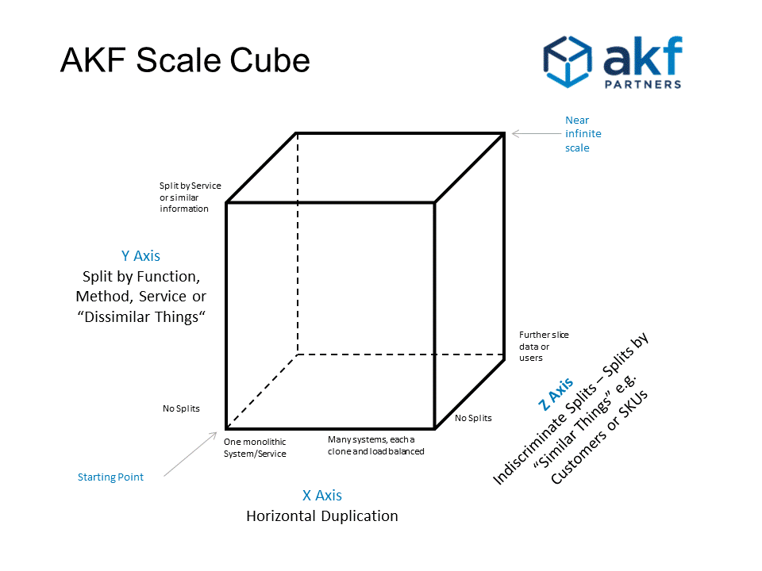

In short, 3 axis:

- X: **low-level technical**: we should duplicate, replicate, cache, load-balance data
- Y: **organizational**: we should have independent services to handle different domains: they are responsible of their own data (à la DDD)
- Z: **high-level sharding**: we should segment similar things (per resource_id, per geography), per use-case, into their own infra

## Commands / Writes: side-effects

So the _thing_ that causes writes to the _write_ model is called a `Command`. It's a generic term to design what we always worked with: something to change the state of the system (an update of any kind).

- A `Command` can be treated synchronously or asynchronously.
- A `Command` can go through a message-bus or not.
- A `Command` can be a simple API call.
- A `Command` can be a super-class if doing OOP or not.
- A `Command` can be a simple function call.

All those concepts are orthogonal to what a `Command` is. We _command_ some state to change in some way.
A `Command` is an _intent_ (and not a fact) and causes _side-effects_ (on a resource). It is directed to a particular destination (not broadcast) and defined in term of the **consumer domain** (the _co-domain_). 

It's generally defined as `VerbSomething`: `CreateOrder`, `ShipProduct`, `ComputePrice`, `GiveMoney`. We'll see later the symmetry with Events defined like `OrderCreated` (again, Events are outside of CQRS scope but they play along nicely).

A `Command` is **behavior-centric** and not _data-centric_. It is about the intent to change something, it does not map to the format of a resource (like DTOs in an API). It can contain data that will help to process the intent but that's it.

We also talk about **Task Based** systems and not *Resource Based* systems. The Writes part doesn't accept new resources or patch of existing resources: they accept tasks aka Commands. It could have been named TQRS :-).

#### Flow

The flow of handling a `Command` is always the same:

- If async, it saves it into a messaging infrastructure and returns OK to the caller (can't do much more)

- When handling it —sync or async— according to its form (API, message, function call), call the right _Command Handler_ (a function)
- This handler must determine if it's possible to process it:
  - It retrieves the current state if must act upon (from a database or using Event Sourcing)
  - It uses some business rules to know if it can grant or deny the `Command` on the state
- If granted, it applies the `Command` on the state (can generate Events or not)
  - If not granted, it returns an error (sync or async)
- It saves the new state
- If sync, it returns OK to the caller—or minimal information such as an ID but **not the whole state** (which is the write model)
  - If async, it commits the message to the messaging infrastructure.

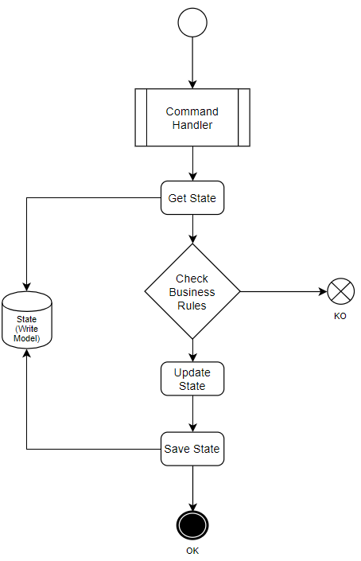

`Commands` should follow a _fire & forget_ principle: we should not expect any result from a `Command` except "OK" or "KO". A `Command` is just an _ask_. The processing can be synchronous or asynchronous, we're not supposed to get the result asap. The result will come later from the read part.

A Command Handler must contain business logic to be able to deny instantly a Command or not. For instance, to handle a `CancelOrderCommand`:

```kotlin
class OrderCommandHandler {
    ...
    fun cancelOrder(cmd: CancelOrderCommand) {
        val order = repo.fetch(cmd.orderId) // the only place where we can fetch the write model
        if (order.inTransit()) error("Too late, we can't cancel an order in transit")
        // ...
        val newState = order.cancel()
        repo.persist(newState) // OR persist only events, OR both atomically (Outbox Pattern)
    }
```

There are a lot more things to know about `Commands`, I won't dive into them here because it's not the point of this article.

- `Commands` processing should be idempotent
- `Commands` can't use the Read side to grab data
- `Commands` should be retried only for technical reasons, and never replayed for business reasons: the result could be different (eg: VTA changed since)
- `Commands` can be saved into a Command Bus for further processing

> `Commands` are about managing side-effects in a system.

## Queries / Reads / Serving Layer: No side-effects

As stated previously, we can have different read models built from the same original data.

We're all used to do this when we need to query our data to answer different use-cases. We have our source of truth somewhere (PostgreSQL, MongoDB, Cassandra, S3...) where we write/update our stuff, but we want to interpret them differently using specialized databases:

- cache data
- do fast text search
- query using a graph language
- handle timeseries data
- precompute aggregations within a set of dimensions
- use a realtime database (like Google Cloud Firestore) to send realtime updates to the client

#### Denormalizing / Consolidating

It's a common practice to sink our data from a relational database into elasticsearch to enjoy fast search, autocompletion, tokenizers, token filters, scoring, ranking, **stable latency**, which often cannot be obtain by the original database.

If we work in the advertising domain and want realtime dashboards about our advertisers and our publishers, we want to **preaggregate** the data in a timeseries database because we care about aggregation by bucket of time and sub-second responses. Therefore, we'll sink our data into Apache Druid or ClickHouse where they will preaggregate incoming data (using a CQRS approach internally, ah!).

We are denormalizing our original model to fit another model:

- to present data differently (SQL to NoSQL)
- to an external model (public) other applications will consume (we want to hide our implementation)
- to a "lighter" model where we don't need all the data
- to a "heavier" model where we're going to add lots of data we don't own

This last point is important. It's common to **consolidate** our data when we update our Reads Database (served by a *Reads Service*). We can JOIN other tables we own or query other applications to fetch data we don't own/can't compute (customer name, product description, VATs..). We don't want to do this at query time: we want a **predictable stable latency** hence accesses in O(1).

This consolidation/transformation is done when we need to update the database (when something changed), not at query-time. It means:

- We can update entities that will NEVER be read
- We can update entities that will be read a million time
  - One acronym I like is WORM: **Write Once Read Many**. This is a sweet spot in using CQRS.
- We must have a way to detect changes in the original data to trigger the updates on the Reads Database. This is where events are useful.

Also, the Reads Database can be scary, because:

- It can contain data of several domains
  - This means **the Reads Services should be managed by the consuming teams**, not the producing team. More on this later.
- It can be quite huge in size
- It can be destroyed and reconstructed from scratch to some extent: by assuming the **idempotency** of the other services.
  - If not, the reconstruction could be different than what it was before.
- We can upgrade our Writes Service without the Reads Services to be down at the same time (independent lifecycles).

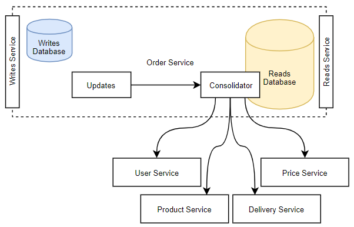


#### Legacy Stack & New Systems

When we are making a new product, we generally want it to be integrated into the existing stack if any (let's say the *Legacy stack*).

The legacy doesn't want (or just can't) to adapt to our new model or way of communicating. It just wants a classic API to fetch data reusing the existing format it understands. This is a perfect use-case for a dedicated Reads Service: a "Legacy Reads Service". It may need a different set of services to build the legacy view, and different business rules to match the legacy model.

A legacy model tends to have more data (because of a monolithic approach), can be cross-domains (that the modern stack is splitting because of a DDD approach), and may have inherited even older stacks constraints. It's not feasible to do a big bang release, so we must ensure the continuity and overlapping of services.

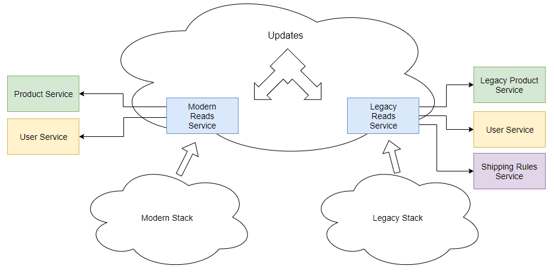

#### Free of side-effects

Having multiple databases imposes a strong constraint: the Reads Services must handle **only reads**, not writes. They are not the source of truth.

There is no synchronization between them and the Writes Database. Reads Databases cannot create side-effects on the Writes Database.
Due to denormalization, it could be even impossible to find back the original record (if we don't keep all the necessary info like the PK because we don't need them)

When we query an API (a `GET` or some GraphQL Query): we don't expect to mutate the data, same thing here.

#### Eventual Consistency

As stated before, those who use the Reads Service could deal with stale data.

When we send a `Command` to be processed, its processing _can_ be done asynchronously (no result, Fire & Forget), and the updates of the Reads Database will be asynchronous (except if it's the same database but that's rare?).

Example:

- T0: We send a `AddProductToOrderCommand` about the Order 1234 (v1).
- T1: The Writes Service updates the items of the Order 1234 (v2).
- T2: The Reads Service is notified and query the Product Service to consolidate its view with the name and description (in progress).
- T3: An external Email service, also notified, requests the details of the Order by querying the Reads Service—which is not yet up-to-date (v1).
- T4: The Product Service responds to the Reads Service which can finally updates its Reads Database (v2).

At T3, despite the previous update happening before in T2 (in absolute time), the Reads Service sent the old version of the Order (v1) because it was not up-to-date yet. We can't know how long it will take for the system to converge.
This is why CQRS does not have the "Read your own Writes" semantics and why we must always think about eventual consistency when external systems talk with us.

The **version** we just introduced is mandatory to have in such system. This represents a logical time, a monotonic counter, to help us understand how the flow progresses and make decisions. It's part of the Writes Model and is propagated into the whole system (events if any, reads models...).

> A *version* is not the only artefact we can find in such system. We could also work with Vector Clocks and CRDTs structures, to deal with event ordering causality. Those are generally things the external systems don't want to deal with, it's our internal mess, hence the need of a distinct Read Model to remove the noise.

There are techniques to help external systems fetching the version they expect, more on that later.

If we want a strong consistency between our Writes and Reads databases, they need to be updated atomically (and that's rarely possile due to the heterogeneous systems used). Even so, if we do that, we'll lose the **Availability** provided by relying on different systems (CAP theorem, we can be CP or AP under failures, not Consistent and Available at the same time).

By clearly separating both systems, the Reads Service works independently of the Writes Service: different lifecycles, different deployments, different constraints, different SLAs.

#### A different set of features

The Reads Service can provide way more features than the Writes service. The actors and use-cases are not the same for both sides.
Such features can be:

- Authentication
- Caching
- Encryption
- Rate Limiting
- Limited Retention
- Elastic Scaling
- Replication & LB
- Sharding
- SSE or Websockets for realtime updates (push)

When we have the same database for writes & reads, we are mixing different concerns together.

- Let's say we have a e-commerce website displaying the carts & orders to the customers using one Reads Service. The traffic is heavy (customer facing), the Reads Service is replicated or sharded, rely on caching, do websockets.
- On the other side, we have the employees of the company, with their own admin applications, who need to see and update the orders to prepare them, package them, update the delivery states etc. They don't need fancy features, the traffic is not heavy, the processes are slow. They just need an uptime of 99.999% because it's part of their job.

Both Reads Service have different SLAs (one can be "down", not the other), features, models (the admin Reads Service will provide more internal details, hidden from the customers Reads Service).

#### How to build a Reads Service

As developers, we love testing new technologies, new databases, new systems. The marvellous idea of splitting how we write of how we read gives us what we need to fulfill this love.

Nothing is easier than creating a new Reads Service (with its distinct Reads Database) and test it in parallel of the existing flow. If we work with events, we just subscribed to them and build the new model. If we work without events, then we probably have a synchronization program from a database we can alter or duplicate to write into our new system.

Moreover, we can have polyglotism. Each Reads Service can be written **in any language**, to answer more precisely to the use-cases and technologies used by the readers.

Here is a list of techniques to build such service:

- Dual writes
  - in code, when we write to database X with our (lovely) ORM (or not), we add code or abstraction to also write to Y
  - we must use a transaction or what's appropriate to ensure atomicity/consistency between them
- Database sync:
  - a batch that copy and transform the data every N minutes
  - an "almost-realtime" background service that poll changes every N minutes
- Change Data Capture (CDC)
  - it derives database changes into an event-stream
  - it relies on the replication log to act as events emitted by the database; then we can do some stream processing upon them
  - it's one of the great usage of [Kafka Connect](https://docs.confluent.io/current/connect/index.html) with [Debezium](https://debezium.io/) (PostgreSQL, MySQL)
- Events
  - we subscribe to the existing events (published on original state change) and build our Reads state from them (we can replay them from the past) to any database
  - we can also create a distributed auto-sharded database with **Kafka Streams** and its Interactive Queries.
- Hides a Lambda Architecture
  - a realtime view merged with a batch view

The best way is by relying on events with a pubsub system. Inherently, they already decouple the publishers from the consumers. It's another reason why CQRS is often associated with events.

## Where is the DDD?

Until now, we barely talked about DDD, which is very often linked to CQRS (but not mandatory). Why?

We said we have `Commands` whose handlers check for business requirements, if ok, update the "state" and save it into the Writes Database.

In DDD, this state is contained into what we call an **Aggregate**. It's a tree of entities (with an entity root) which is self-contained, autonomous, and always consistent from an exterior and business point-of-view.

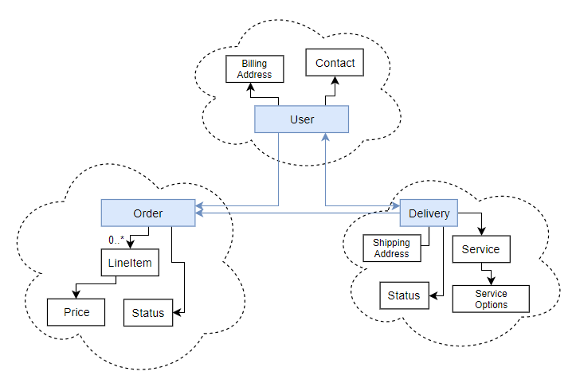

An aggregate must ensure transactional boundaries within its entities: from the exterior, we can never see an aggregate "half-formed", "half-transformed", "half-valid". **We can't access the sub-entities directly**: everything must reference the Aggregate only (for it to control the consistency). The business invariance rules are always respected (eg: "an Order can't be 'delivrable' if it's not payed yet" (ok, it depends but we get the idea!)).

[[info]]
|In DDD, _Entity_ has a special meaning. It's an object defined by its unique identity and not by its attributes, like `User(userId)`. `Color(r,g,b)` is not an entity, its attributes define it, it's a _Value Object_, it's immutable, therefore it can be shared.

The aggregate is typically an **immutable** and **side-effects free** class in OOP with all the business related code (contrary to a DTO, which is often anemic, ie: without business logic). It does not depend on any serialization framework (no crappy JSON annotations, not an Avro generated class..), it does not have any annotations etc.

It's a plain, simple, reusable code the business should understand because it's using their words: this is the **Ubiquitous Language**. Using the same language reduce confusion and misunderstanding because we don't translate implicitely (and loosely) between the "technical" and "business" sides.

```scala
// our aggregate with a private constructor
case class Order private(id: OrderId, items: List[LineItem], state: OrderStatus) {
    def addItem(item: LineItem): Order = ???
    def removeItem(item: LineItem): Order = ???
    def canBeCancelled(): Boolean = ???
    def startProcessing(): Order = ???
    def addCoupon(): Order = ???
    def cancel(): Order = ???

    // Optional: events generated by the previous methods to be persisted separately
    private val events: List[OrderEvents] = List()
}
object Order {
    // the public constructor ("factory method")
    def apply(): Order = Order(randomOrderId(), List(), OrderStatus.CREATED)
}
```

An **Aggregate** is retrieved and persisted by a **Repository** (which has its own persistence method, hidden). An Aggregate does NOT represent the exact mapping of an underlying database or serialization format. It's business-oriented, not technical-oriented.

```scala
class OrderRepository {
    def fetch(id: OrderId): IO[Option[Order]] = ???
    def save(order: Order): IO[Unit] = ???
}
```

Back to the `Command`, what is truly happening when we are dealing with Aggregates:

- the _code_ directs it to a Command Handler to handle it
- the CH fetches the Aggregate (referenced in the `Command`) from a `Repository`
  - a `Command` can be about an existing resource, or can request to create one, eg: `CreateOrderCommand`
- the CH checks some business rules to see if it the Command fits the business rules at this point
- it yes, it calls the necessary functions on the Aggregate.
  - Each of these functions return the new state of the Aggregate.
- the ending state of the Aggregate is persisted into the Writes Database (or Events to a Events Store).

In complex domains, DDD makes us structure our `Commands` and `Events` in a business way, comprehensible by everyone understanding the domain. DDD helps finding boundaries, limit responsabilities, and make the different parts of the system maintainable because "making sense". *Such systems doesn't grow organically by the only will of the developers.*

#### Finding Commands & Aggregates & More

A popular practice to find the **Aggregates** and their **Commands** (and **Events**, and more..) is to do an [_Event Storming_](https://en.wikipedia.org/wiki/Event_storming) workshop with developers, business people and experts.

By looking for all the possible events our domain must deal with, we can regroup them and form aggregates containing related events. From this, we make cohesive subdomains emerge (things belonging together), we form **Entities**, **Aggregates**, and agree upon the **Ubiquitous Language**.

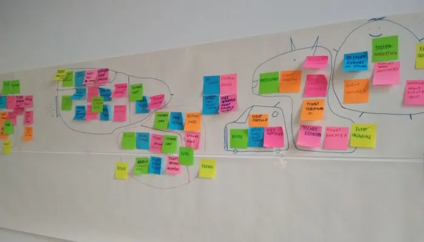

Another technique is the [_Domain Story Telling_](https://domainstorytelling.org/). We think of a user scenario. We draw it displaying the artefacts and persons involved in the flow (requests from where, who, where it goes, validated by who, where, who reacts, who sends stuff etc.). There are 4 items: actors, work items (documents, exchanges), activities (verb), (comments).


If you are curious, you can also check the [_Business Model Canvas_](https://en.wikipedia.org/wiki/Business_Model_Canvas).

# Events

It's not mandatory to broadcast Events with CQRS. It's just a _natural_ way of working with it.
Events are emitted when _Aggregates_ are updated. They are broadcast to "who wants to hear" (others and itself). It's very useful to make systems reactive and independants.

Here is a list of events:

```scala
case class OrderCreated(orderId: OrderId, items: List[LineItem], customer: CustomerId)
case class OrderLineAdded(orderId: OrderId, item: LineItem)
case class OrderCancelled(orderId: OrderId, reason: Option[String])
...
```

Now we can look _a_ more complete picture relying on CQRS, Aggregates, Events:

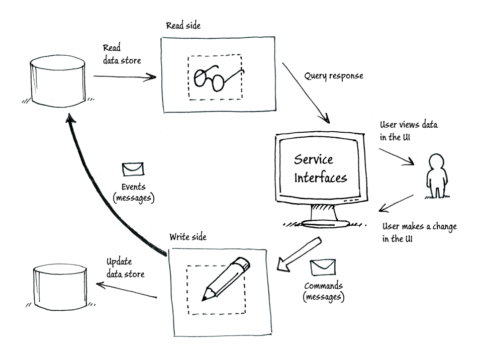

## Raison d'être

When we have events, they often become _first-class citizen_. It means everything is built around them: the business logic, the dependencies ("we need X and Y before doing Z").

As `Commands`, `Events` is a generic term which does not define its implementation but more its behavior and origins.

An `Event` is a fact of the **past**. It's inherently immutable (we can't change the past right?).
Unlike `Commands` which have a fixed destination, can contain their origin, are intentful, `Events` are the opposite: they are just broadcast to the world with a _fire & forget_ fashion, are **intentless**, and can be **anonymous**.
Because we don't know who is listening, we can't hardcode who needs it (we just rely on the technical bus transporting the events): **this decreases coupling between systems**. We can create new systems listening without the emitting system to know and to care.


This is where publish/subscribe systems like Kafka are useful, because they are this intermediate bus, keeping the events, dealing with the distribution to consumers that can be dynamically added or removed and so much more.

Importantly, `Events` are defined in the **producer domain**. A `Command` (or a "Message" in a more general way) is defined in the **consumer domain** (we speak the language of the target, we give it an "order").

## Projecting Events

Events can be created by anything. When doing CQRS and DDD, they are mostly created by the Aggregates. When an Aggregate is altered, it emits one or more Events corresponding to the changes.
Events can also be produced by something *exterior* such as a scheduler, when it depends upon time: "send this event X at the end of the hour".

**This is where we have the choice of doing Event Sourcing or not.**

- We can decide to update the state of the Aggregate *independently* of the event it has generated:

```scala
def increment(state: State): (State, Event) = {
    val newState = state + 1
    (newState, NumberWasIncremented(1))
}
val (newState, event) = increment(5)
```

- We can decide to create the new state of the Aggregate by "playing" an event on the current state:

```scala
def increment(): Event = NumberWasIncremented(1)
def apply(state: State, e: Event): State = e match {
    case NumberWasIncremented(x) => state + x
}
val newState = apply(5, increment())
```

The Event-Sourcing way can look over-engineered. We need one more function `apply` and pattern-matching. We have split the logic of event creation from event application.
It's easier to reason about. When applying an event, we don't have to know where it comes from.

An event is lightweight, it is only about _what changed_. We can recreate an Aggregate from scratch by replaying all the Events of its life. We have more knowledge about what happened, we don't keep only the latest state or the snapshot between changes. We keep the changes themselves. A state, an aggregate, is a **projection of events**.
We often have a function to replay everything at once, sometimes called a *calculator*, *reducer*, *replayer*:
```scala
def applyAll(initialState: State, events: List[Event]): State = {
    events.foldLeft(initialState) { case (s, e) => apply(s, e) }
}
```

One of the strength of doing Event Sourcing is that we can also replay the events in a different way: this will form a different state. It's perfect when our model often changes: the events don't change but we interpret them differently. This is useful when our model is dynamic because of a *business-ever-changing* mindset. Technology such as **Kafka** allows the consumers to replay past events (to rebuild their state/aggregates) and catch up the present (by resetting offsets).

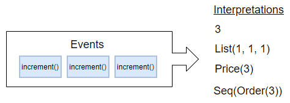

Working with CQRS and DDD, we tends to emit Events because they represent a business reality: something happened in the business! The past won't changed because we want to add new features. We can only **interpret the past**.

We may have existing use-cases to handle events, but we may discover new use-cases in the future. This is why we don't want to discard anything and we prefer to store all events: to process them later in a new manner we don't know yet (and for traceability and more reasons). **Events are gold**. Don't lose them.

## Events does not mean Event Sourcing

It's not because we are dealing with Events that we must do Event Sourcing.
If we don't build our aggregate from the events: we are not sourcing from events, hence it's not event sourcing. QED.

The logic of the Event Sourcing (or not) is hidden in an implementation of `AggregateRepository`.
It's simply a specific way of fetching an aggregate.

When we do Event Sourcing, instead of fetching the latest state from a database directly, we ask to an *Event Store* to get all the events about a particular aggregateId (hence Kafka is not a good choice for an Event Store, but Kafka Streams may be, with Interactive Queries) and we replay them to build the latest state. This also means that we MUST keep all events in history to do Event Sourcing.

There are strategies of snapshotting a state every X events to avoid having to replay 10000 events each time if the aggregates are massively updated. But that's for another article.

Event Sourcing is an orthogonal concept to CQRS. We can do one without the other.

## Smart Endpoints & Dumb Pipes

Martin Fowler introduced the notions of "_Smart Endpoints, Dumb Pipes_". In short: don't put business logic in the transport mechanism. We must control _our_ business logic. We don't want some pipes to become a bottleneck (as ESBs become in large companies). The transport mechanism should stay dumb: it's there for the technical side, nothing more.

> This reminds me of ReactJS where we talk about:
>
> - Dumb Components: pure, render a piece of UI, logicless (a button, a calendar, a menu)
> - Smart Components: dealing with data, having a state and some business logic.
>   <br /><br />
>   Smart Components rely on Dumb Components. We can change the implementation of a Smart Component just by changing which Dumb Components it is using: we don't change its logic.

The systems publishing or consuming are smart: they handle the mappings, the conversions of domains etc. (using **Anti-Corruption Layers**, a DDD notion when different Bounded Contexts talk to each others). It's more scalable, generally easier to maintain because everyone has its own logic and asks. DIY.

It's also common to let some state living in an ESB because we want to alter the behavior according to the past or some dynamic conditions. A _Smart Endpoint_ will create and maintain its own private state. It's not the role of a "pipe" to do this.

## Format & Semantics

We understand why emitting events is nice, but is there a format we should follow? Is there a standard? What should we save into them? What about metadata? What if I don't do Event Sourcing but want to generate events, what are the differences? _Event_ is a simple word but has a huge semantics.

Nothing is "official", but we can rely or take inspiration from those:

- https://www.w3.org/TR/activitystreams-core/ + https://www.w3.org/TR/activitystreams-vocabulary/

  - This provide a JSON-based syntax compatible with JSON-LD.
    - A Context
    - A Type of Activity
    - An Actor
    - An Object
    - A potential Target
    - ...

- https://cloudevents.io/ + https://github.com/cloudevents/spec
  - More useful and more complete, CloudEvents provides a spec and SDKs in different languages, different serialization format (Json, Avro, Protobuf, ...) and _may_ end up at the CNCF (Cloud Native Computing Foundation). It's serverless oriented, but an event is an event right?

```json
{
  // CloudEvents metadata data goes here
  "eventType": "order.line.added",
  "eventID": "C1234-1234-1234",
  "eventTime": "2019-08-08T14:48:09.769Z",
  "eventTypeVersion": "1.0",
  "source": "/orders",
  "extensions": {},
  "contentType": "application/json",
  "cloudEventsVersion": "0.1",

  // Custom event data goes here
  "data": {
    "orderId": "abc",
    "item": { "reference": "prod123", "quantity": 12 }
  }
}
```

About the semantics, [Mathias Verraes](http://verraes.net/) (a DDD expert) did a great job listing and explaining the different semantics an event can hold. Here is a short extract:

- **Summary Event**: conflate multiple events into one (multiple `ItemAdded` into `ItemsAdded`)
- **Passage of Time Event**: a scheduler emits events instead of commands `DayHasPassed`
- **Segregated Event**: convert events from one domain to another
- **Throttling Event**: only emit the latest event per time unit
- **Change Detection Event**: produce a new Event only when a value from an Event Stream change `PriceChanged`
- **Fat Event**: add redundant info to the Event to reduce complexity in the consumer
- ...

> Notice the last event: "Fat Event". We will use this strategy soon to embed the full state of the aggregate in the event itself.

## Internal VS External Events

More about semantics and DDD: an event can be **internal** or **external**.

- an **internal** event is produced and consumed by our domain (bounded context), it's private.
- an **external** event is going to be consumed by other domains we don't control, it's public.
  - our own application will consume external events from other parties.
  - external events have a **schema** for people to know how to consume them. It is shared into a metadata service or some registry (or Excel..).

Both types have different targets hence different constraints and usages.

An **internal** event tends to be normalized and contains mostly references (IDs). It works with an internal model. We don't want to add useless info or repeat information we already have in other part of our system. The more references, the better it is to future developments. We'll be able to refactor our model without altering the events.

**External** events, working with external models, are for **public consumption**. They are often denormalized (contain name, addresses, no versions, are simpler) to avoid consumers to understand dependencies.

Exposing internal events to the exterior leads to complex architectures, difficult evolutions, lack of visibility, and blur the domains frontiers. If we do that, **without noticing**, we are transforming our _internal_ event into an _external_ event. Therefore, this also transforms our internal model into an external model. We are introducing a strong coupling between us and the others services.

That's the whole point of this article: why and how should we protect us from this.

## From Internal to External

One solution is to do some stream processing to transform and consolidate (by calling other services) the event to make it _external_. It's a mix of _Fat Events_ and _Segregated Event Layers_.
Here is an example of conversion from private (a bit complex to see a clear the difference) to public:

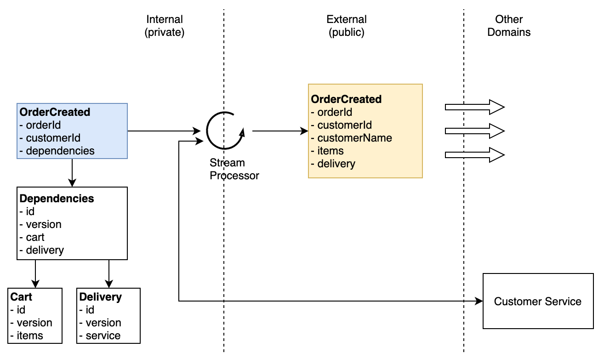


## Event-Carried State Transfer

Sometimes, for performances and simplications, we want to include the state of the aggregate alongside its own events it generates when updated.

It can be delicate to know exactly what to put in the events. If we forget something or if it's not enough for the consumers to their work (internal or external), we can introduce network/request overhead and complexify their work.

If the event is plain/nude (just what changed, without the latest state), they may need more info, and need to build their own state from all the past events (ie: act as a Reads Service; it could be a KTable if using Kafka Streams) or request an existing Reads Service to do their work.

That leads to a few issues for consumers:

- they don't want do be stateful and replicate a state that already exists somewhere
- they don't want to listen to all events to build the state (`OrderCreated`, `OrderItemsAdded`, `OrderShipped`, ... to build the `Order`) if they care only about one type of event (like `OrderShipped` to send an email, they need the whole content of the `Order` but `OrderShipped` could have only the `orderId`)
- they want to query some Reads Service to get what is missing
  - this introduces eventual-consistency: they may cannot accept it.

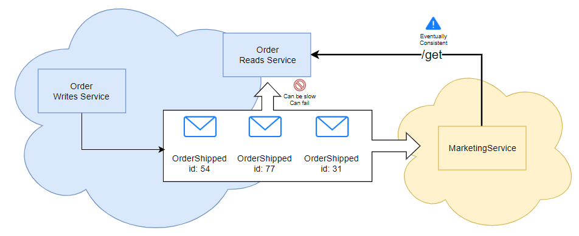

One solution is therefore to embed the state into the event itself.
This is a **Event-Carried State Transfer**.

Imagine 3 plain events:

```json
{ type: "OrderCreated", orderId: 1337, customer: "john" }
{ type: "OrderLineAdded", orderId: 1337, item: { ref: "prodA", qty: 2 } }
{ type: "OrderShipped", orderId: 1337 }
```

If our Email Service listens only to `OrderShipped` events, it don't have the items, it needs to query a Reads Service that may have not yet processed `OrderLineAdded` (lag, network issues). The email sent won't contain of items or worse, the Reads Service may not even know about the orderId 1337.

One solution is to add a version on the events (each event increases the version of the aggregate it represents), then we can ask for the a specific version in the Reads Service:
```json
{ type: "OrderCreated", orderId: 1337, v: 1, customer: "john" }
{ type: "OrderLineAdded", orderId: 1337, v: 2, item: { ref: "prodA", qty: 2 } }
{ type: "OrderShipped", orderId: 1337, v: 3 }

GET /reads/orders/1337?v=3
```

The Reads Service may then **block** until it gets the expected version or *timeouts* if this never happens.

Another solution, avoiding a dependency, a network call and a blocking request is to use this *Event-Carried State Transfer* strategy (we put the state in the event):

```json
{ type: "OrderCreated", orderId: 1337, customer: "john",
  state: { id: 1337, customer: "john", items: [], state: "CREATED" }
}

{ type: "OrderLineAdded", orderId: 1337, item: { ref: "prodA", qty: 2 },
  state: { id: 1337, customer: "john", items: { ref: "prodA", qty: 2 } }, state: "CREATED" }

{ type: "OrderShipped", orderId: 1337, 
  state: { id: 1337, customer: "john", items: { ref: "prodA", qty: 2 }, state: "SHIPPED" } }
}
```

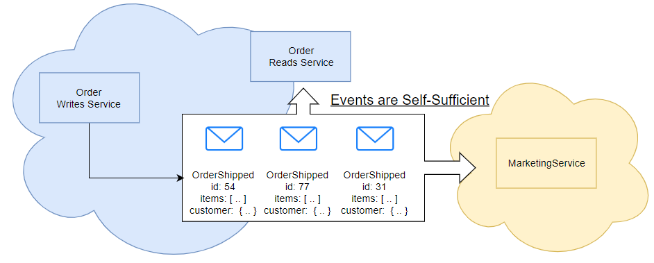

For consumers, it's now a brainless work.
They just have to read the "state" field, which is always the same model (this is the `Order` **Write Model** here) to do their job.

The overhead is now on the messaging infrastructure (the messages are bigger because the events now contain the whole state).

# Protect the Write Model

The above example is okay for **internal consumption only** but not for external services (like here, the Marketing Service), because we don't want to expose our Write Models. 

## private _wm: WriteModel;

The Write model is the model of the Writes side. It is the model of the aggregates our domain is responsible for.

If we happen to expose it as previously with the *state-in-event* strategy, 3rd party services could based their logic on the state, which is our Write model. Therefore, we are going to have troubles evolving our own model while maintaining consumers compatibility (up to a point).

If we are doing CQRS, this is not desired. If you remember, CQRS is useful when we have **changing business requirements** hence changes are going to happen a lot. We don't want to notify our consumers that we changed our format, that the current topic is deprecated, that we have breaking changes and so on. We want to isolate our internal modal and what we expose in our events.

## What if we need to expose it?

Business people can rarely reason about eventual-consistency, it makes no sense to them ("it's technical, I don't care").
They wants to use a _reactive architecture_, _microservices_, _scale globally_, have _available_ _resilient_ _consistent_ services (work with the latest state). Unfortunately, we generally end up with an eventual-consistency system (AP) under these constraints.

Technically, we can quickly think about adding `/get` routes on our Write Service and be done with it. "Why bother with a Reads Service that makes data eventually consistent, it makes no sense". It would work, but it would be a serious mistake for all the reasons this article enumerated and an anti-pattern in a CQRS architecture anyway. It we settled to use CQRS, we must respect how it works.

- No one should be know about the Write model except the system who writes it.
- We choose CQRS because of scalability reasons
  - if we expose our Write Model to readers, it's not a Write Model anyone, it's a Write/Read model, there is no distinction anymore, we can't scale them differently.
- We can't publicly publish events containing our Write Model (Event-Carried State)

If another service must absolutely have our latest _written_ data, we should ask ourselves:

- Why, What is its business case?
- Why can't it handle eventually-consistency? Is there is real reason, backed by facts and numbers?
- Why our events are not covering its use-case?
- Should we send it a `Command` instead of being reactive?
- Do we have a wrong domain separation? (should be _in_ working with `Commands` instead of _out_)

## ACL to the rescue

A last solution, solving the privacy of our Write model—but not the scalability issue— would be to write an ACL (Anti-Corruption Layer) in our Writes Service.
We could transform our Write Model to _a_ Read Model. 

- On-the-fly, but coupling our Writes Service to reads:

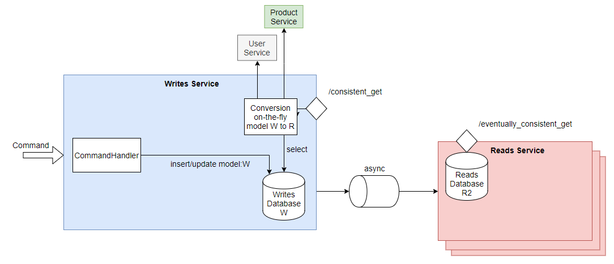

- or save it in a Database to avoid on-the-fly conversions (still coupling):

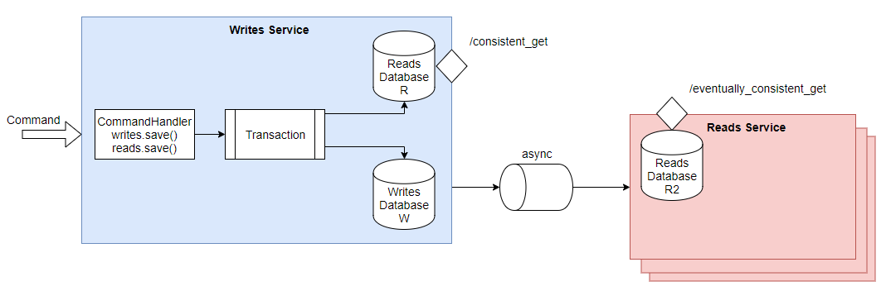

In the latter case, both the Write Model (or the events to an Event Store) and this _Read Model_ must be saved atomically, in the same transaction (to not be inconsistent in case of failure). Also we can't call external APIs: if they are failing, we won't be able to finish our conversion, hence no commit of our transaction, hence all the `Commands` would fail. SLA = min(dependent SLAs). That would defeat the purpose of CQRS.

# Conclusion

## To the business..

CQRS is a good pattern to reason about a whole system, when we are used to work with it. There is definitely a **steep learning curve** to apprehend the separations and the constraints. Instead of thinking *globally*, we must think *locally* (`Commands`, `Events`). It's **difficult to predict the general behavior**. The features are broken into pieces and we can have different actors and different timelines to complete it (and more case of failures). The eventual-consistency can also add its bag of issues we didn't have before with a unified design. We trade control over scalability and flexibility.

CQRS is generally coupled to a good DDD thinking beforehands, to avoid mixing different domains (or the inverse, split domains we shouldn't), creating weird Aggregates that doesn't fit the business after all. The distinction between Write and Read models help tremendously.

Often I'm asking: "Why is this attribute in the Write Model, do we have a business rule on it?". If the answer is "No, but it's for a downstream internal service that.." then I know it does not belong here. Every property on a Write Model should have a business rule in at least one CommandHandler.

About the Read model, it's totally *YOLO*, *FFA*, because it does not matter, it has no impact. It is meant to evolve a lot, following the front-end needs. I just want to **protect the Write Model**.

CQRS is also meant to work with Events. They are about the business. They offer traceability and decouple systems among other things. The Event Sourcing approach is useful but comes with its own bagages of constraints. Such CQRS system is an **Event-Driven system**. As such, a feature can required 20 hops through the message bus, to complete (a succession of boundaries Event Handlers / Command Handlers). Without a good **performance tuning** and a good **observability** of the system (logs/metrics/tracing, and a good understanding of how things correlate together), it can perform poorly. Even if it can scale, it won't be efficient.

## ..And Beyond!

Moreover, some technical precautions have to be taken care of, such as **idempotence** and **exactly-once processing** (we don't want to process twice an event because of a transient network issue). The events for a given aggregate must be processed **in order** (you don't want a OrderItemAdded before a OrderCreated). Events also means we'll talk about Event Streaming processing.

Also, when errors occur in the middle of processing events (deserialization issue, unexpected value, network error), our processing can be stuck in the middle of processing a large feature (split in multiple events): what do we do? what's the resulting state? how do we emit an error, who will consume it? how do we contact the user to tell him (the `Command` is gone since a while)? how do we ensure our state is consistent? We didn't even talked about **Sagas** and error management because it's a whole story.

We also must think about versioning our aggregates and events, managing causal dependencies if necessary (Vector or Matrix Clocks).

All those issues are not caused by CQRS itself, but because we are working with **distributed systems**. If your company wants to make the jump from a monolith to a CQRS architecture, you will need to consider all of it: this is where you need strong shoulders (..to cry).