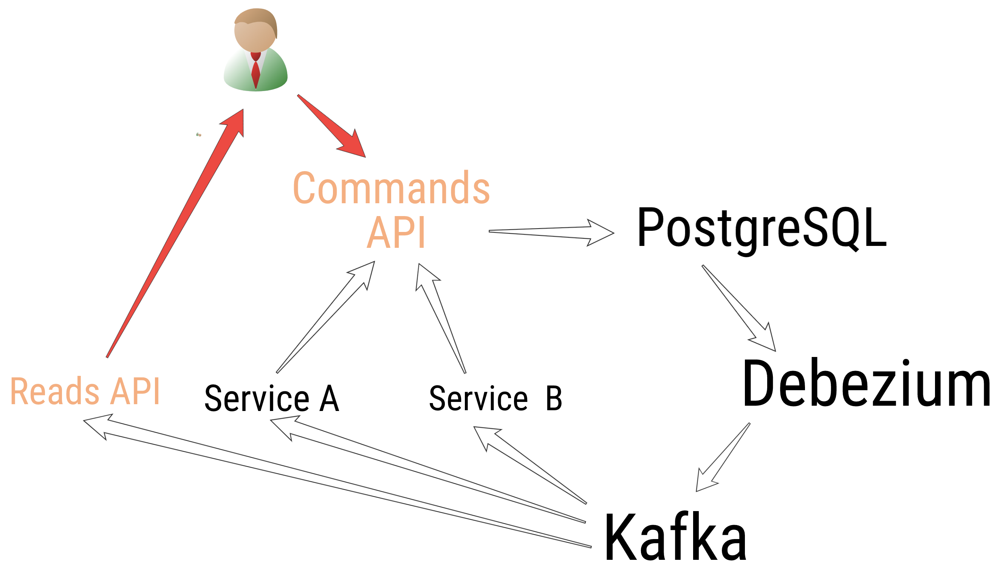
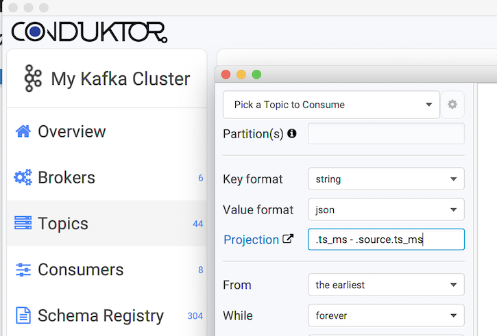
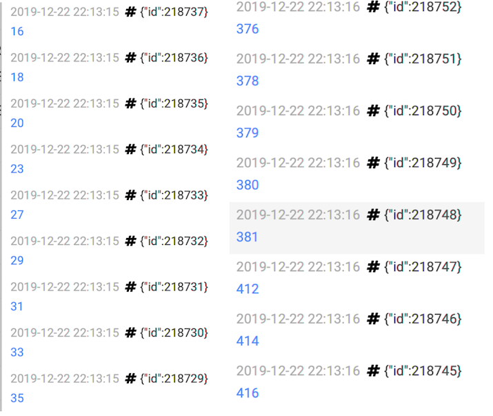
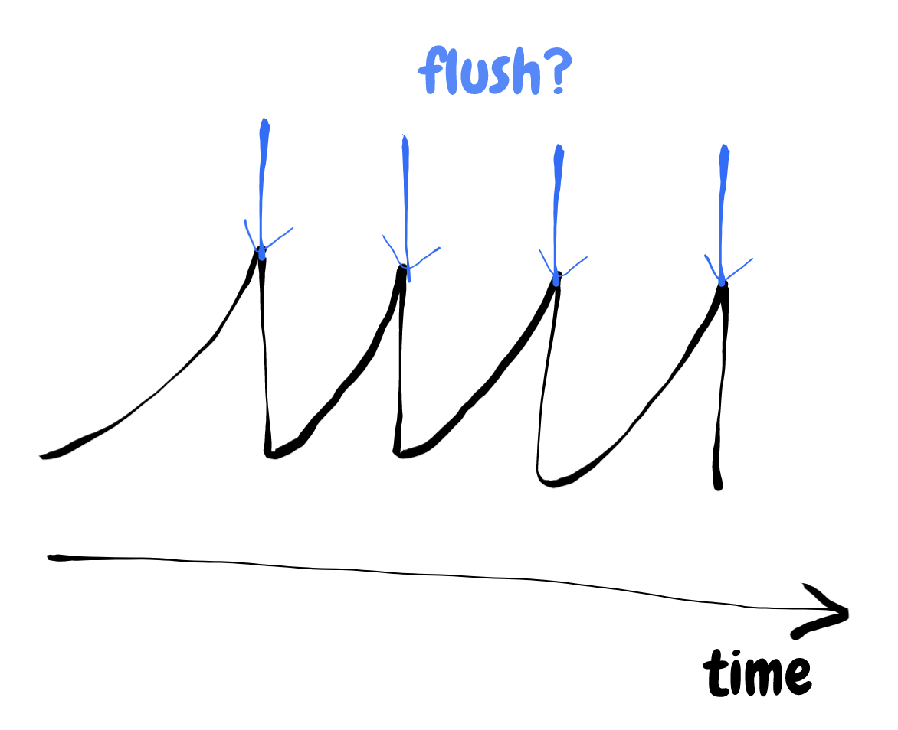
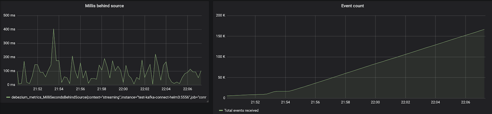
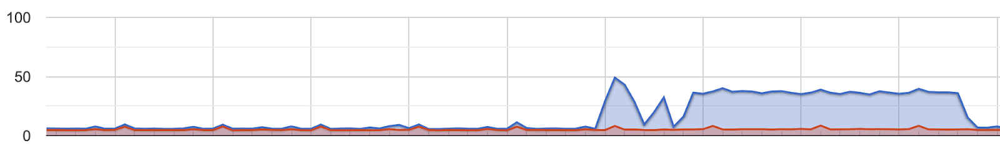
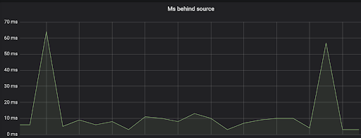
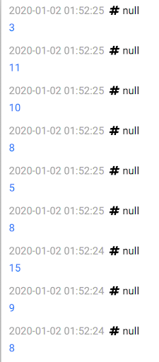
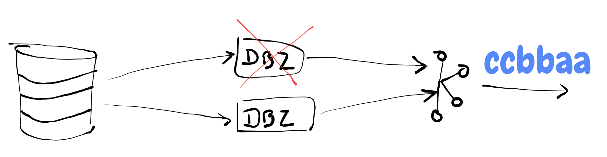

Thanks to Kafka Connect & Debezium, Change Data Capture is now a common pattern to expose databases changes as _events_ into Kafka.

It's _easy_ to setup, but by adding PostgreSQL and Debezium into the loop, it's necessary to understand some technical knobs accessible to tune the whole system. You probably know that _queues are everywhere_. The more systems we have: the more queues we have, the more knobs we have, the more metrics we have to watch for.

We'll explain some of these knobs and metrics to know when working with Debezium (and PostgreSQL).

---

TOC

# Use-case

We have a User-facing CQRS API, taking Commands, updating aggregates and saving them into PostgreSQL. When we save them, we also save the Events caused by the updates in another table, everything in the same SQL Transaction (see the [Outbox Pattern](https://debezium.io/blog/2019/02/19/reliable-microservices-data-exchange-with-the-outbox-pattern/), avoiding dangerous dual writes ⚠️). This provides us a "Read your own Writes" semantics.

From there, a Debezium connector gets notified and send the INSERTs into a Kafka Topic "topic-events", which is consumed by a Reads API to expose the data, and by others services to be triggered, react accordingly, and send us Commands to update the aggregate.

We're having rounds of Commands and updates on the same aggregate. Each round can trigger a new set of updates. At the end, it will converge to a stable state. Meanwhile, being a User-facing API, the global latency must stay minimal (<1s), hence the latency during each round must stay minimal (if we have 3 rounds, <300ms per round).

A round is: API ➡️ PostgreSQL ➡️ Debezium ➡️ Kafka ➡️ Consumer Service ➡️ Command to API.

Debezium is in the critical path.



[[info]]
|Using Change Data Capture pattern, we can INSERT + DELETE the events in the same SQL Transaction. Debezium will be notified of the INSERT and will ignore the DELETE (using `tombstones.on.delete=false`). This means the Events table will always be empty in PostgreSQL, this is normal. The goal is not to have all the events in PostgreSQL but in Kafka only. Of course, for a quick debugging purpose, it can be useful to not DELETE the events in PostgreSQL directly.

# The situation

When we tested our first version of the complete loop (several rounds), we were disappointed by the overall latency, between 1s and 2s. It was unacceptable. Our SLO was around 500ms.

We had some tracing in place, and we quickly noticed large "blanks" in our traces. Debezium?

## Looking at Debezium

Debezium exposes different times for each record from the database:

```json
{
	...
	"source":{
		"ts_ms":1577923422512,
		"txId":2049068,
		"lsn":129771832832,
		...
	},
	"op":"c",
	"ts_ms":1577923422530
}
```

- `source.ts_ms` is the time of the PostgreSQL transaction when we INSERTed our record (`c`: create).
- `ts_ms` is when Debezium processed it.

Therefore, to know the _lag_ between PostgreSQL and Debezium: `ts_ms - source.ts_ms`. Here, `1577923422530 - 1577923422512 = 18ms`, not that bad.

## Conduktor: looking at individual records

To quickly see what's going on at the individual record level, we consume our topic using [Conduktor](https://www.conduktor.io/) and a `jq` projection `.ts_ms - .source.ts_ms` to do the math for us:



It's scrolling quickly. According to where we look, we get different pictures:



In the "same" instant, we get between 20ms lag and 400ms lag. 400ms of latency, totally lost in the Nether! 🔥

We understand there is some buffering occuring upstream: some records are quickly processed after being INSERTed, others must "wait".



## Debezium metrics

Debezium exposes some metrics about the lag, but it's not as obvious as with Conduktor.

Exporting its JMX metrics to a Prometheus agent, we can look at `debezium_metrics_MilliSecondsBehindSource`.
It depends on the current time (when processing). It's like the lag of a consumer group in Kafka compared to `now()`. You can know if you're going to catch up with the lag or not.

- Below, a bunch of records are INSERTed into PostgreSQL (the right image).
- We see `debezium_metrics_MilliSecondsBehindSource` doing hiccups between 40ms~200ms (the left image).

It's a bit like what we saw with Conduktor, but more "flatten" and depending of the time Prometheus scrapes the data (every 10s here). Too bad the metric is not an histogram (to get the percentiles).



Note that during this benchmark, the CPU of the database went up to almost 50% (small-sized: 1 vCPU, 4GB RAM):



[[info]]
|There is also `debezium_metrics_MilliSecondsSinceLastEvent` useful to monitor (ie: > 30s ?) and alert us if we expect a regular stream of new events.

## Using pgbench

We quickly looked at our raw PostgreSQL performances and network (no Debezium involved).

The network is _probably_ not an issue, everything being in the same VPC or using VPC-peering on GCP.

- PostgreSQL is managed at Aiven's, on GCP.
- Kafka is managed at Confluent's, on GCP.
- Our apps are on Kubernetes, on GCP.

GCP. ❤️

[pgbench](https://www.postgresql.org/docs/10/pgbench.html) is a useful tool to quickly test the database. It's the `ab` (Apache Bench, for HTTP) of PostgreSQL. A quick and dirty benchmark confirmed us the database and the network are not the cause of this large latency:

```
number of clients: 20
number of threads: 5
duration: 20 s
number of transactions actually processed: 12356
latency average = 31.959 ms
latency stddev = 10.638 ms
```

30ms ain't bad, considering this was the default test with transactions more complex than just an `INSERT` as we do.

# Tuning Debezium

To create the Debezium connector, the bare minimum is to give the database schema and table to listen to:

```ini
connector.class  = io.debezium.connector.postgresql.PostgresConnector
schema.whitelist = public
table.whitelist  = public.events

slot.name = debezium
tasks.max = 1
tombstones.on.delete = false
...
```

We also have to pick which logical decoder to use (how the records from PostgreSQL are deserialized). Three options:

- [wal2json](https://github.com/eulerto/wal2json): outputs JSON. Often the default choice because easy to work with. Must be installed in PostgreSQL server.
- [decoderbufs](https://github.com/debezium/postgres-decoderbufs): outputs Protobuf. Now maintained by Debezium; and its default value. Must be installed in PostgreSQL server.
- [pgoutput](https://github.com/postgres/postgres/blob/master/src/backend/replication/pgoutput/pgoutput.c): native in PostgreSQL since 10+. No need to install anything. Support all PostgreSQL types.

Each of them has constraints and issues: [differences-between-plugins](https://debezium.io/documentation/reference/1.0/connectors/postgresql.html#discrepance-between-plugins). Nowadays, we should bet on `pgoutput` because it's the native one.

Whichever we choose, we can ask Debezium to filter out columns we don't need in the output to avoid extra payload:

```ini
column.blacklist = public.events.id, public.events.event_type,...
```

We can configure wal2json by adding parameters in Debezium using `slot.stream.params=...` to tune the behavior of the replication slot: they will be used when Debezium will create the `REPLICATION SLOT` in PostgreSQL on startup:

```json
"slot.stream.params": "add-tables=public.events; write-in-chunks=true; actions=insert;"
```

Nothing helped us here, the latency was still high, no matter server/client filtering.

## Replication Slots

[[info]]
|A replication slot is a logical (or physical but we just look at the logical here) piece in PostgreSQL, with a name, that "advances" over time by consuming the WAL. It's keeping track of the position in the WAL and prevent its deletion (if not consumed yet). It's like a Pub/Sub.

Remember, it's important: the WAL is shared by all the databases 👪.

The replication slots needs to be closely monitored.
When they are not catching up the WAL, it can't be removed (because it hasn't been consumed yet). There are subtleties around WAL allocation: it will grow on the disk until exhaustion if not consumed / configured properly ⚠️. See [Debezium notes](https://debezium.io/documentation/reference/1.0/connectors/postgresql.html#wal-disk-space) about this (ie: enable Debezium heartbeats, send dummy records...).

Using plain SQL, we can look at the lag in term of size of the replication slots:

```sql
SELECT slot_name,
  pg_size_pretty(pg_wal_lsn_diff(pg_current_wal_lsn(), restart_lsn)) as replicationSlotLag,
  pg_size_pretty(pg_wal_lsn_diff(pg_current_wal_lsn(), confirmed_flush_lsn)) as confirmedLag,
  active
FROM pg_replication_slots;
```

```sql
-- To drop: SELECT pg_drop_replication_slot('debezium-dev');
```

```
name          | replicationSlotLag | confirmedLag | active
debezium-dev  | 1184 MB            | 128 MB      | true
debezium-stg  | 21 GB              | 21 GB       | false
```

- replicationSlotLag: the oldest valid WAL, that retains WAL deletion
- confirmedLag: the latest WAL ack'ed by Debezium

Here, `debezium-stg` is inactive, but exists. Therefore, the WAL can't be removed and is up to 21GB and going on.

## pgoutput / REPLICATION

When using `pgoutput`, Debezium creates a "FOR ALL TABLES" publication. PUBLICATION are PostgreSQL native structures. The subscriber of this PUBLICATION is Debezium.

```sql
CREATE PUBLICATION dbz_publication FOR ALL TABLES;
-- To drop: DROP PUBLICATION dbz_publication;
```

On PostgreSQL, we can see this:

```sql
> select * from pg_publication
     pubname     | pubowner | puballtables | pubinsert | pubupdate | pubdelete | pubtruncate
-----------------+----------+--------------+-----------+-----------+-----------+-------------
 dbz_publication |    16393 | t            | t         | f         | f         | f

> select * from pg_publication_tables ;
     pubname     | schemaname |       tablename
-----------------+------------+------------------------
 dbz_publication | public     | events
 dbz_publication | public     | ...
 ...
```

It's possible (and probably more devops oriented) to create it handcrafted beforehands:

```sql
CREATE PUBLICATION dbz_publication FOR TABLE "events" WITH (publish = 'insert');
```

Unfortunately, about our latency issue, even using `pgoutput` did not changed a thing for us. 💁‍♂️

It wasn't the network, it wasn't Debezium. It has to be PostgreSQL. Long story short: it was.

# The Solution: Fix PostgreSQL

Looking at the configuration, here are the interesting bits:

```c
> show all
...
synchronous_commit                     | off        | Sets the current transaction's synchronization level.
...
max_replication_slots                  | 8          | Sets the maximum number of simultaneously defined replication slots.
max_sync_workers_per_subscription      | 2          | Maximum number of table synchronization workers per subscription.
max_wal_senders                        | 8          | Sets the maximum number of simultaneously running WAL sender processes.
max_wal_size                           | 4005MB     | Sets the WAL size that triggers a checkpoint.
...
wal_keep_segments                      | 250        | Sets the number of WAL files held for standby servers.
wal_level                              | logical    | Set the level of information written to the WAL.
...
wal_segment_size                       | 16MB       | Shows the size of write ahead log segments.
wal_sync_method                        | fdatasync  | Selects the method used for forcing WAL updates to disk.
wal_writer_delay                       | 200ms       | Time between WAL flushes performed in the WAL writer.
wal_writer_flush_after                  | 1MB        | Amount of WAL written out by WAL writer that triggers a flush.
...
```

The most interesting bits is the `wal_writer_delay` by default to 200ms. It looks like the lag we noticed.

"Time between WAL flushes performed in the WAL writer". It is used when `synchronous_commit` is `off`, like in our case, to buffer writes to the disks. `on` is a safe value against a server crash (it wouldn't cause any inconsistency issue, "just" data loss).

Using Debezium, to get the lowest latency, this should be `on` or otherwise set `wal_writer_delay` to `10ms` (what we did).

And boom, fixed, 10ms max. Our overall latency shrank to less than 1s. In hindsight, this looks kinda straightforward right? It's not always the network. 😃





# Debezium: watch out

If you're planning to use Debezium, you should be aware of the followings...

## Scalability

Using Debezium, it's useless to set `tasks.max` to > 1, this won't matter. Debezium is hardcoded with 1 max, because of the way to subscribe to PostgreSQL (there is no consumer groups in PostgreSQL). This means: bottleneck, no scalability, a poor resilience, critical path. 🌶️

Doing Event Sourcing with the Outbox Pattern means Debezium is really critical. No Debezium, no events.

## Duplication

Debezium does not prevent us to dedup in the consumers. It is still **mandatory**.

If Kafka Connect crashes (hence the existing task crashes) and restart a new Debezium Connector that will start a new task, this new replacement task will generate the same latest change events that were processed just prior to the crash.

For a consumer, it's possible to keep the max LSN number it has processed to know if it's reading a duplicate. LSNs increment monotonically.

## Downtime

All Kafka Connects must be closely monitored to restart as soon as their connectors are not working.
We have noticed our Debezium regularly stopped with these kinds of errors:

```
org.postgresql.util.PSQLException: Database connection failed when reading from copy
```

This can happen when there is a restart of the PostgreSQL master (update, maintenance, whatever) and the standby replica steps up. Because we are using a SaaS (Aiven), it's normal.
Otherwise, it's not even exceptional for the connection to be "lost". We must live with failures.

Right now, Debezium just "stops" processing, logs an exception, and stop. This is your duty to restart it.

## Double Replication



It's possible to ensure HA with Debezium: create 2 connectors on 2 different Kafka Connect, listening to the changes of the same tables...

Yes, it's data duplication for the greater good. Thanks to the idempotence of our consumers (or a dedicated Kafka Streams deduplicator), the rest of the stack is "safe". In the context of Event Sourcing, the order is also safe.

Let's say we have a CREATED then a UPDATED of the same entity (order matters).

If our consumer gets UPDATED (slot 2) then CREATED (slot 1), are we screwed? No, because if we get the UPDATED (slot 2), it means we also got the CREATED (slot 2) before, and thanks to our idempotence, we will ignore the late CREATED (slot 1).

## Master. Master.

Replication slots are only supported on primary servers. We can't replicate from a Read Replica (Debezium acts as a Read Replica).

When there is a master failover in PostgreSQL, the replication slot is gone because they are not replicated on the standby instances ⚠️. Restarting Debezium connector will recreate a replication slot on the new master but we could have some data loss here

If some data were committed before Kafka Connect created its slot, it won't see them (we can't create a replication slot starting at a specific LSN). And if Debezium does a snapshot of the table, it may not see every changes (DELETE). This seems to be not resolvable for now in PostgreSQL. There is a thing called "failover slots" but not sure what's its state, and if that truly fix this issue.
